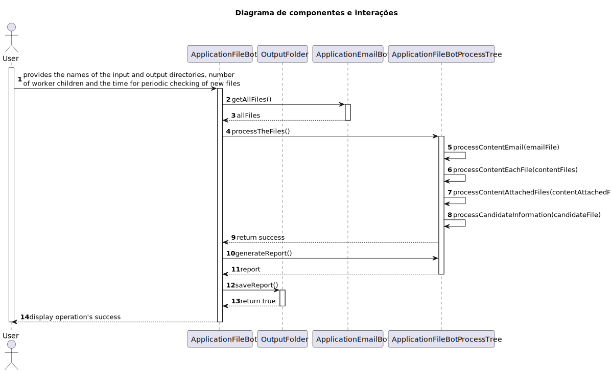

# 2001 - the system should, continuously, process the files produced by the Applications Email Bot

-----------

## 1. User Story Description

* As Product Owner, I want the system to, continuously, process the files produced
by the Applications Email Bot, so that they can be imported into the system by initiative
of the Operator.

      – Priority: 1

      – References: NFR12(SCOMP) : The base solution for the upload of files must be implemented following specific technical requirements such as the use of the C programming language with processes, signals and pipes. Specific requirements will be provided in SCOMP*.

### 2. NFR12

  The “Applications File Bot” must be developed in C and utilize processes, signals,
pipes, and exec function primitives.

  A child process should be created to periodically monitor an input directory for new
files related to the 'Application' phase of the recruitment process. If new files are
detected, a signal should be sent to the parent process.

  Please refer to Section 2.2.3 of the “System Specification” document for a
description of the input directory, input files, output directory, and their expected
subdirectories.

  Upon receiving a signal, the parent process should distribute the new files among a
fixed number of worker child processes. Each child process will be responsible for
copying all files related to a specific candidate to its designated subdirectory in the
output directory.

  Once a child has finished copying all files for a candidate, it should inform its parent
that it is ready to perform additional work. Child workers do not terminate unless they
are specifically terminated by the parent process.

  Once all files for all candidates have been copied, the parent process should
generate a report file in the output directory. This report should list, for each
candidate, the name of the output subdirectory and the names of all files that were
copied.

  To terminate the application, the parent process must handle the SIGINT signal.

  Upon reception, it should terminate all children and wait for their termination.

  The names of the input and output directories, the number of worker children, the
time interval for periodic checking of new files, etc., should be configurable. This
configuration can be achieved either through input parameters provided when
running the application or by reading from a configuration file.

  Unit and integration tests are highly valued.

## 2. Contribuição dos elementos do grupo

|  **Aluno**  | **Contribuição** |
|:-----------:|:-----------------|
| **1201293** | 30%              |
| **1211236** | 15%              |
| **1211916** | 15%              |
| **1220772** | 20%              |
| **1220812** | 20%              |

## 3. Funcionalidades implementadas e percentagem funcional

|       **Funcionalidade**        | **Percentagem de funcionalidade** |
|:-------------------------------:|:----------------------------------|
| **Monitoramento do diretório**  | 100%                              |
|  **Deteção de novos arquivos**  | 100%                              |
|  **Distribuição de arquivos**   | 60% (1)                           |
| **Comunicação entre processos** | 100%                              |
|    **Criação do relatório**     | 100%                              |
|    **Terminação controlada**    | 100%                              |
|        **Configuração**         | 100%                              |
|           **Testes**            | 60% (2)                           |

(1) A percentagem apresentada deve-se ao facto da pasta partilhada não estar organizada por job reference.

(2) A percentagem apresentada deve-se ao facto dos testes implementados não estarem automatizados

## 4. Diagrama de interações

## 5. Outros aspetos a referir

N/a
