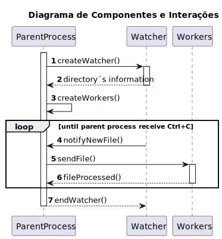

# 2001b - the system should, continuously, process the files produced by the Applications Email Bot

-----------

## 1. User Story Description

* As Product Owner, I want the system to, continuously, process the files produced by the Applications Email Bot, so that they can be imported into the system by initiative of the Operator.

      – Priority: 1

      – References: NFR13(SCOMP) : An alternative solution for the upload of files must be implemented following specific technical requirements such as the use of the C programming language with shared memory and semaphores. Specific requirements will be provided in SCOMP.

### 2. NFR13

  The “Applications File Bot” must be developed in C and utilize processes, shared
memory and semaphore primitives. It's crucial to eliminate busy waiting wherever
possible.

  A child process should be created to periodically monitor an input directory for new
files related to the 'Application' phase of the recruitment process. If new files are
detected, a notification (using a semaphore) should be sent to the parent process.
Please refer to Section 2.2.3 of the “System Specification” document for a
description of the input directory, input files, output directory, and their expected
subdirectories.

  Upon receiving the notification, the parent process should distribute the new files
among a fixed number of worker child processes. Each child process will be
responsible for copying all files related to a specific candidate to its designated
subdirectory in the output directory.

  Once a child has finished copying all files for a candidate, it should inform its parent
that it is ready to perform additional work. Child workers do not terminate.
Once all files for all candidates have been copied, the parent process should
generate a report file in the output directory. This report should list, for each
candidate, the name of the output subdirectory and the names of all files that were
copied.

  The names of the input and output directories, the number of worker children, the
time interval for periodic checking of new files, etc., should be configurable. This
configuration can be achieved either through input parameters provided when
running the application or by reading from a configuration file.

## 2. Team members contribution

| **Student** | **Contribution** |
|:-----------:|:-----------------|
| **1201293** | 35%              |
| **1211236** | 10%              |
| **1211916** | 10%              |
| **1220772** | 10%              |
| **1220812** | 35%              |

## 3. Implemented functionality and percentage

|      **Functionality**      | **Percentage** |
|:---------------------------:|:---------------|
|    **Monitor directory**    | 100%           |
| **New archives detection ** | 100%           |
| **Archives distribution **  | 60% (1)        |
|  **Process communication**  | 100%           |
|         **Report**          | 100%           |
|      **Configuration**      | 100%           |
|          **Tests**          | 60% (2)        |

(1) The percentage shown is due to the fact that the shared folder is not organized by job reference.

(2) The percentage presented is due to the fact that the implemented tests are not automated.

## 4. Iterations diagram

## 5. Other information

N/a.