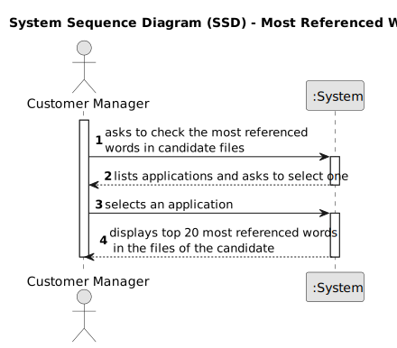
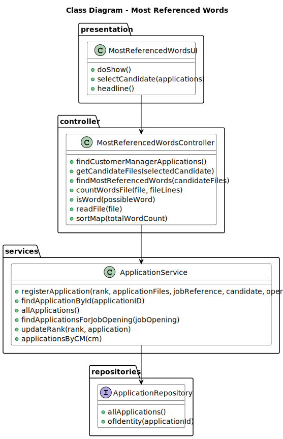
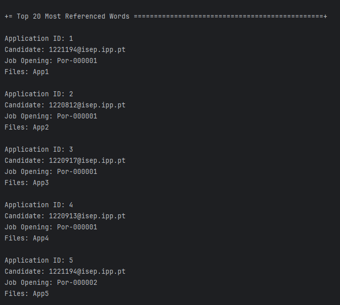
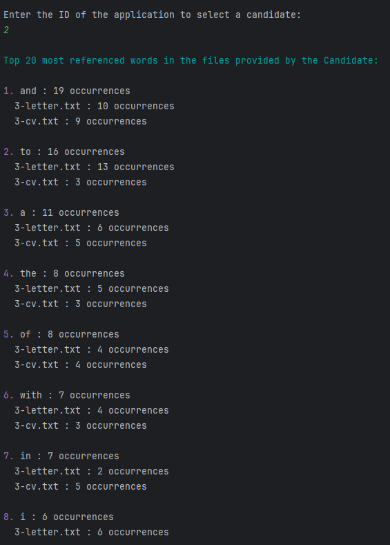
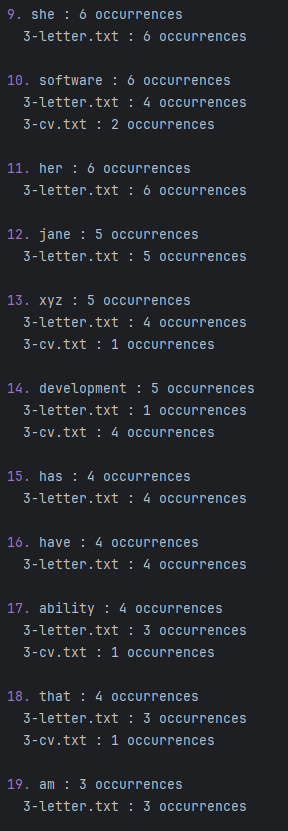
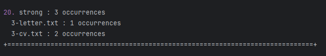

# Presenting the top 20 most referenced words in candidate files

-----------

## 1. User Story Description

### 1.1. User Story Description

As a Customer Manager, when displaying the candidate data, I expect the system to present 
a top 20 list of the most frequently referenced words from files uploaded by a
candidate. Additionally, I require a comprehensive list of the files in which these 
words appear.

### 1.2. Customer Specifications and Clarifications

**From the specifications document:**

> **NFR14(SCOMP) - Process to counting words of very large files:**
> 
> The process to count words of very large files should follow specific
technical requirements such as implementing parallelism and concurrency using Java
and threads. Specific requirements will be provided in SCOMP.

**From the client clarifications:**

> **Question 170:**
> 
> Gostaria de saber se na US4000, relativa há criação da lista de palavras mais comuns, presentes nos 
ficheiros carregados pelo candidato, pretende escolher uma candidatura desse mesmo candidato e criar a 
respetiva lista, ou se pretende que esta lista seja criada, tendo em conta todas as candidaturas associadas
a esse candidato.
> 
> **Answer:**
> A lista de palavras é relativa a uma candidatura em particular.

> **Question 181:**
> 
> Files for word count evaluation - When making the Top 20 Used Words by a candidate, the files subject to 
word counting are all files of all the chosen candidate's applications? Or can the Customer Manager choose 
a candidate's specific application and from there get the top 20 words from those files?
> 
> **Answer:**
> See Q170
 
> **Question 185:**
> 
> The order of the list is important? Does it need to be ordered by the number of occurrences of the words?
> 
> **Answer:**
> Yes, the order is important. The system must present a top 20 list, from most referenced words to less referenced words.
 
> **Question 186:**
> 
> For the word count, should all types of words be counted, or are there words that don't make sense to count, 
such as conjunctions?
> 
> For the moment there are no restrictions like the one you mention since they depend on the 
language used in the text (the solution could/would be complex).
 
> **Question 187:**
> 
> When displaying the candidate info is expected to show the list of words for each application of the 
candidate, or the customer manager needs to select a specific application to see the list of words?
> 
> **Answer:**
> See Q170. This regards all the possible applications of a candidate that the customer manager is managing.
 
> **Question 191:**
> 
> I think it makes sense to ignore words with less than 3 letters, or something like this, because it makes 
no sense to have words like as, I, am... Can we make this assumption or should we count any word?
> 
> **Answer:**
> See Q186. If you want, you may use a configuration file to configure the minimum number of sequence 
of characters to be counted as a word in the process. However, this is a temporary exception, accepted, 
but not considered as a good solution (a good solution should be one that takes into account the used language).
 
> **Question 219:**
> 
> Recentemente, respondeu a dúvidas sobre a funcionalidade que pretende que seja feita sobre o top 20 número 
de palavras em ficheiros de candidaturas de candidatos (Q170 e Q187). Quando analisamos as perguntas, ficámos 
na dúvida sobre qual a interpretação a levar em conta, de que a funcionalidade deve ser feita sobre todas as 
candidaturas do candidato (Q187), ou se o Customer Manager escolhe 1 candidatura do candidato e depois a 
funcionalidade faz o seu trabalho sobre apenas essa candidatura.
> 
> **Answer:**
> Os dados do candidato (“candidate data”) referem-se aos dados do candidato que pode ter várias candidaturas. 
Nesse contexto ao apresentar os dados de cada candidatura devem aparecer, para cada candidatura (application), 
o top 20.
 
> **Question 220:**
> 
> Na us 4000 é referido, "Additionally, I require a comprehensive list of the files in which these words appear." 
Quer apenas que para a palavra "x" digamos em que ficheiros existe ou mais alguma informação?
> 
> **Answer:**
> É como indica, para cada palavra em que ficheiros aparece.

### 1.3. Acceptance Criteria

* AC1: How to count words:

        The system must count all words in the files, including conjunctions and prepositions.
        A word is a sequence of characters separated by spaces, tabs, or newlines.

* AC2: File reading:

        The system must read the files concurrently using threads.

* AC3: Thread count:

        Each thread should read a file, count word occurrences, and update a shared word count map.

* AC4: Final result:

        The system must sort the map based on word counts and return the top 20 most referenced words.

### 1.4. Found out Dependencies

* None to specify

### 1.5. Input and Output Data

**Selected Data:**

    * Application

**Output Data:**

    * (In)Success of the operation
    * Top 20 most referenced words

### 1.6. System Sequence Diagram (SSD)


### 1.7. Sequence Diagram (SD)


### 1.8 Other Relevant Remarks

*  None to specify

## 2. Analysis and Design
The desing of this use case is based on the following domain model and class diagram:

### 2.1. Domain Model


### 2.2. Class Diagram


## 3. Implementation
The most important method analyzes a list of candidate files to find the most referenced words across them. It spawns 
threads to process each file concurrently. Each thread reads a file, counts word occurrences, and updates a shared word 
count map, ensuring thread safety with synchronization. After all threads complete, it sorts the map based on word counts 
and returns the result.

```java
    public Map<String, Map<String, Integer>> findMostReferencedWords(List<File> candidateFiles) {
        Map<String, Map<String, Integer>> totalWordCount = new HashMap<>();
        List<Thread> threads = new ArrayList<>();

        for (File file : candidateFiles) {
            Thread thread = new Thread(() -> {
                List<String> fileLines = readFile(file);
                Map<String, Map<String, Integer>> wordCount = countWordsFile(file, fileLines);

                synchronized (totalWordCount) {
                    for (Map.Entry<String, Map<String, Integer>> entry : wordCount.entrySet()) {
                        String word = entry.getKey();
                        Map<String, Integer> fileCounts = entry.getValue();

                        totalWordCount.merge(word, fileCounts, (oldMap, newMap) -> {
                            newMap.forEach((fileName, count) -> oldMap.merge(fileName, count, Integer::sum));
                            return oldMap;
                        });
                    }
                }
            });

            threads.add(thread);
            thread.start();
        }

        for (Thread thread : threads) {
            try {
                thread.join();
            } catch (InterruptedException e) {
                LOGGER.error("Thread interrupted while waiting for completion", e);
            }
        }

        return sortMap(totalWordCount);
    }
```

## 4. Testing
The `Application` class is fully tested in order to ensure that the implementation is correct.

```java
    @Test
    void testRank() {
        assertEquals(rank, application.rank());
    }

    @Test
    void testSubmissionDate() {
        assertEquals(createdOn, application.submissionDate());
    }

    @Test
    void testDataFile() {
        assertEquals(applicationFiles, application.dataFile());
    }

    @Test
    void testOperator() {
        assertEquals(operator, application.operator());
    }

    @Test
    void testCandidate() {
        assertEquals(candidate, application.candidate());
    }

    @Test
    void testJobReference() {
        assertEquals(jobReference, application.jobReference());
    }

    @Test
    void testCandidateRequirements() {
        assertEquals(candidateRequirements, application.candidateRequirements());
    }

    @Test
    void testIdentity() {
        assertNotNull(application.identity());
    }

    @Test
    void testStatus() {
        application.changeStatus(Status.CHOSEN);
        assertEquals(Status.CHOSEN, application.status()); // assuming the initial status is PENDING
    }

    @Test
    void testUpdateRank() {
        Rank newRank = new Rank("2");
        application.updateRank(2);
        assertEquals(newRank, application.rank());
    }

    @Test
    void testChangeStatus() {
        Status newStatus = Status.ACCEPTED; // replace with actual Status
        application.changeStatus(newStatus);
        assertEquals(newStatus, application.status());
    }

    @Test
    void testUploadCandidateRequirements() {
        CandidateRequirements newCandidateRequirements = new CandidateRequirements(Arrays.asList("Requirement3", "Requirement4"));
        application.uploadCandidateRequirements(newCandidateRequirements);
        assertEquals(newCandidateRequirements, application.candidateRequirements());
    }
```

## 5. Demonstration







