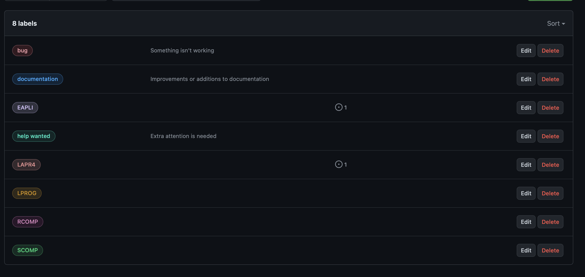
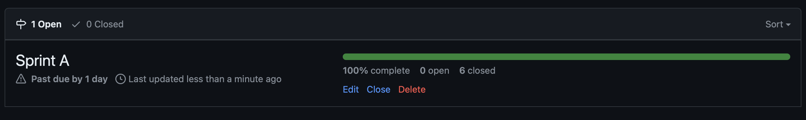

# US G002

## Context

 - Developing the project repository and management tool is a task that has been assigned for the first time.
## Requirements
    
**US G002:** As Project Manager, I want the team to use the defined project repository (GitHub) and set up a tool for 
project management

    Acceptance Criteria:

        1. The repository must be established within the ISEP-DEI Workspace on GitHub.

    Dependencies / References:

        1. This requirement pertains to creating the repository on GitHub and configuring GitHub Projects as the management tool.

## Analysis

 - GitHub Projects is a tool enabling the creation of boards within the repository for organizing issues and project management purposes.

## Design

    An issue should be generated for every User Story. 
    Additionally, a milestone should be established for each sprint, with issues appropriately labeled and organized within these milestones.

## Implementation

**Lables:**

**Milestones:**

**Issues:**

