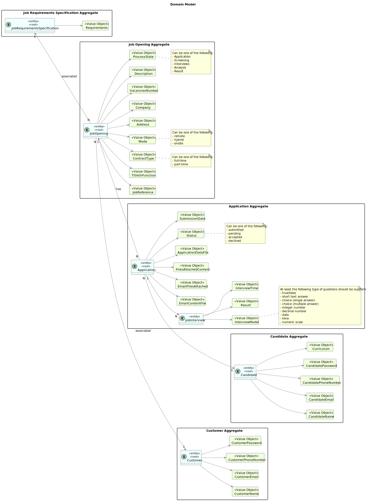

# Domain Model elaboration using DDD - G006

## Overview

This README contains the Domain Model for the Jobs4U project. The Domain Model represents the essential concepts, entities, aggregates, and their relationships within the project's domain.

## Contents

## Introduction

The domain model serves as a conceptual blueprint of the project's domain. It helps to understand the key entities, their attributes, and relationships, facilitating effective communication and development.

## Project Structure

The domain model is structured using UML notation. It consists of entities, aggregates, value objects, and associations between them.

## Entities and Aggregates

Entities represent distinct objects with unique identities and lifecycles within the domain. Aggregates are clusters of associated entities and value objects that are treated as a unit for data changes.

- Admin

        Represents system administrators responsible for managing customer entities and employees.

- Customer Manager

      Represents managers responsible for managing customers and job openings.

- Customer

      Represents entities (other companies or entities) that need to recruit human resources.

- Operator

      Represents employees responsible for monitoring the application process.

- Candidate

      Represents individuals applying for job openings.

- Language Engineer

      Represents engineers responsible for creating modules related to job requirements and interview models.

- Job Opening

      Represents job openings created by customers.

- Application

      Represents job applications submitted by candidates.

- Job Interview

      Represents interviews conducted for job candidates.

## Value Objects

Value objects are immutable objects that represent attributes or characteristics within the domain. They do not have a unique identity and are defined by their attributes.

AdminName

AdminEmail

ManagerName

ManagerEmail

CustomerName

CustomerEmail

CustomerPhoneNumber

CustomerPassword

OperatorName

OperatorEmail

CandidateName

CandidateEmail

CandidatePhoneNumber

CandidatePassword

Curriculum

EngineerName

EngineerEmail

RequirementsAnswers

JobReference

TitleOrFunction

ContractType

Mode

Address

Company

VacanciesNumber

Description

EmailContentFile

EmailFilesAttached

FilesAttachedContent

ApplicationDataFile

Status

SubmissionDate

InterviewModel

Results

InterviewTime

QuestionText

QuestionType

## Associations

Associations represent relationships between entities, aggregates, and value objects within the domain. They define how objects are connected and interact with each other.

Admin -> AdminEmail

Admin -> AdminName

Customer Manager -> ManagerEmail

Customer Manager -> ManagerName

Customer -> CustomerEmail

Customer -> CustomerName

Customer -> CustomerPhoneNumber

Customer -> CustomerPassword

Operator -> OperatorEmail

Operator -> OperatorName

Candidate -> CandidateEmail

Candidate -> CandidateName

Candidate -> CandidatePhoneNumber

Candidate -> CandidatePassword

Candidate -> Curriculum

Language Engineer -> EngineerEmail

Language Engineer -> EngineerName

Language Engineer -> RequirementsAnswers

Job Opening -> JobReference

Job Opening -> TitleOrFunction

Job Opening -> ContractType

Job Opening -> Mode

Job Opening -> Address

Job Opening -> Company

Job Opening -> VacanciesNumber

Job Opening -> Description

Application -> EmailContentFile

Application -> EmailFilesAttached

Application -> FilesAttachedContent

Application -> ApplicationDataFile

Application -> Status

Application -> SubmissionDate

Job Interview -> InterviewModel

Job Interview -> Results

Job Interview -> InterviewTime

InterviewModel -> QuestionText

InterviewModel -> QuestionType

## Contributing

Contributions to the domain model are welcome! If you identify any issues, inconsistencies, or improvements, feel free to open an issue or pull request.

## Domain Model

