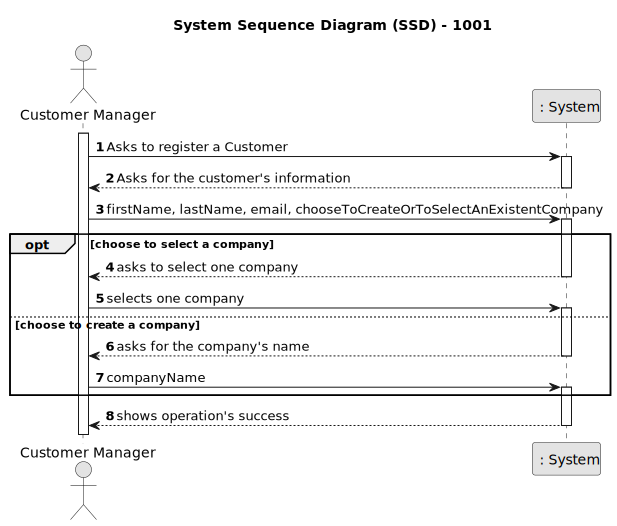
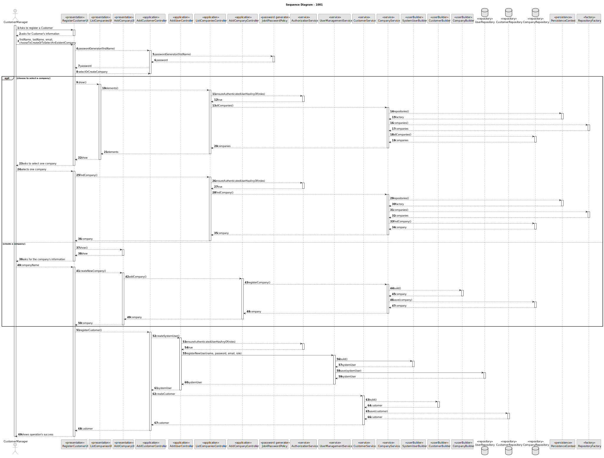
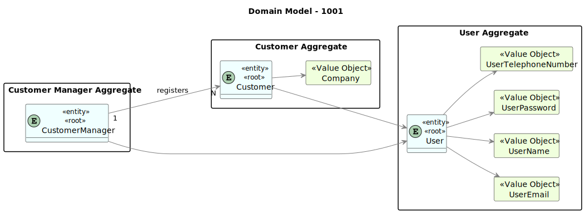

# 1001 -  register a customer and that the system automatically creates a user for that customer

| **ID** | **Sprint** | **Priority** |
|:------:|:----------:|:------------:|
|   9    |     B      |      1       |

--------

## 1. Requirements

"As Customer Manager I want to register a customer and that the system automatically creates a user for that customer"

### 1.1. Customer Specifications and Clarifications

#### From the specifications document:

    Equals to the User Story Description

#### From the client clarifications:

* Question:

      19. Na criação de um utilizador no sistema o nome é definido pelo utilizador ou é o nome da pessoa (primeiro e último) e se a password é definida pelo utilizador ou gerada pelo sistema?

* Answer:

      19. No âmbito da US 2000a o Operator cria utilizadores do sistema para candidatos que ainda não estejam no sistema. Tem de fazer isso com base nos dados recebidos na candidatura (que incluem email e nome). O email servirá para identificar a pessoa. Neste contexto é necessário ter uma password para esse novo utilizador. Uma vez que essa informação não é transmitida pelo candidato, suponho que a solução mais “aconselhada” será o sistema gerar uma password para esse utilizador. Como o utilizador/candidato irá receber essa informação (a forma de autenticação na app) está out of scope, no sentido em que não existe nenhuma US que remete para isso. As US 1000 e 1001 também remetem para criação de utilizadores. Aqui, eventualmente poderia-se pensar em introduzir manualmente as passwords, mas pode ser pelo mesmo mecanismo de definição automática de password, descrito anteriormente.
  
* Question:

      81. When we register a customer... are we registering the data of the customer without the data of the user of the company who manage the app or both at the same time? Should we consider the posibility that the Customer User who manage the app changes and we should save the data of the old user too?
    
* Answer:

      81. For registering a customer see US1001.

### 1.3. Acceptance Criteria

* AC1: Customer Registration:

      The system should allow the Customer Manager to initiate the registration process for a new customer.
      
      Upon registration, the system should prompt the Customer Manager to provide necessary information such as the company name.
  
* AC2: User Creation:
  
      Upon successful registration of a customer, the system should automatically create a corresponding user account.
  
      The user account should include essential details such as email, username, password, and telephone number.
  
      The system should generate a unique username and password for the user account.

* AC3: Data Integrity:
  
      The system should ensure that the user account is linked accurately to the registered customer.

      Data consistency checks should be performed to verify the correctness of the user information entered during registration.
  
* AC4: Notification:

      After the user account is created successfully, the system should notify the Customer Manager of the successful registration and user creation.
  
* AC5: Error Handling:

      If any errors occur during the registration or user creation process, the system should provide informative error messages to the Customer Manager.
  
      Error messages should include guidance on resolving the issue and retrying the operation if necessary.
  
* AC6: User Access:

       The newly created user account should be accessible for authentication and use in the system.

       The Customer Manager should be able to view and manage the created user accounts within the system's user management interface.
  
* AC7: Logging:

      The system should log all registration and user creation activities, including timestamps and the identities of the Customer Managers involved.
  
* AC8: Security:

      User passwords should be securely stored using encryption techniques to protect sensitive information.

      Access controls should be enforced to ensure that only authorized personnel, such as Customer Managers, can perform customer registrations and user creations.

### 1.4. Functional Requirements

      NFR08 - Authentication and Authorization The system must support and apply authentication and authorization for all its users and functionalities

### 1.5. Found out Dependencies

* G007 - As a Project Manager, I want the system to support and apply authentication and authorization for all its users and functionalities.

* 1000 - As Administrator, I want to be able to register, disable/enable, and list users of the backoffice.

### 1.5 Input and Output Data

* Input Data:

      - Customer´s first name
      - Customer's last name
      - Customer's email
      - Company's name

* Output Data:

      - All the inputed data
      - (In)Success of the operation

## 2. Analysis

### 2.1. Main success scenario

    The customer is registered in the system.

### 2.2. System Sequence Diagram (SSD)

### 2.3. System Diagram (SD)

### 2.4. Partial Domain Model

## 3.0. Design

----------------

### 3.1. Partial Class Diagram

### 3.2. Applied Patterns

### 3.3. Tests

## 4.0. Integration and Demonstration

------------------

## 5.0. Observations

------------------

      N/a.