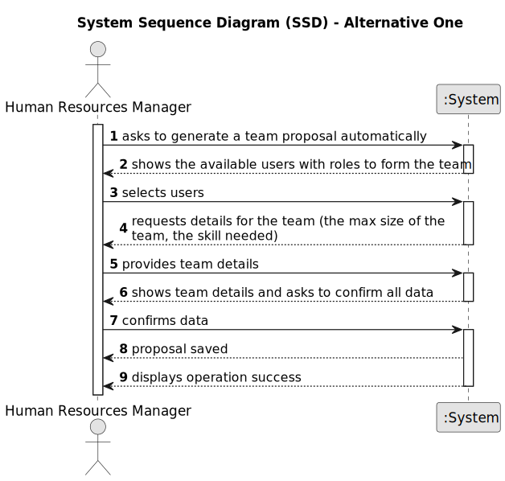

# US05 - Generate a team proposal automatically

## 1. Requirements Engineering

### 1.1. User Story Description

As a HRM, I want to generate a team proposal automatically.

### 1.2. Customer Specifications and Clarifications 

**From the specifications document:**

> Teams consist of temporary groupings of employees tasked with undertaking various activities within one or more green 
spaces.

> When forming versatile teams, it is imperative to consider both the team size and the spectrum of skills required to 
be adequately addressed.

**From the client clarifications:**

> **Question:** What information will the customer provide?
>
> **Answer:** The customer provide the max size of the team and a set of skills.

> **Question:** What should the output of the automation be? (should it just store the team proposal or show it to the customer?)
Will the team proposal be a document about all the instructions of each team member/worker?
>
> **Answer:** The systems provide team proposals and HRM can accept of refuse the proposals. In the future (not in this 
sprint) HRM may decide to edit the team.

> **Question:** How does it generate the team if there are not enough employees?
>
> **Answer:** The system should provide information why it can't generate a team.

> ** Question:** How does he propose a team, for what purpose? (Is there any predefinition)?
>
> **Answer:** There is no purpose, at least in this sprint. 

> **Question:** What are the input data to automatically generate a team?
>
> **Answer:** the max size of the team (for instance 4), and the skill needed: 4 tree pruner and 1 light vehicle driver,
meaning that one team member has 2 skills.

### 1.3. Acceptance Criteria

* AC1: The HRM must provide the maximum team size and the required skill set.

### 1.4. Found out Dependencies

* To ensure the effective and organized registration of collaborators, as specified in "US03 - Registration of a 
collaborator with a job and essential attributes," it is essential to first establish and register skills, as outlined 
in "US01 - Registration of skills that HRM may assign to a collaborator." The presence of registered skills is 
fundamental for later linking them with collaborators during the registration procedure. Thus, guaranteeing the 
availability of registered skills is pivotal for streamlining the registration of collaborators in a structured manner.

### 1.5 Input and Output Data

**Input Data:**

* Typed data:
    * Team's max size
    * Skill's needed

**Output Data:**

* Proposals for teams that are subject to further acceptance or rejection.
* Information on why a team couldn't be generated if there are not enough employees with the required skills.
* Confirmation of successful registration (In)Success of the operation

### 1.6. System Sequence Diagram (SSD)

### 1.7 Other Relevant Remarks

* In ensuring effective team assembly, the system must offer transparent and informative notifications should it 
encounter a shortage of employees possessing the requisite skills. Additionally, HRM should be afforded the choice to 
either accept or decline team proposals put forth by the system.