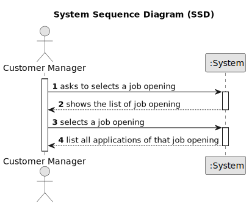
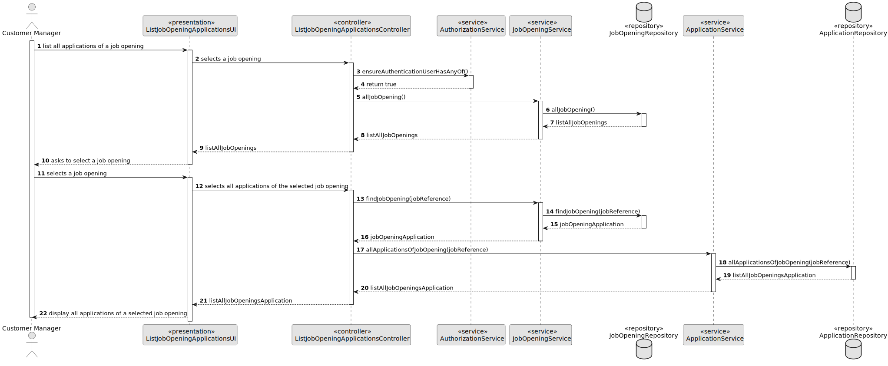
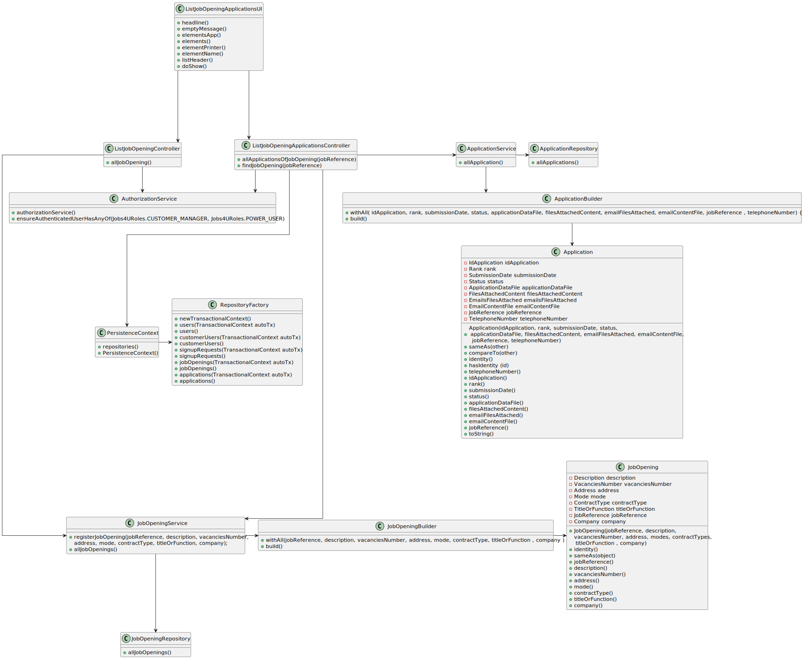

# 1005 - List all applications for a job opening

================================================================================================

## 1. Requirements Engineering

### 1.1. User Story Description

As Customer Manager, I want to list all applications for a job opening.

### 1.2. Customer Specifications and Clarifications 

**From the specifications document:**

**From the client clarifications:**

### 1.3. Acceptance Criteria

* None

### 1.4. Found out Dependencies

* There aren't any dependencies of other user stories.

### 1.5 Input and Output Data

**Input Data:**

* No input's data.

**Output Data:**

* All applications of the selected job opening.

## 2. Design

### 2.1 System Sequence Diagram (SSD)

### 2.2 Sequence Diagram (SD)

### 2.3 Class Diagram (CD)

### 2.4 Applied patterns

- Controller
- Builder
- Repository
- Factory
- Persistence Context

### 2.5 Tests

**Test 1**

**Test 2**

## 3. Implementation

## 4. Comments

