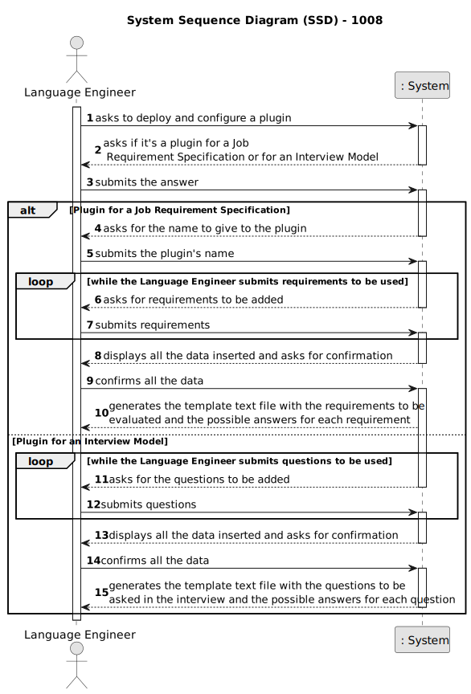
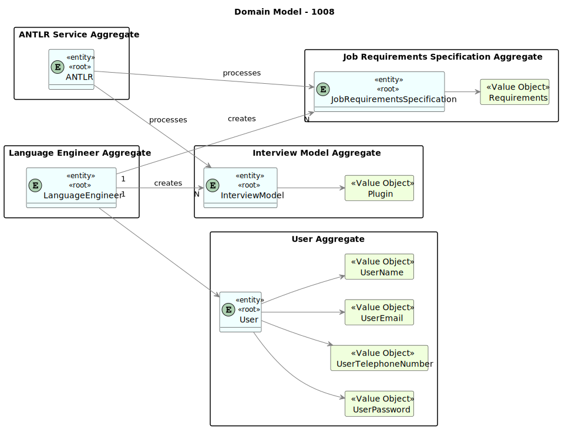
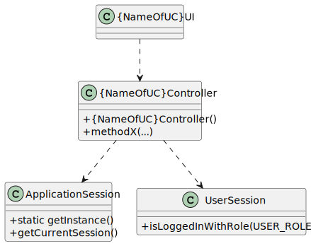

# 1008 - deploy and configure a plugin (i.e., Job Requirement Specification or Interview Model) to be used by the system
# How to execute .g4: java -jar .\libs\antlr-4.13.0-complete.jar .\jobs4u.backoffice.app\src\main\java\antlr4\InterviewModel.g4
--------

## 1.1. User Story Description

As Language Engineer, I want to deploy and configure a plugin (i.e., Job Requirement Specification or Interview Model) to be used by the system.

## 1.2. Customer Specifications and Clarifications

### From the specifications document:

      Job vacancies (job openings) must include a Job Requirement Specification. This represents a set of application requirements that the applicants must achieve. For instance, we could define a job requirement specification named "front end junior programmer", were candidates must have at least 2 years of experience, a degree in computer science or similar program, and knowledge in, at least, one of the following programming languages: java, javascript, typescript. Usually this information can be collected from the curriculum vitae of the candidate.
      Interviews are a very important tool for the evaluation of candidates. Interviews should be based on a set of pre-defined questions. Interview Models, as the name implies, are sequences of questions that can be used to register the answers of candidates during interviews.
      Both job requirement specifications and interview models follow the same usage. A software engineer, with great competences in language engineering, following directions from customer managers, designs and implements modules that are dynamically added to the system. These modules contain the implementation of job requirements specification or interview models.
      These modules should be able to implement the necessary functionalities from processing job requirements or interviews.

        - A job requirement specification module should:
            • Generate a template text file with the requirements to be evaluated and the possible answers for each requirement
            • Evaluate if a text file with the requirements for a particular candidate is syntactically correct
            • Evaluate a text file with the requirements for a particular candidate and provide the result, approved or rejected, and in case of rejection, include justification

        - An interview model module should:
            • Generate a template text file with the questions to be asked in the interview and the possible answers for each question
            • Evaluate if a text file with the questions and answers for a particular candidate interview is syntactically correct
            • Evaluate a text file with the questions and answers for a particular candidate interview and provide a numeric grade for that interview

### From the client clarifications:

* Question:

      41. Como é que o Language Engineer faz o interview model e os job requirements? É texto? Ou ele seleciona perguntas para a interview e requirements para a job opening? E isso é quando se está a criar uma entrevista ou uma job opening ou para-se a meio para fazer isso e depois continua se?

* Answer:

      41. O language enginner com informação passada pelo customer manager (que obteve do customer) vai desenvolver em java um jar correspondente ao modulo/plugin. Para esse desenvolvimento terá de utilizar técnicas de desenvolvimento de gramáticas/linguagens como o antlr. Esse código ficará num jar que depois o language engineer “instala/regista” na aplicação (US1008, por exemplo, associando um nome ao jar num ficheiro de configuração – “5 anos experiencia java”, “req-model-5-years-java.jar”). A aplicação com essa informação carrega dinamicamente esse jar. Na gramátca usada no jar é que vão estar espelhadas a estrutura das perguntas a usar nesse modelo e sua avaliação. Estas atividades têm de ser feitas antes de se poder fazer a US1008. Esse trabalho é feito “fora” dos sistema, apenas se registando o modelo (quando está pronto) na US1008. A US 1009 e US1011 permitem selecionar modelos a usar (dos que foram devidamente registados no sistema).

* Question:

      47. US1008, relativamente aos módulos das entrevistas e dos requisitos, os seus identificadores podem ser automáticos ou específicos (i.e., manuais)?

* Answer:

      47. A Q41 refere a mesma US. Lá refere-se que cada modulo será registado no sistema através de 2 dados, por exemplo, associando um nome ao jar num ficheiro de configuração – “5 anos experiencia java”, “req-model-5-years-java.jar”. Ou seja, assume-se que cada modulo terá um nome/designação (que suponho que deverá ser única) e a este nome ficará associado o nome do ficheiro jar (provavelmente um path completo) que implementa esse módulo. Ou seja, esse nome/designação pode ser considerado como um identificador especifico/manual.

* Question:

      88. Quando o Customer Manager regista uma job offer, é ele que cria as requirement specifications e as interview models ou é-lhe dada uma lista destes para ele selecionar?

* Answer:

      88. Existe a US1002 e as US1009 e US1011. Penso que está claro qual a responsabilidade de cada uma. A criação dos modelos das entrevistas e dos requisitos é um caso de uso especifico e com um US especifica para registar no sistema os respectivos plugins (US1008).

## 1.3. Acceptance Criteria

* AC1: The deployed plugin is accessible and usable by other system components.

* AC2: The configured plugin functions correctly according to the provided configuration.

* AC3: The system supports versioning of deployed plugins to manage updates and changes.

* AC4: Appropriate error messages and notifications are provided if there are issues during plugin deployment or configuration.

* AC5: Only authorized users, such as Language Engineers, can deploy and configure plugins.

## 1.4. Found out Dependencies

* 1002 - As Customer Manager, I want to register a job opening.

* 1003 - As Customer Manager, I want to list job openings

* 2002 - As Operator, I want to register an application of a candidate for a job opening and import all files received.

## 1.5 Input and Output Data

* Input Data:

        - Plugin type : Job Requirements Specification or Interview Model
        - Plugin Name
        - Data Confirmation
        - Requirements (for Job Requirements Specification)
        - Questions (for Interview Model)
        - Confirmation

* Output Data:

        - Template Text File (for Job Requirement Specification)
        - Template Text File (for Interview Model
        - Chosen details

## 1.6. System Sequence Diagram (SSD)

## 1.7. System Diagram (SD)

## 1.8 Other Relevant Remarks

None to specify

## 2.0. Domain Model

----------------

### 2.1. Relevant Domain Model Excerpt

### 2.2. Entities and Aggregates

Entities represent distinct objects with unique identities and lifecycles within the domain. Aggregates are clusters of associated entities and value objects that are treated as a unit for data changes.

* ANTLR

      Represents a service or tool used for processing and parsing job requirements specifications and interview models. It assists in automating the evaluation of candidate applications and interviews.

* JobRequirementsSpecification

      Represents a set of application requirements that candidates must meet for a specific job opening. These specifications are designed and implemented by Language Engineers and used in the candidate screening process.

* Language Engineer

      Represents a software engineer specializing in language processing, responsible for designing and implementing modules for processing job requirements specifications and interview models.

* User

      Represents all the users that are registered in the system.

* InterviewModel

      Represents a predefined sequence of questions used for conducting job interviews. These models are designed and implemented by Language Engineers and are used to assess candidate qualifications during the interview process.

### Associations

ANTLR ---> JobRequirementsSpecification : processes

ANTLR --> InterviewModel : processes

LanguageEngineer --> User

LanguageEngineer "1" --> "N" JobRequirementsSpecification : creates

LanguageEngineer "1" --> "N" InterviewModel : creates

## 3.0. Class Diagram

------------------

### 3.1. Relevant Class Diagram Excerpt

