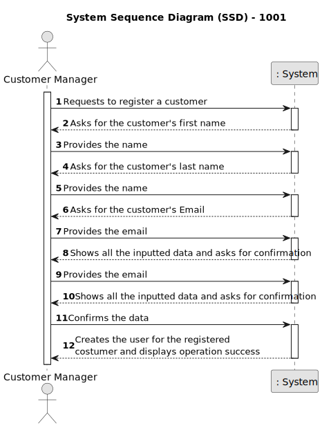
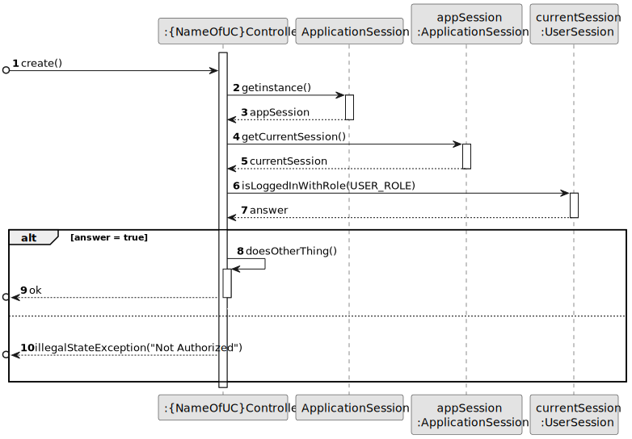
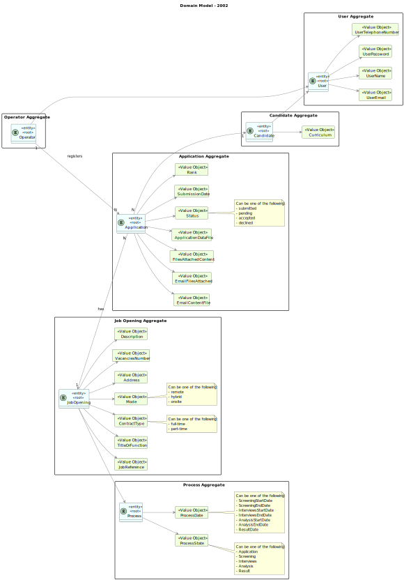

# 2002 - register an application of a candidate for a job opening and import all files received.

--------

## 1.1. User Story Description

As Operator, I want to register an application of a candidate for a job opening and  import all files received.
## 1.2. Customer Specifications and Clarifications

### From the specifications document:

Import the data from the file that was processed by the Application File Bot in Req 2001. The Files should be kept in the shared folder, but the Backoffice application needs to know the references to the file locations.

### From the client clarifications:

* Question:

      15. É o Operador que regista uma candidatura ou é o sistema que o faz automaticamente? E como integra o “plugin” de verificação da candidatura neste processo?

* Answer:

      15. Na US 2002 o Operator regista a candidatura. Para isso, é o Operator que inicia o processo mas o sistema deve importar os dados resultantes do Application File Bot de forma “automática” (Ver References da US 2002). O plugin referido entra neste processo através da US 2003, em que o Operador gera um ficheiro template com os dados a introduzir para validar uma candidatura. Na US 2004, o Operador, após preencher os dados específicos da candidatura (com base no ficheiro template anterior) submete no sistema esse ficheiro que vai ser usado para o sistema avaliar/verificar a candidatura. Se os critérios não forem atingidos a candidatura é recusada.
  
* Question:

      65. Micael – US2002 - UI and UX. I'd like to know what is the expected flow of executing US2002 (application registration and files import, by the operator). Can you reproduce step by step which actions should the operator execute? Example: 1. The system asks the operator for the candidate's email. 2. The operator enters the candidate's email. 3. The system asks for the job reference. 4. The operator enters the job reference. 5. The system creates the job application, if there is data for it in the shared folder.
    
* Answer:

      65. There are no specific requirements for the UI/UX but I think it will be more user friendly if the Operator could start the process by selecting the shared folder for the application to be imported.

* Question:

      83. Na descrição da US o PO refere uma importação de ficheiros e depois na referência à mesma a importação dos dados do ficheiro. Poderia esclarecer a que se refere a importação? São importações distintas? Têm destinos diferentes?

* Answer:

      83. Nessa US refiro-me à importação dos ficheiros gerados pelo Application File Bot. Quando me refiro aos dados, serão os dados do ficheiro de texto “A text file with the data of the application and candidate”, secção 2.2.3, um dos ficheiros gerados.

* Question:

      84. Após a informação dos ficheiros que estiverem na shared folder forem utilizados pelo Operator para registar uma candidatura, devem estes permanecer na pasta ou serem eliminados? Caso não sejam apagados como determinamos quais é que ainda não foram "utilizados"?

* Answer:

      84. Admitindo que já foram importados para o sistema, não tenho requisitos adicionais quanto aos ficheiros. A segunda pergunta é um problema que deve ser resolvido pela solução proposta. Eu não tenho nada a dizer sobre esse aspeto.

* Question:

      100. O que é que tem de ser registado no sistema?

* Answer:

      100. Tem de haver um registo que indique que o candidato em questão fez a candidatura e têm de ser registados/importados para o sistema todos os ficheiros submetidos.

## 1.3. Acceptance Criteria
* AC1: Customer Registration:

      The system should allow the Customer Manager to initiate the registration process for a new customer.
      
      Upon registration, the system should prompt the Customer Manager to provide necessary information such as the company name.
  
* AC2: User Creation:
  
      Upon successful registration of a customer, the system should automatically create a corresponding user account.
  
      The user account should include essential details such as email, username, password, and telephone number.
  
      The system should generate a unique username and password for the user account.

* AC3: Data Integrity:
  
      The system should ensure that the user account is linked accurately to the registered customer.

      Data consistency checks should be performed to verify the correctness of the user information entered during registration.
  
* AC4: Notification:

      After the user account is created successfully, the system should notify the Customer Manager of the successful registration and user creation.
  
* AC5: Error Handling:

      If any errors occur during the registration or user creation process, the system should provide informative error messages to the Customer Manager.
  
      Error messages should include guidance on resolving the issue and retrying the operation if necessary.
  
* AC6: User Access:

       The newly created user account should be accessible for authentication and use in the system.

       The Customer Manager should be able to view and manage the created user accounts within the system's user management interface.
  
* AC7: Logging:

      The system should log all registration and user creation activities, including timestamps and the identities of the Customer Managers involved.
  
* AC8: Security:

      User passwords should be securely stored using encryption techniques to protect sensitive information.

      Access controls should be enforced to ensure that only authorized personnel, such as Customer Managers, can perform customer registrations and user creations.

## 1.4. Found out Dependencies

* G007 -  As a Project Manager, I want the system to support and apply authentication and authorization for all its users and functionalities.

* 2001 -  As Operator, I want to register an application of a candidate for a job opening and import all files received.

## 1.5 Input and Output Data

* Input Data:

      - Customer´s first name
      - Customer's last name
      - Customer's email
      - Data Confirmation.

* Output Data:

      - All the inputed data
      - (In)Success of the operation

## 1.6. System Sequence Diagram (SSD)

## 1.7. System Diagram (SD)

## 1.8 Other Relevant Remarks

None to specify

## 2.0. Domain Model

----------------

### 2.1. Relevant Domain Model Excerpt

### 2.2. Entities and Aggregates

Entities represent distinct objects with unique identities and lifecycles within the domain. Aggregates are clusters of associated entities and value objects that are treated as a unit for data changes.

* Candidate

      Represents individuals applying for job openings.

* Job Opening

      Represents job openings created by customers.

* Process

      Represents the different stages in which a job offer can be found.

* Application

      Represents job applications submitted by candidates.

* Operator

      Represents employees responsible for monitoring and managing the automated processes within the talent acquisition system. Operators oversee the processing of candidate applications, handle exceptions, and ensure the smooth operation of the system.

### Associations

Application "N" --> "1" JobOpening : has

JobOpening  --> Process

Application "N" ---> "1" Candidate

Operator --> User

Candidate --> User

Operator "1" ---> "N" Application : registers

## 3.0. Class Diagram

------------------

### 3.1. Relevant Class Diagram Excerpt

