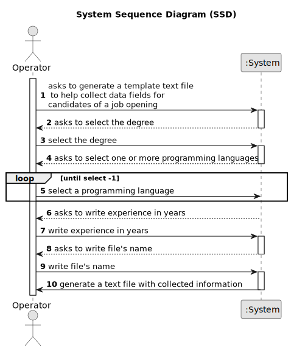
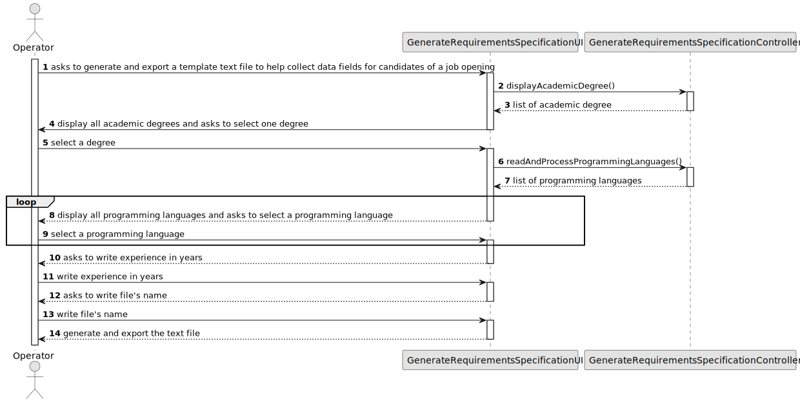
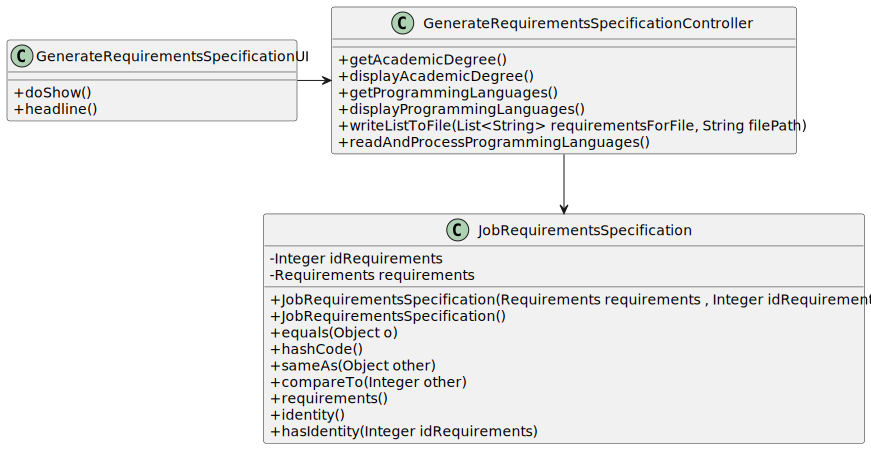
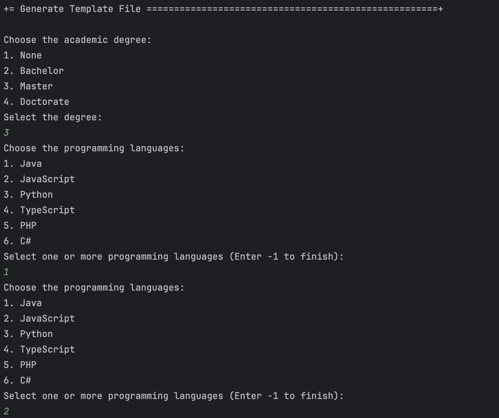
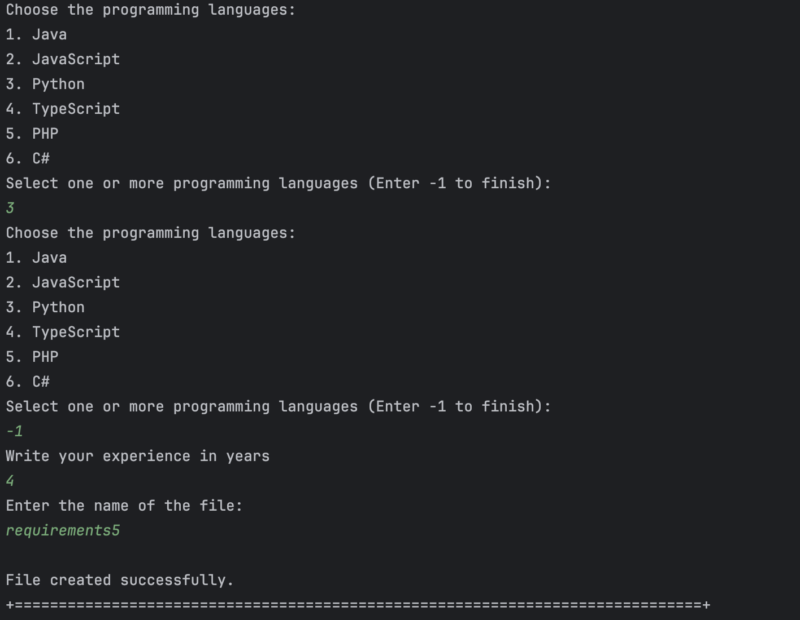
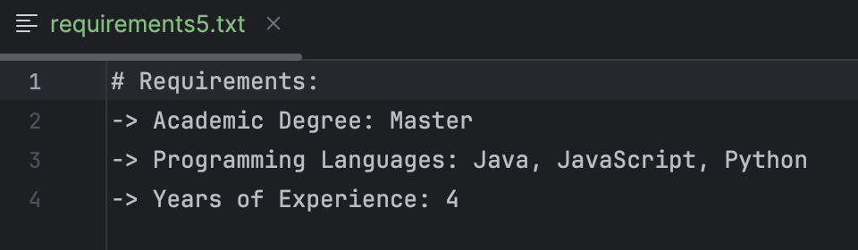

# Want to generate and export a template text file to help collect data fields for candidates of a job opening

================================================================================================

## 1. Requirements Engineering

### 1.1. User Story Description

As Operator, I want to generate and export a template text file to help collect data fields for candidates of a job opening (so the data is used to verify the requirements of the job opening)

### 1.2. Customer Specifications and Clarifications

**From the specifications document:**

**From the client clarifications:**

### 1.3. Acceptance Criteria

* None

### 1.4. Found out Dependencies

* This us depends on us1008.
* 
### 1.5 Input and Output Data

**Input Data:**

* Degree
* Programming Languages
* Experience

**Output Data:**

* text file

## 2. Design

### 2.1 System Sequence Diagram (SSD)

### 2.2 Sequence Diagram(SD)

### 2.3 Class Diagram(CD)

### 2.4 Applied patterns

- Controller

## 3. Implementation

## 4. Comments

