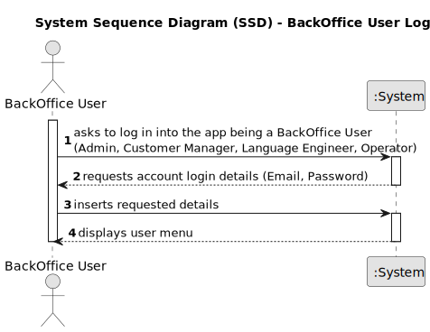
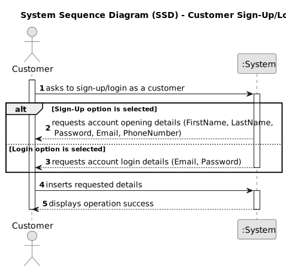
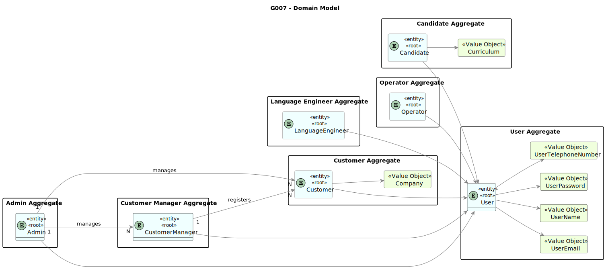

# G007 -  Applying authentication and authorization for all its users and functionalities.

## 1. Requirements Engineering

### 1.1. User Story Description

As a Project Manager, I want the system to support and apply authentication and authorization for all its users and functionalities.

### 1.2. Customer Specifications and Clarifications

**From the specifications document:**

**From the client clarifications:**

> **Question 59:** 
> 
> Pretende-se que todos os utilizadores acedam à mesma aplicação e que consoante as credências tenham acesso a
funcionalidades diferentes ou são aplicações diferentes (que acedem à mesma base de dados)?
> 
> **Answer:**
>
> Do ponto de vista do product owner faz sentido ter aplicações distintas. Ou seja, quando, por exemplo, um utilizador 
“executa” a aplicação “Candidate App” mesmo que se identifique como um user válido do tipo “Customer” a aplicação não deve
aceitar esse login.

### 1.3. Acceptance Criteria

* AC1: User Creation:

      Upon successful registration of a new user, the system should automatically create a corresponding user account.

      The user account should include the essential details provided earlier.

      The system should generate a unique password for the account.

### 1.4. Found out Dependencies

### 1.5 Input and Output Data

**Input Data:**

    While registering, the user must provide the following data:
    * Email,
    * First Name,
    * Last Name,
    * Phone Number,
    * Curriculum (only for candidates).

    While logging in, the user must provide the following data:
    * Email,
    * Password.

**Output Data:**

    * (In)Success of the operation

### 1.6. System Sequence Diagrams (SSD)

### 1.7 Other Relevant Remarks

*  None to specify

## 2.0. Domain Model

----------------

### 2.1. Relevant Domain Model Excerpt

