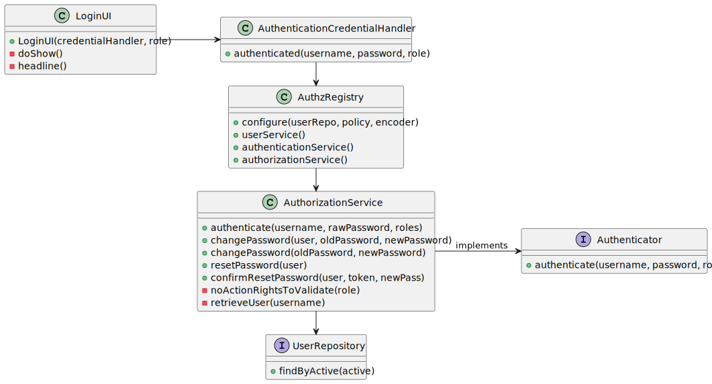

# G007 -  Applying authentication and authorization for all its users and functionalities.

## 1. Requirements Engineering

### 1.1. User Story Description

As a Project Manager, I want the system to support and apply authentication and authorization for all its users and functionalities.

### 1.2. Use Case Diagram


### 1.3. Customer Specifications and Clarifications

**From the specifications document:**

> **NFR08 - Authentication and Authorization :**
>
> The system must support and apply authentication and authorization for all its users and functionalities.

**From the client clarifications:**

> **Question 11:**
>
> No enunciado não está explicita a informação a recolher para os Customers? Qual a informação necessária? E quanto
aos funcionários da empresa?
>
> **Answer:**
> De facto isso não está explicito. No entanto, são referidos no nome da empresa e o seu endereço no âmbito de um job opening.
Quanto aos utilizadores (representante da empresa que acede à Customer App) eu diria que serão dados similares ao do Candidate.
Quando aos funcionários da empresa, eu diria que é importante garantir que é usado o email para identificar qualquer utilizador
do sistema. Penso que será importante para cada utilizador termos o nome completo assim como um short user name (que deverá ser
único). O Product Owner reconsiderou e decidiu que o short user name é dispensável uma vez que para autenticação dos utilizadores
se deve usar apenas o email e a password.

> **Question 19:**
>
> Na criação de um utilizador no sistema o nome é definido pelo utilizador ou é o nome da pessoa (primeiro e último) e se
a password é definida pelo utilizador ou gerada pelo sistema?
>
> **Answer:**
> No âmbito da US 2000a o Operator cria utilizadores do sistema para candidatos que ainda não estejam no sistema. Tem de
fazer isso com base nos dados recebidos na candidatura (que incluem email e nome). O email servirá para identificar a
pessoa. Neste contexto é necessário ter uma password para esse novo utilizador. Uma vez que essa informação não é
transmitida pelo candidato, suponho que a solução mais “aconselhada” será o sistema gerar uma password para esse utilizador.
Como o utilizador/candidato irá receber essa informação (a forma de autenticação na app) está out of scope, no sentido em
que não existe nenhuma US que remete para isso. As US 1000 e 1001 também remetem para criação de utilizadores. Aqui,
eventualmente poderia-se pensar em introduzir manualmente as passwords, mas pode ser pelo mesmo mecanismo de definition
automática de password, descrito anteriormente. Relativamente ao nome ver novamente a Q11.

> **Question 59:** 
> 
> Pretende-se que todos os utilizadores acedam à mesma aplicação e que consoante as credências tenham acesso a
funcionalidades diferentes ou são aplicações diferentes (que acedem à mesma base de dados)?
> 
> **Answer:**
>
> Do ponto de vista do product owner faz sentido ter aplicações distintas. Ou seja, quando, por exemplo, um utilizador 
“executa” a aplicação “Candidate App” mesmo que se identifique como um user válido do tipo “Customer” a aplicação não deve
aceitar esse login.

### 1.4. Acceptance Criteria

* AC1: User Creation

      Upon successful registration of a new user, the system should automatically create a corresponding user account.

      The user account should include the essential details provided earlier.

      The system should generate a unique password for the account.

### 1.5. Found out Dependencies

*  None to specify

### 1.6. Input and Output Data

**Input Data:**

    While logging in, the user must provide the following data:
    * Email,
    * Password.

**Output Data:**

    * (In)Success of the operation

### 1.7. System Sequence Diagrams (SSD)

#### 1.7.1. Login in to Backoffice SSD


#### 1.7.2. Login in to Candidate App SSD


#### 1.7.3. Login in to Customer App SSD


### 1.8. Sequence Diagram (SD)


### 1.9 Other Relevant Remarks

*  None to specify

## 2. Analysis and Design

The authentication and authorization system in our framework leverages a pre-existing base implementation, sparing us 
from building it anew. At its core lies the AuthenticationService, a pivotal component offering the authenticate method 
for user identity verification. This service relies on ancillary elements like the AuthorizationService, responsible for 
managing user sessions, and the PasswordPolicy, which ensures password adherence to system-defined rules.

Within this ecosystem, the SystemUser entity embodies a user within our system, while the Role value object delineates 
the user's role, dictating their permissions and access levels.

### 2.1. Domain Model


### 2.2. Class Diagram


## 3. Implementation

Most of the code for the implementation of this user story was already present in the base code. We only had to change the password criteria to match
the new requirements and create a password generator method as requested by the client to be used by other use cases of other user stories.

```java
    @Override
    public boolean isSatisfiedBy(final String rawPassword) {
        // sanity check
        if (StringPredicates.isNullOrEmpty(rawPassword)) {
            return false;
        }

        // at least 8 characters long
        if (rawPassword.length() < 8) {
            return false;
        }

        // at least one digit
        if (!StringPredicates.containsDigit(rawPassword)) {
            return false;
        }

        // at least one capital letter
        return StringPredicates.containsCapital(rawPassword);
    }

    public String passwordGenerator(String name) {
        String initials = name.substring(0, 1).toUpperCase() + name.substring(1, Math.min(name.length(), 4));

        Random random = new Random();
        int randomNumber;

        if (name.length() < 3) {
            randomNumber = 10000000 + random.nextInt(9000000);
        } else {
            randomNumber = 100000 + random.nextInt(90000);
        }

        return initials + randomNumber;
    }
```
## 4. Testing

We created tests to ensure the password policy is working as expected, as well as the password generator and strength methods.

```java
    @Test
    void testIsSatisfiedBy_ValidPassword() {
        Jobs4UPasswordPolicy passwordPolicy = new Jobs4UPasswordPolicy();
        assertTrue(passwordPolicy.isSatisfiedBy("StrongPassword1"));
    }

    @Test
    void testIsSatisfiedBy_TooShort() {
        Jobs4UPasswordPolicy passwordPolicy = new Jobs4UPasswordPolicy();
        assertFalse(passwordPolicy.isSatisfiedBy("Pwd1"));
    }

    @Test
    void testIsSatisfiedBy_NoDigit() {
        Jobs4UPasswordPolicy passwordPolicy = new Jobs4UPasswordPolicy();
        assertFalse(passwordPolicy.isSatisfiedBy("WeakPassword"));
    }

    @Test
    void testIsSatisfiedBy_NoCapitalLetter() {
        Jobs4UPasswordPolicy passwordPolicy = new Jobs4UPasswordPolicy();
        assertFalse(passwordPolicy.isSatisfiedBy("weakpassword1"));
    }

    @Test
    void testStrength_InvalidPassword() {
        Jobs4UPasswordPolicy passwordPolicy = new Jobs4UPasswordPolicy();
        assertEquals(Jobs4UPasswordPolicy.PasswordStrength.INVALID, passwordPolicy.strength("invpassword"));
    }

    @Test
    void testStrength_GoodPassword() {
        Jobs4UPasswordPolicy passwordPolicy = new Jobs4UPasswordPolicy();
        assertEquals(Jobs4UPasswordPolicy.PasswordStrength.GOOD, passwordPolicy.strength("GoodPassword1"));
    }

    @Test
    void testStrength_ExcellentPassword() {
        Jobs4UPasswordPolicy passwordPolicy = new Jobs4UPasswordPolicy();
        assertEquals(Jobs4UPasswordPolicy.PasswordStrength.EXCELLENT, passwordPolicy.strength("Exce11entP@ssw0rd"));
    }
```