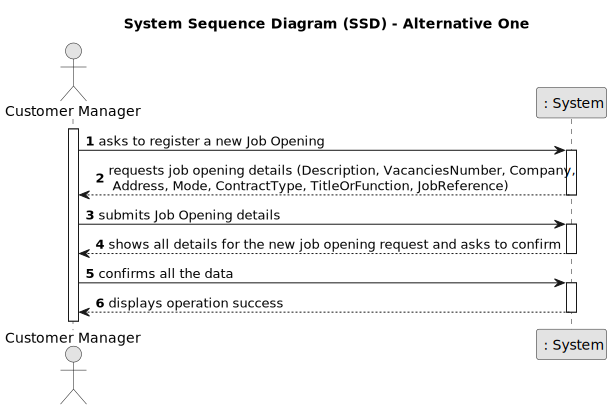
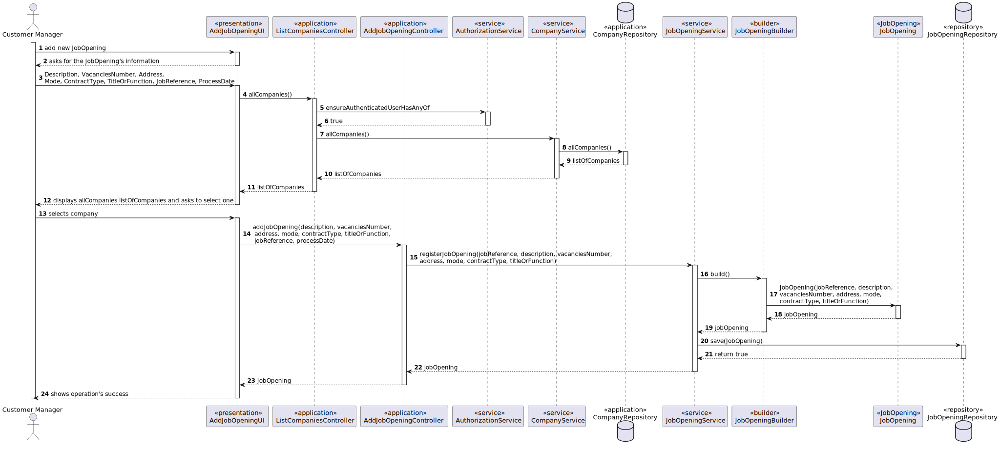
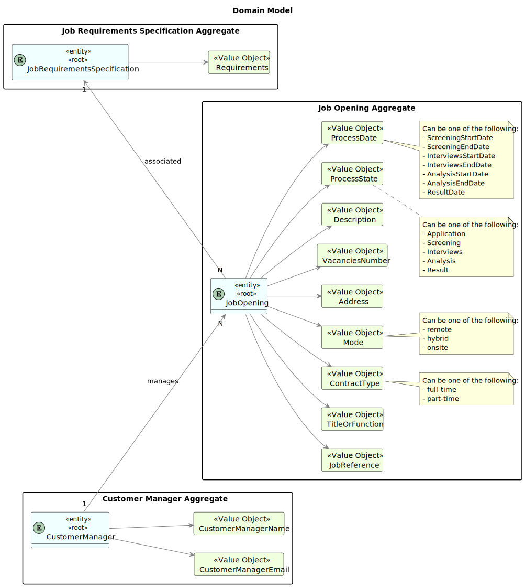
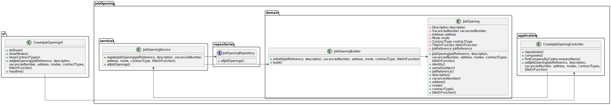

# 1002 - As Customer Manager, I want to register a job opening.

--------

## 1.1. User Story Description

As Customer Manager, I want to register a job opening.

## 1.3. Acceptance Criteria

* The system must be able to:

  * display the modes available
  * display the contract type available
  * display companies

## 1.4. Found out Dependencies

  None

## 1.5 Input and Output Data

* Input Data:

      - Selection of Job Opening.
      - modes 
      - contract
      - companies
      - Data Confirmation.

* Output Data:

      - List of all job openings registered in the system
      - Chosen details
      - (In)Success of the operation

## 1.6. System Sequence Diagram (SSD)

## 1.7. System Diagram (SD)

## 1.8 Other Relevant Remarks

None to specify

## 2.0. Domain Model

----------------

### 2.1. Relevant Domain Model Excerpt

### 2.2. Entities and Aggregates

Entities represent distinct objects with unique identities and lifecycles within the domain. Aggregates are clusters of associated entities and value objects that are treated as a unit for data changes.

* Job Opening

      Represents job openings created by customers.

* CustomerManager:

      Represents employees of the Jobs4U company who manage relationships with customer entities. Customer Managers are responsible for registering job openings, setting up recruitment processes, and overseeing the selection of candidates for their assigned customers.

* Process

        Represents the different stages in which a job offer can be found.

## 3.0. Class Diagram

------------------

### 3.1. Relevant Class Diagram Excerpt

