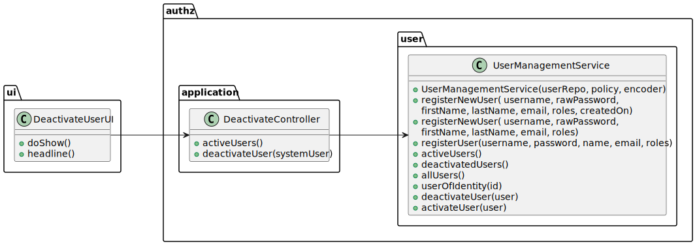

# 1000 - be able to register, disable/enable, and list users of the backoffice.
--------

## 1.1. User Story Description

As Administrator, I want to be able to register, disable/enable, and list users of the backoffice.

## 1.2. Customer Specifications and Clarifications

### From the specifications document:

### From the client clarifications:

## 1.3. Acceptance Criteria

* The system must be able to:

  * display the backoffice users activated
  * select the users to deactivate

## 1.4. Found out Dependencies

  None

## 1.5 Input and Output Data

* Input Data:

      - Selection of user

* Output Data:

      - List of all users activated

      - (In)Success of the operation

## 1.6. System Sequence Diagram (SSD)

## 1.7. Sequence Diagram (SD)

## 1.8 Other Relevant Remarks

None to specify

## 2.0. Domain Model

----------------

### 2.1. Relevant Domain Model Excerpt

### 2.2. Entities and Aggregates

Entities represent distinct objects with unique identities and lifecycles within the domain. Aggregates are clusters of associated entities and value objects that are treated as a unit for data changes.

* Admin:

      Represents employees of the Jobs4U company who manage relationships with user entities. 
* User

        Represents all the users that are registered in the system.

## 3.0. Class Diagram

------------------

### 3.1. Relevant Class Diagram Excerpt

