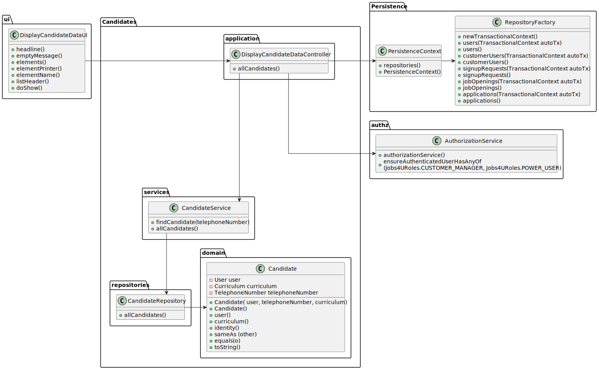

# Display all personal data of a candidate

================================================================================================

## 1. Requirements Engineering

### 1.1. User Story Description

As Customer Manager, I want to display all the personal data of a candidate.

### 1.2. Customer Specifications and Clarifications 

**From the specifications document:**

> The candidate's details consists in the name, phone number, email and curriculum of a candidate.

**From the client clarifications:**

> Q42 Bernado – US1006, Qual a informação do nome do candidato deve aparecer (nome completo, primeiro e ultimo nome , etc)?
 A42. À partida diria que seria o nome, tal como foi recebido na application que fez (página 6, “name of the candidate”)

>Q75 Silva – US1006 – Em relação à listagem dos dados pessoais de um determinado candidato, um customer manager vai ter acesso a todos os candidatos do sistema ou apenas aos candidatos que submeteram uma application para uma job opening de um cliente que é gerido por esse customer manager?
A75. No contexto actual vamos assumir que o Customer Manager pode aceder (consultar) os dados pessoais de qualquer candidato.

### 1.3. Acceptance Criteria

* AC1: Just the candidate details.

### 1.4. Found out Dependencies

* There aren't any dependencies of other user stories.

### 1.5 Input and Output Data

**Input Data:**

* candidate

**Output Data:**

* The candidate's details consists in the name, phone number, email and curriculum of a candidate.

## 2. Design

### 2.1 System Sequence Diagram (SSD)

### 2.2 Sequence Diagram(SD)

### 2.3 Class Diagram(CD)

### 2.4 Applied patterns

- Controller
- Builder
- Repository
- Factory
- Persistence Context

## 3. Demonstration

## 4. Comments

The use case has been fully developed

