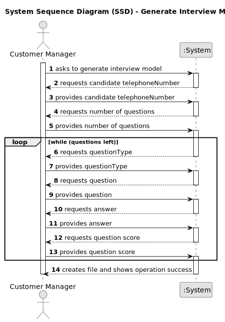
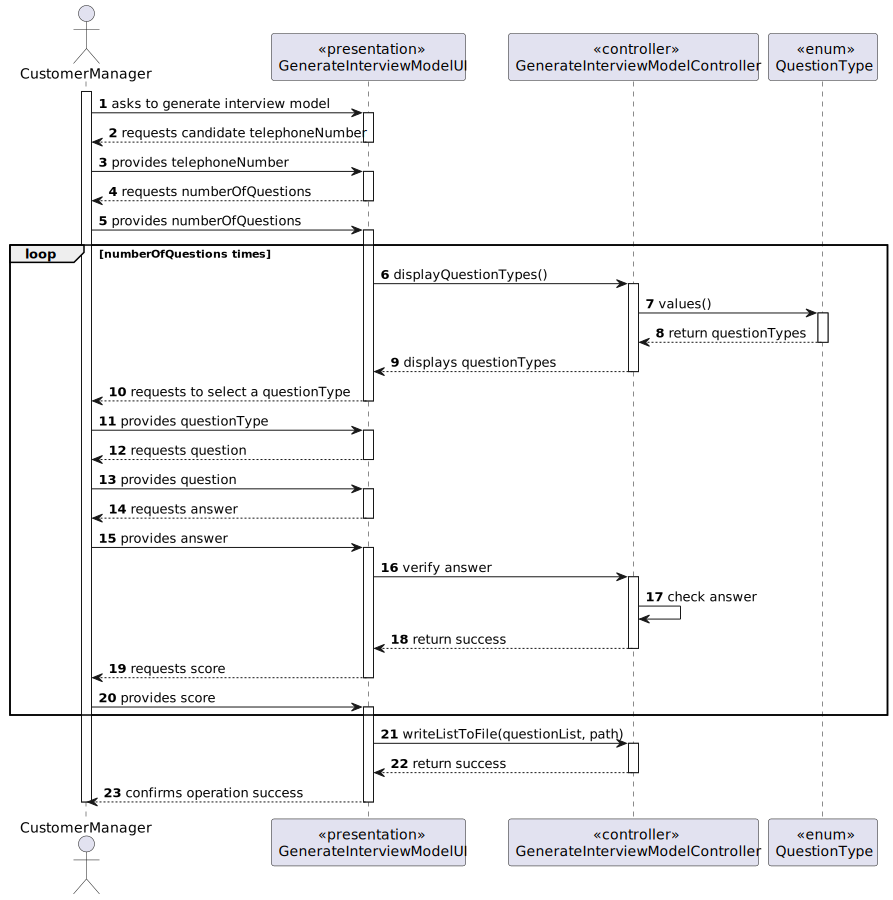
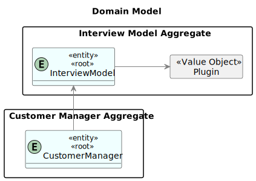
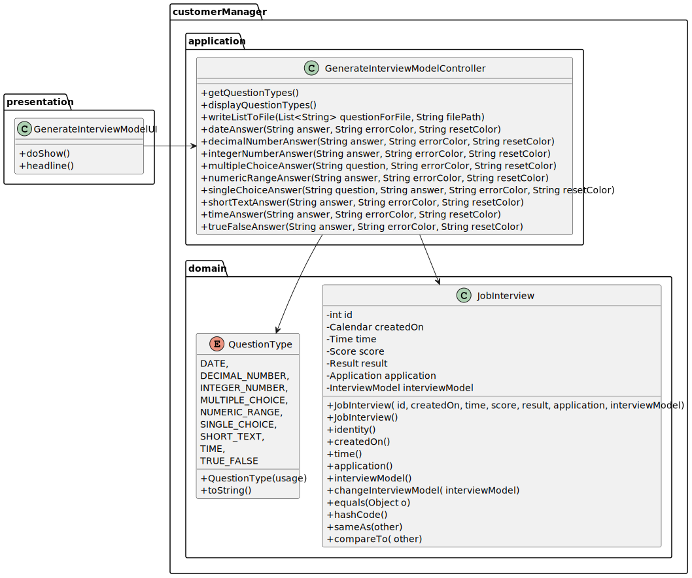

# Generate and export a template text file to help collect the candidate answers during the interviews.

--------

## 1. Requirements Engineering

### 1.1. User Story Descriptions.

As Customer Manager, I want to generate and export a template text file to help collect the candidate answers during the interviews.

### 1.2. Customer Specifications and Clarifications

**From the specifications document:**

**From the client clarifications:**

### 1.3. Acceptance Criteria

* None

### 1.4. Found out Dependencies

* 1008 - Deploy and configure a plugin (i.e., Job Requirement Specification or Interview Model) to be used by the system

### 1.5. Input and Output Data

**Input Data:**

**Output Data:**

    * Interview Template .txt file
    * (In)Success of the operation

### 1.6. System Sequence Diagram (SSD)

### 1.7. Sequence Diagram (SD)

### 1.8 Other Relevant Remarks

*  None to specify 

## 2. Analysis and Design

### 2.1. Domain Model

### 2.2. Class Diagram

## 3. Implementation

## 5. Demonstration