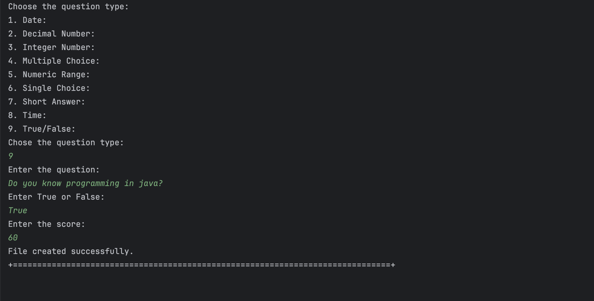

# Generate and export a template text file to help collect the candidate answers during the interviews.

--------

## 1. Requirements Engineering

### 1.1. User Story Descriptions.

As Customer Manager, I want to generate and export a template text file to help collect the candidate answers during the interviews.

### 1.2. Customer Specifications and Clarifications

**From the specifications document:**

> NFR09(LPROG):
> 
> Requirement Specifications and Interview Models The support
 for this functionality must follow technical requirements in LPROG.
 The ANTLR tool should be used (https://www.antlr.org/).

**From the client clarifications:**

> **Question 121:**
> 
> Perguntas para os plugins.- É possível esclarecer-nos se as perguntas a serem feitas para os Interview Models e os
Requirement Especifications são aquelas que estão no exemplo da documentação ou tem algum grupo de questões que gostaria 
que nós utiliza-se-mos?
> 
> **Answer:**
> O documento de especificação apresenta, como disse, exemplos. São apenas exemplos indicativos. Podem usar esses exemplos 
como casos de teste e como ponto de partida para definirem outros. Mas é suposto a solução suportar mais do que apenas os 
exemplos que estão no documento. Em qualquer dos plugins, o tipo de perguntas que deve ser suportado é o que está apresentado 
na página 8 do documento. Como product onwer eu gostaria que uma demonstração funcional do sistema incluísse pelo menos 2 
plugins de cada tipo, para se poder demonstrar, minimamente, o suporte para mais do que um plugin usado (de cada tipo) em 
simultâneo. Deve ainda demonstrar o uso de todos os tipos de perguntas apresentados na página 8.

> **Question 125:**
>
> Devem ser registadas mais algum tipo de perguntas para a entrevista para além das que nos foram fornecidas no projeto?
> 
> **Answer:**
> Ver Q121.

### 1.3. Acceptance Criteria

* AC1 : The generated .txt file must be accepted by the ANTLR4 grammar implemented in 1008.

### 1.4. Found out Dependencies

* 1008 - Deploy and configure a plugin (i.e., Job Requirement Specification or Interview Model) to be used by the system

### 1.5. Input and Output Data

**Input Data:**

    * Telephone number of the candidate
    * Number of questions
    * Question type
    * Question
    * Answer
    * Score

**Output Data:**

    * Interview Template .txt file
    * (In)Success of the operation

### 1.6. System Sequence Diagram (SSD)


### 1.7. Sequence Diagram (SD)


### 1.8 Other Relevant Remarks

*  None to specify 

## 2. Analysis and Design

### 2.1. Domain Model


### 2.2. Class Diagram


## 3. Implementation

Implementation of the main method of the UI class that allows the user to generate the interview model template file:

```java
    protected boolean doShow() {
            String ERROR_COLOR = ConsoleColors.RED;
            String RESET_COLOR = ConsoleColors.RESET;
    
            String telephoneNumber = Console.readLine("Enter the telephone number of the candidate: ");
    
            int questions = Console.readInteger("Enter the number of questions you want in the template file: ");
            int totalScore = 0;
    
            List<String> questionForFile = new ArrayList<>();
            String title = "# Questions:";
            questionForFile.add(title);
    
            while (questions > 0) {
                theController.displayQuestionTypes();
                int questionType = Console.readInteger("Chose the question type: ");
                String question = Console.readLine("Enter the question: ");
    
                String answer = "";
                switch (questionType) {
                    case 1: // DATE
                        answer = theController.dateAnswer(answer, ERROR_COLOR, RESET_COLOR);
                        break;
                    case 2: // DECIMAL_NUMBER
                        answer = theController.decimalNumberAnswer(answer, ERROR_COLOR, RESET_COLOR);
                        break;
                    case 3: // INTEGER_NUMBER
                        answer = theController.integerNumberAnswer(answer, ERROR_COLOR, RESET_COLOR);
                        break;
                    case 4: // MULTIPLE_CHOICE
                        answer = theController.multipleChoiceAnswer(question, ERROR_COLOR, RESET_COLOR);
                        break;
                    case 5: // NUMERIC_RANGE
                        answer = theController.numericRangeAnswer(answer, ERROR_COLOR, RESET_COLOR);
                        break;
                    case 6: // SINGLE_CHOICE
                        answer = theController.singleChoiceAnswer(question, answer, ERROR_COLOR, RESET_COLOR);
                        break;
                    case 7: // SHORT_TEXT
                        answer = theController.shortTextAnswer(answer, ERROR_COLOR, RESET_COLOR);
                        break;
                    case 8: // TIME
                        answer = theController.timeAnswer(answer, ERROR_COLOR, RESET_COLOR);
                        break;
                    case 9: // TRUE_FALSE
                        answer = theController.trueFalseAnswer(answer, ERROR_COLOR, RESET_COLOR);
                        break;
                }
    
                int score = Console.readInteger("Enter the score: ");
                totalScore += score;
    
                String endProduct = "-> " + QuestionType.values()[questionType - 1] + "<" + question + "> " + answer + " " + score + "%";
                questionForFile.add(endProduct);
                questions--;
            }
    
            if (totalScore != 100) {
                System.out.println(ERROR_COLOR + "The total score of the questions is not 100%. Please review the questions." + RESET_COLOR);
                return false;
            }
    
            String fileName = telephoneNumber + "-InterviewModel";
            theController.writeListToFile(questionForFile, "jobs4u.core/src/main/resources/interviewModels/" + fileName + ".txt");
    
            return true;
        }
````

## 4. Testing

All inputs in this use case are verified and will throw exceptions if the user does not provide the correct input. Other tests for this use case are:

```java
    @Test
    void testGetQuestionTypes() {
        List<String> questionTypes = controller.getQuestionTypes();
        assertNotNull(questionTypes);
        assertEquals(QuestionType.values().length, questionTypes.size());
    }
````

## 5. Demonstration





