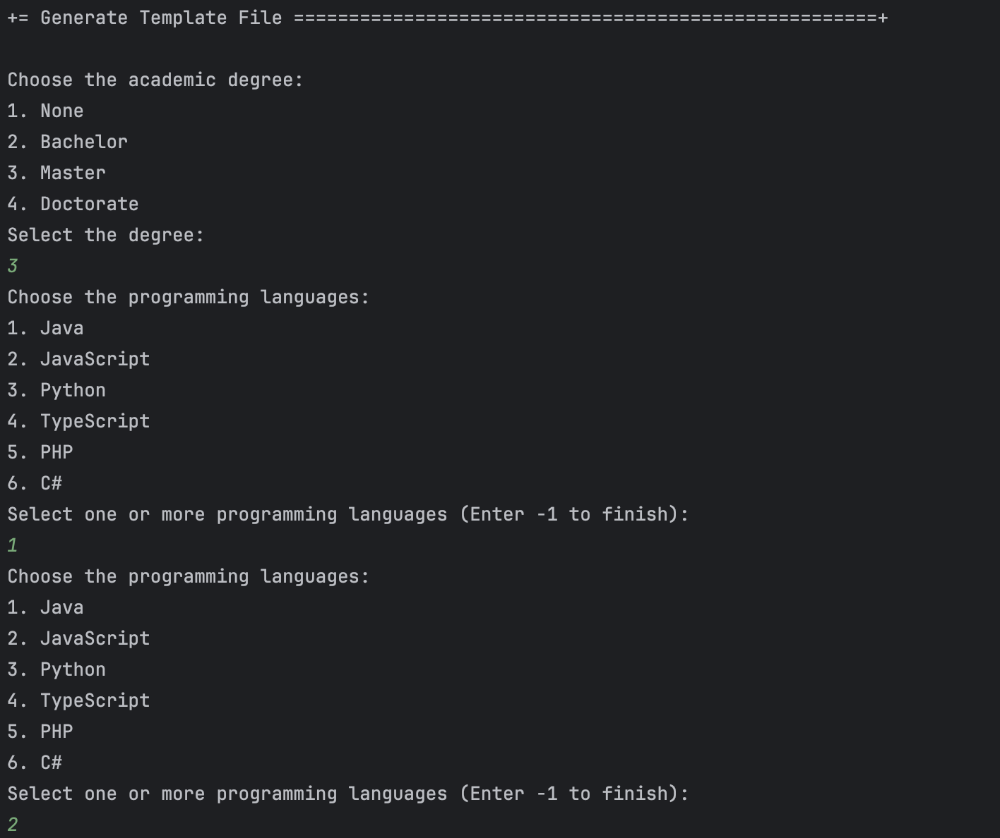

# Want to generate and export a template text file to help collect data fields for candidates of a job opening

================================================================================================

## 1. Requirements Engineering

### 1.1. User Story Description

As Operator, I want to generate and export a template text file to help collect data fields for candidates of a job opening (so the data is used to verify the requirements of the job opening)

### 1.2. Customer Specifications and Clarifications

**From the specifications document:**

> A job requirement specification module should:
>• Generate a template text file with the requirements to be evaluated and the possible
answers for each requirement
>• Evaluate if a text file with the requirements for a particular candidate is syntactically
correct
>• Evaluate a text file with the requirements for a particular candidate and provide the
result, approved or rejected, and in case of rejection, include justification

**From the client clarifications:**

> Q102 Daniela – US2003 – Quem vai preencher as respostas no ficheiro template?
A102 Será o Operador e, no âmbito da US2004, este submete o ficheiro já preenchido no sistema.

### 1.3. Acceptance Criteria

* None

### 1.4. Found out Dependencies

* This uc depends on uc1008.

### 1.5 Input and Output Data

**Input Data:**

* Degree
* Programming Languages
* Experience

**Output Data:**

* text file

## 2. Design

### 2.1 System Sequence Diagram (SSD)

### 2.2 Sequence Diagram(SD)

### 2.3 Class Diagram(CD)

### 2.4 Applied patterns

- Controller

## 3. Implementation

## 4. Comments

