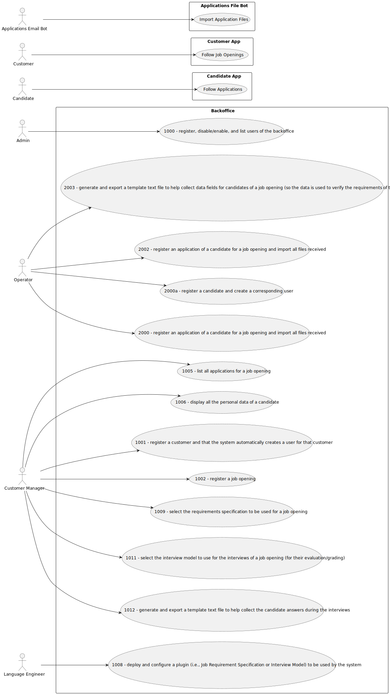

# Use Case Diagram (UCD)

**In the scope of this project, there is a direct relationship of _1 to 1_ between Use Cases (UC) and User Stories (US).**

However, be aware, this is a pedagogical simplification. On further projects and course units there may also exist _1 to N **and/or** N to 1_ relationships between UC and US.

**Insert below the Use Case Diagram in a SVG format**

**For each UC/US, it must be provided evidences of applying main activities of the software development process (requirements, analysis, design, tests and code). Gather those evidences on a separate file for each UC/US and set up a link as suggested below.**

# Use Cases / User Stories

| UC/US | Description                                                            |                   
|:-----:|:-----------------------------------------------------------------------|
| US01  | to register skills that may be appointed to a collaborator.            |
| US02  | to register a job.                                                     |
| US03  | to register a collaborator with a job and fundamental characteristics. |
| US04  | to assign one or more skills to a collaborator.                        |
| US05  | to generate a team proposal automatically.                             |
| US06  | to register a vehicle                                                  |
| US07  | to register a vehicle’s check-up.                                      |
| US08  | to list the vehicles needing the check-up.                             |

