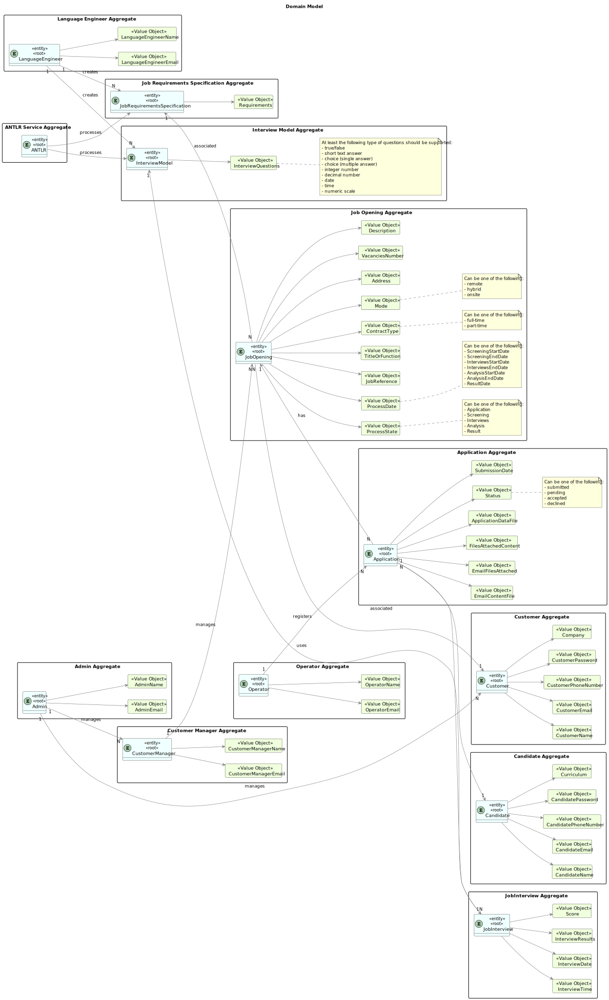

# G006 - Domain Model elaboration using DDD

-----------------------------------------------------------------------------------------------------------------------------------------

## Overview

This README contains the Domain Model for the Jobs4U project. The Domain Model represents the essential concepts, entities, aggregates, and their relationships within the project's domain.

## Introduction

The domain model serves as a conceptual blueprint of the project's domain. It helps to understand the key entities, their attributes, and relationships, facilitating effective communication and development.

## Project Structure

The domain model is structured using UML notation. It consists of entities, aggregates, value objects, and associations between them.

## Entities and Aggregates

Entities represent distinct objects with unique identities and lifecycles within the domain. Aggregates are clusters of associated entities and value objects that are treated as a unit for data changes.

- Customer

      Represents entities (other companies or entities) that need to recruit human resources.

- Candidate

      Represents individuals applying for job openings.

- Job Opening

      Represents job openings created by customers.

- Application

      Represents job applications submitted by candidates.

- Job Interview

      Represents interviews conducted for job candidates.

- Language Engineer

      Represents a software engineer specializing in language processing, responsible for designing and implementing modules for processing job requirements specifications and interview models.

- JobRequirementsSpecification

      Represents a set of application requirements that candidates must meet for a specific job opening. These specifications are designed and implemented by Language Engineers and used in the candidate screening process.

- ANTLR

      Represents a service or tool used for processing and parsing job requirements specifications and interview models. It assists in automating the evaluation of candidate applications and interviews. 

- InterviewModel

      Represents a predefined sequence of questions used for conducting job interviews. These models are designed and implemented by Language Engineers and are used to assess candidate qualifications during the interview process.

- Admin

      Represents system administrators responsible for managing customer entities and system users. Admins oversee the registration of entities, assignment of roles, and general system management tasks.

- CustomerManager: 

      Represents employees of the Jobs4U company who manage relationships with customer entities. Customer Managers are responsible for registering job openings, setting up recruitment processes, and overseeing the selection of candidates for their assigned customers.

- Operator

      Represents employees responsible for monitoring and managing the automated processes within the talent acquisition system. Operators oversee the processing of candidate applications, handle exceptions, and ensure the smooth operation of the system.

## Value Objects

Value objects are immutable objects that represent attributes or characteristics within the domain. They do not have a unique identity and are defined by their attributes.

Score

InterviewResults

InterviewDate

InterviewTime

Curriculum

CandidatePassword

CandidatePhoneNumber

CandidateEmail

CandidateName

Company

CustomerPassword

CustomerPhoneNumber

CustomerEmail

CustomerName

Status

SubmissionDate

Rank

EmailContentFile

EmailFilesAttached

FilesAttachedContent

ApplicationDataFile

Description

VacanciesNumber

Address

Mode

ContractType

TitleOrFunction

JobReference

ProcessDate

ProcessState

InterviewQuestions

Requirements

LanguageEngineerEmail

LanguageEngineerName

AdminName

AdminEmail

CustomerManagerName

CustomerManagerEmail

OperatorName

OperatorEmail

## Associations

Associations represent relationships between entities, aggregates, and value objects within the domain. They define how objects are connected and interact with each other.

JobInterview --> InterviewModel

JobOpening -->  Customer

JobOpening --> JobRequirementSpecifications

Application --> Candidate

Application --> JobOpening

Application --> JobInterview

Admin --> Customer

Admin --> CustomerManager

CustomerManager --> JobOpening

Operator --> Application

LanguageEngineer --> JobRequirementsSpecification

LanguageEngineer -->  InterviewModel

ANTLR --> JobRequirementsSpecification

ANTLR --> InterviewModel

## Domain Model

