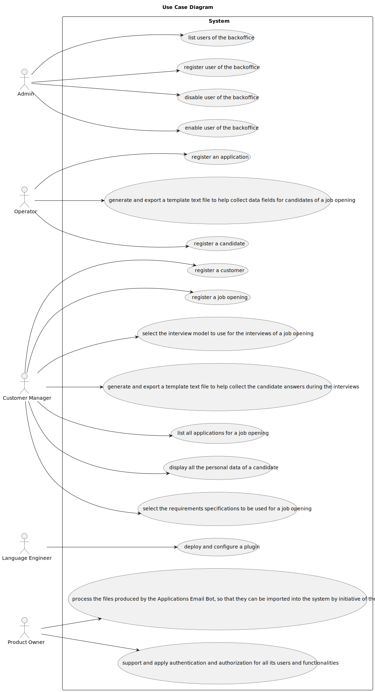
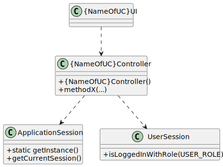

# Sprint B

--------------------------------------------------------------------------

## 1. Use Cases

---------------------------------------------------------------------------

### 1.1. Use Case Diagram

### 1.2. Use Cases/User Stories

| **UC/US** | **Description**   |
|:---------:|:------------------|
|   1000    |                   |
|   1001    | [1001](..%2F1001) |
|   1002    | [1002](..%2F1002) |
|   2000a   |                   |
|   2001    | [2001](..%2F2001) |
|   2002    | [2002](..%2F2002) |
|   1005    |                   |
|   1006    | [1006](..%2F1006) |
|   1008    | [1008](..%2F1008) |
|   1009    | [1009](..%2F1009) |
|   1011    |                   |
|   1012    |                   |
|   2003    |                   |

## 2. Domain Model

-----------------------------------------------------------------------

The Domain Model represents the essential concepts, entities, aggregates, and their relationships within the project's domain.

### 2.1. Introduction

The domain model serves as a conceptual blueprint of the project's domain. It helps to understand the key entities, their attributes, and relationships, facilitating effective communication and development.

### 2.2. Project Structure

The domain model is structured using UML notation. It consists of entities, aggregates, value objects, and associations between them.

### 2.3. Entities and Aggregates

Entities represent distinct objects with unique identities and lifecycles within the domain. Aggregates are clusters of associated entities and value objects that are treated as a unit for data changes.

* Customer

      Represents entities (other companies or entities) that need to recruit human resources.

* Candidate

      Represents individuals applying for job openings.

* Job Opening

      Represents job openings created by customers.

* Application

      Represents job applications submitted by candidates.

* Job Interview

      Represents interviews conducted for job candidates.

* Language Engineer

      Represents a software engineer specializing in language processing, responsible for designing and implementing modules for processing job requirements specifications and interview models.

* JobRequirementsSpecification

      Represents a set of application requirements that candidates must meet for a specific job opening. These specifications are designed and implemented by Language Engineers and used in the candidate screening process.

* ANTLR

      Represents a service or tool used for processing and parsing job requirements specifications and interview models. It assists in automating the evaluation of candidate applications and interviews.

* InterviewModel

      Represents a predefined sequence of questions used for conducting job interviews. These models are designed and implemented by Language Engineers and are used to assess candidate qualifications during the interview process.

* Admin

      Represents system administrators responsible for managing customer entities and system users. Admins oversee the registration of entities, assignment of roles, and general system management tasks.

* CustomerManager

      Represents employees of the Jobs4U company who manage relationships with customer entities. Customer Managers are responsible for registering job openings, setting up recruitment processes, and overseeing the selection of candidates for their assigned customers.

* Operator

      Represents employees responsible for monitoring and managing the automated processes within the talent acquisition system. Operators oversee the processing of candidate applications, handle exceptions, and ensure the smooth operation of the system.

* User

        Represents all the users that are registered in the system.

* Process

        Represents the different stages in which a job offer can be found.

### 2.4. Associations

Associations represent relationships between entities, aggregates, and value objects within the domain. They define how objects are connected and interact with each other.

Application "N" --> "1" JobOpening : has

JobOpening "N" ---> "1" Customer : associated

JobOpening "1" --> "N" Process

Application "N" ---> "1" Candidate

Application "1" ---> "1" JobInterview

JobOpening "N" ---> "1"JobRequirementsSpecification

Admin "1" ---> "N" Customer : manages

Admin "1" ---> "N" CustomerManager : manages

CustomerManager "1" ---> "N" JobOpening : manages

Operator "1" ---> "N" Application : registers

LanguageEngineer "1" ---> "N" JobRequirementsSpecification : creates

LanguageEngineer "1" ---> "N" InterviewModel : creates

JobInterview "N" ---> "1" : uses

ANTLR ---> JobRequirementsSpecification : processes

ANTLR ---> InterviewModel : processes

Admin ---> User

CustomerManager ---> User

Operator --> User

LanguageEngineer ---> "1" User

Customer ---> User

Candidate --> User

### 2.5. Domain Model

## 3. Class Diagram

----------------------------------------------------------------------

## 4. Glossary

----------------------------------------------------------------------

[glossary.md](glossary.md)

## 5. Supplementary Specification

-----------------------------------------------------------------------

[supplementary-specification.md](supplementary-specification.md)