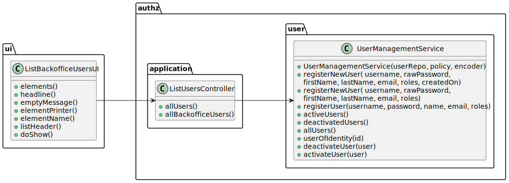

# 1000 - be able to register, disable/enable, and list users of the backoffice.
--------

## 1.1. User Story Description

As Administrator, I want to be able to register, disable/enable, and list users of the backoffice.

## 1.2. Customer Specifications and Clarifications

### From the client clarifications:

## 1.3. Acceptance Criteria

## 1.4. Found out Dependencies

* 1002 - As Customer Manager, I want to register a job opening.

## 1.5 Input and Output Data

* Input Data:

      - Selection of Job Opening.
      - Selection of Requirement Specification.
      - Data Confirmation.

* Output Data:

      - List of all job openings registered in the system
      - List of all requirement specification registered in the system
      - Chosen details
      - (In)Success of the operation

## 1.6. System Sequence Diagram (SSD)

## 1.7. Sequence Diagram (SD)

## 1.8 Other Relevant Remarks

None to specify

## 2.0. Domain Model

----------------

### 2.1. Relevant Domain Model Excerpt

## 3.0. Class Diagram

------------------

### 3.1. Relevant Class Diagram Excerpt

