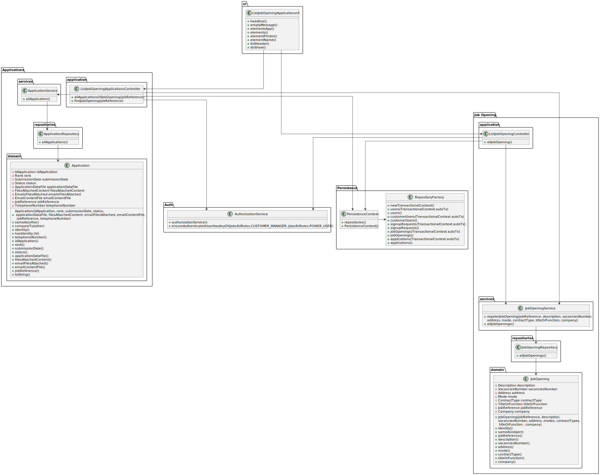

# List all applications for a job opening

================================================================================================

## 1. Requirements Engineering

### 1.1. User Story Description

As Customer Manager, I want to list all applications for a job opening.

### 1.2. Customer Specifications and Clarifications 

**From the specifications document:**

**From the client clarifications:**

>Q63 Gonçalves –US1005. Relativamente aos critérios para a listagem das candidaturas: Devem aparecer candidaturas que estão a decorrer ou podem aparecer candidaturas feitas no passado? Podem aparecer quaisquer candidaturas ou apenas as que tenham sido aceites? Que informação deverá ser mostrada em cada candidatura?
A63. Tal como refere a descrição da US, devem ser listadas todas as candidaturas para um job opening. Faz sentido mostrar todas as candidaturas, independentemente do seu estado. Assim, para cada cada candidatura deve ser identificado o candidato e o estado da sua candidatura.

### 1.3. Acceptance Criteria

* None

### 1.4. Found out Dependencies

* There aren't any dependencies of other user stories.

### 1.5 Input and Output Data

**Input Data:**

* job opening

**Output Data:**

* All applications of the selected job opening.

## 2. Design

### 2.1 System Sequence Diagram (SSD)

### 2.2 Sequence Diagram (SD)

### 2.3 Class Diagram (CD)

### 2.4 Applied patterns

- Controller
- Builder
- Repository
- Factory
- Persistence Context

## 3. Implementation

## 4. Comments

