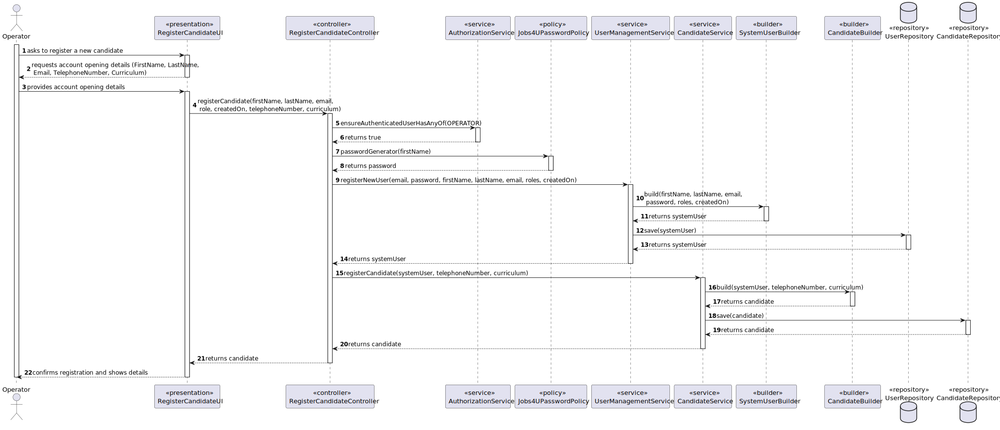
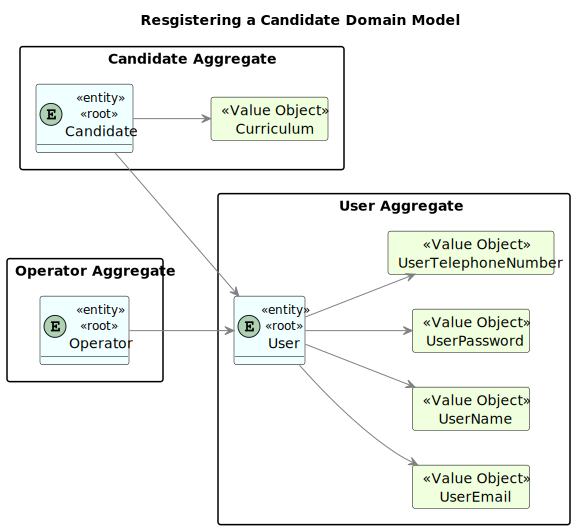
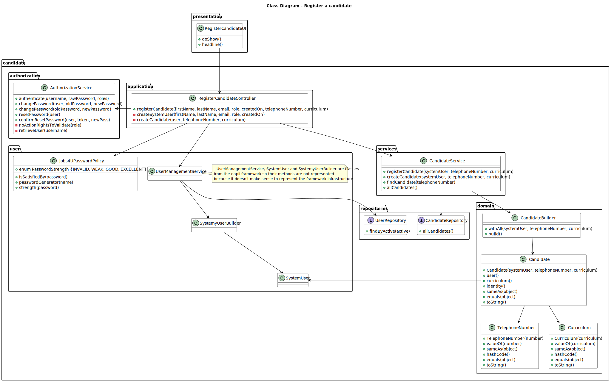
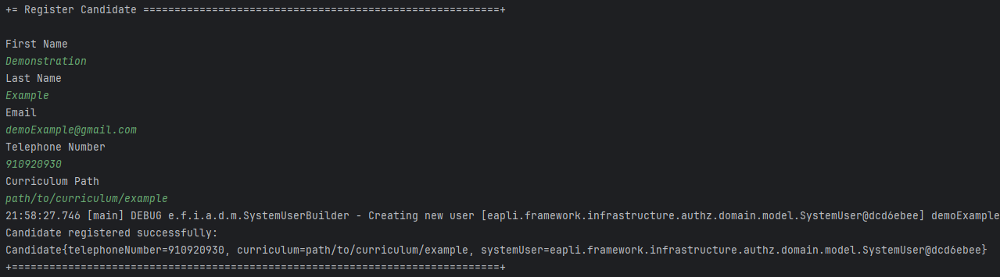
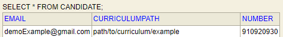

# Registering a candidate and creating a corresponding user.

--------

## 1. Requirements Engineering

### 1.1. User Story Description

As Operator, I want to register a candidate and create a corresponding user.

### 1.2. Customer Specifications and Clarifications

**From the specifications document:**

> After the candidate is registered, the created user needs to be able to use the Candidate App.

**From the client clarifications:**

> **Question 11:**
> 
> No enunciado não está explicita a informação a recolher para os Customers? Qual a informação necessária? E quanto 
aos funcionários da empresa?
> 
> **Answer:**
> De facto isso não está explicito. No entanto, são referidos no nome da empresa e o seu endereço no âmbito de um job opening.
Quanto aos utilizadores (representante da empresa que acede à Customer App) eu diria que serão dados similares ao do Candidate. 
Quando aos funcionários da empresa, eu diria que é importante garantir que é usado o email para identificar qualquer utilizador 
do sistema. Penso que será importante para cada utilizador termos o nome completo assim como um short user name (que deverá ser 
único). O Product Owner reconsiderou e decidiu que o short user name é dispensável uma vez que para autenticação dos utilizadores 
se deve usar apenas o email e a password.

> **Question 19:**
> 
> Na criação de um utilizador no sistema o nome é definido pelo utilizador ou é o nome da pessoa (primeiro e último) e se 
a password é definida pelo utilizador ou gerada pelo sistema?
>
> **Answer:**
> No âmbito da US 2000a o Operator cria utilizadores do sistema para candidatos que ainda não estejam no sistema. Tem de 
fazer isso com base nos dados recebidos na candidatura (que incluem email e nome). O email servirá para identificar a 
pessoa. Neste contexto é necessário ter uma password para esse novo utilizador. Uma vez que essa informação não é 
transmitida pelo candidato, suponho que a solução mais “aconselhada” será o sistema gerar uma password para esse utilizador. 
Como o utilizador/candidato irá receber essa informação (a forma de autenticação na app) está out of scope, no sentido em 
que não existe nenhuma US que remete para isso. As US 1000 e 1001 também remetem para criação de utilizadores. Aqui, 
eventualmente poderia-se pensar em introduzir manualmente as passwords, mas pode ser pelo mesmo mecanismo de definition 
automática de password, descrito anteriormente. Relativamente ao nome ver novamente a Q11.

> **Question 54:**
>
> Regarding the US2000a requirement which states "As an Operator, I want to register a candidate and create a corresponding 
user," I would like to know how a candidate will be registered in the system, i.e., understand the processes for 
registering a candidate. Since the candidate has their name, email, and phone number, how should their username be 
formatted to avoid conflicts with other candidates' names? Additionally, how should the candidate be notified of their 
username and password?
> 
> **Answer:**
> There is no need for a username (See Q11). Regarding the password, I think the system can generate a unique password. 
> You may assume the candidate will be informed of his/her password by means that are outside the scope of what is to 
> be developed for this version of the system.

> **Question 57:** 
> 
> Quais as politicas de negócio para registar um candidato, quais as caracteristicas da password, email, telemóvel?
>
> **Answer:**
> Sobre o telemóvel, seguir o Q56. Sobre email, seria qualquer email válido. Sobre a password, podemos seguir algo como: 
ter no mínimo 8 caracteres, letras maiúsculas e minúsculas, dígitos e pelo menos, um caracter não alfanumérico.

> **Question 74:**
> 
> Relativamente ao registo dos candidatos, os dados devem ser inseridos manualmente ou importados do ficheiro com os dados do candidato?
> 
> **Answer:**
> Faz sentido que sejam importados do ficheiro, no âmbito da US2002. Eventualmente dar a possibilidade do utilizador fazer 
alterações, caso seja necessário. A US2000a refere-se a uma funcionalidade do Operador, manualmente, registar candidatos.

> **Question 78:**
> 
> The operator can register a candidate: does he put the info manually or has to be read of the file generated by the bot? 
This user will appear then in the backoffice...enable as default I think. Then the admin, can also register manually a 
candidate as the operator, did it? I don't understand at all the different between a registration of the candidate made by 
the admin or made by the operator.
> 
> **Answer:**
> See Q74. US2000a is for the Operator to manually register a candidate and his/her user in the system. US2002 is for import 
of the applications from the data in the files produced by the application file bot. If the candidate does not exist, it 
should be created. I think there is no registration of a candidate by the admin.

### 1.3. Acceptance Criteria

* AC1: Candidate Registration:
  
      The system should allow the Operator to initiate the registration process for a new candidate.
      
      Upon registration, the system should prompt the Operator to provide necessary information such as the candidate's first name, 
      last name, email, telephone number and curriculum.

* AC2: User Creation:
  
      Upon successful registration of a candidate, the system should automatically create a corresponding user account.
  
      The user account should include the essential details provided earlier.
  
      The system should generate a unique password for the candidate account.

### 1.4. Found out Dependencies

* G007 - As a Project Manager, I want the system to support and apply authentication and authorization for all its users and functionalities.

### 1.5. Input and Output Data

**Input Data:**

    * First Name
    * Last Name
    * Email
    * Telephone Number
    * Curriculum

**Output Data:**

    * (In)Success of the operation

### 1.6. System Sequence Diagram (SSD)


### 1.7. Sequence Diagram (SD)


### 1.8 Other Relevant Remarks

*  None to specify 

## 2. Analysis and Design

The .md file is followed by a Class Diagram and a Sequence Diagram, with the purpose of illustrating the design decisions.

### 2.1. Domain Model


### 2.2. Class Diagram


## 3. Implementation

The implementation of this use case is centered around the creation of a new Candidate entity. The Candidate entity is responsible for encapsulating the candidate's information, such as their curriculum, telephone number, and system user. 
The Candidate entity is also responsible for managing the candidate's identity, which is represented by their telephone number.

````java
  /**
   * Represents a candidate entity in the system.
   *
   * @author Miguel Cardoso
   */
  @Entity
  @Table(name = "CANDIDATE")
  public class Candidate implements AggregateRoot<TelephoneNumber> {
      @EmbeddedId
      @Column(name = "TELEPHONE_NUMBER")
      private TelephoneNumber telephoneNumber;
  
      @Column(name = "CURRICULUM")
      private Curriculum curriculum;
  
      @OneToOne
      @JoinColumn(name = "EMAIL")
      private SystemUser systemUser;
  
      /**
       * Constructs a new Candidate object with the specified user, telephone number, and curriculum.
       *
       * @param user            The system user associated with the candidate.
       * @param telephoneNumber The telephone number of the candidate.
       * @param curriculum      The curriculum of the candidate.
       */
      public Candidate(final SystemUser user, final TelephoneNumber telephoneNumber, final Curriculum curriculum) {
          Preconditions.nonNull(user);
          Preconditions.nonNull(telephoneNumber);
          Preconditions.nonNull(curriculum);
  
          this.systemUser = user;
          this.telephoneNumber = telephoneNumber;
          this.curriculum = curriculum;
      }
  
      protected Candidate() {
          // for ORM only
      }
  
      /**
       * Retrieves the system user associated with this candidate.
       *
       * @return The system user.
       */
      public SystemUser user() {
          return this.systemUser;
      }
  
      /**
       * Retrieves the curriculum of this candidate.
       *
       * @return The curriculum.
       */
      public Curriculum curriculum() {
          return this.curriculum;
      }
  
      /**
       * Retrieves the identity of this candidate, which is represented by their telephone number.
       *
       * @return The telephone number representing the identity of this candidate.
       */
      @Override
      public TelephoneNumber identity() {
          return telephoneNumber;
      }
  
      /**
       * Checks if this candidate is equal to another object.
       *
       * @param other The object to compare.
       * @return True if the objects are equal, false otherwise.
       */
      @Override
      public boolean sameAs(Object other) {
          if (this == other) {
              return true;
          }
          if (other == null || getClass() != other.getClass()) {
              return false;
          }
          final Candidate candidate = (Candidate) other;
          return telephoneNumber.equals(candidate.telephoneNumber) && curriculum.equals(candidate.curriculum);
      }
  
      /**
       * Checks if this candidate is equal to another object.
       *
       * @param o The object to compare.
       * @return True if the objects are equal, false otherwise.
       */
      @Override
      public boolean equals(Object o) {
          if (this == o) {
              return true;
          }
          if (o == null || getClass() != o.getClass()) {
              return false;
          }
  
          Candidate that = (Candidate) o;
  
          return telephoneNumber.equals(that.telephoneNumber) && curriculum.equals(that.curriculum);
      }
  
      /**
       * Returns a string representation of this candidate.
       *
       * @return A string representation of this candidate.
       */
      @Override
      public String toString() {
          return "Candidate{" +
                  "telephoneNumber=" + telephoneNumber +
                  ", curriculum=" + curriculum +
                  ", systemUser=" + systemUser.toString() +
                  '}';
      }
  }
````

## 4. Testing

We made several tests for the domain classes used mainly in this use case. Here are some examples of them:

```java
    @Test
    public void testTelephoneNumberCreation_ValidNumber() {
        String phoneNumber = "123456789";

        TelephoneNumber telephoneNumber = new TelephoneNumber(phoneNumber);

        assertEquals(phoneNumber, telephoneNumber.toString());
    }

    @Test
    public void testTelephoneNumberCreation_NullNumber() {
        assertThrows(IllegalArgumentException.class, () -> new TelephoneNumber(null));
    }

    @Test
    public void testTelephoneNumberCreation_EmptyNumber() {
        assertThrows(IllegalArgumentException.class, () -> new TelephoneNumber(""));
    }

    @Test
    public void testTelephoneNumberEquality_SameNumber() {
        String phoneNumber = "123456789";
        TelephoneNumber telephoneNumber1 = new TelephoneNumber(phoneNumber);
        TelephoneNumber telephoneNumber2 = new TelephoneNumber(phoneNumber);

        assertEquals(telephoneNumber1, telephoneNumber2);
    }

    @Test
    public void testTelephoneNumberEquality_DifferentNumber() {
        TelephoneNumber telephoneNumber1 = new TelephoneNumber("123456789");
        TelephoneNumber telephoneNumber2 = new TelephoneNumber("987654321");

        assertNotEquals(telephoneNumber1, telephoneNumber2);
    }
```

## 5. Demonstration


Once the candidate is registered and the user is created, the system will display a success message.
We can then check the database to verify that the candidate was successfully created.

