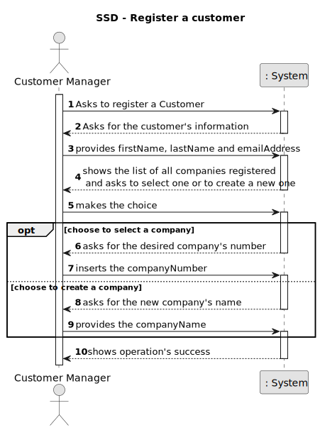
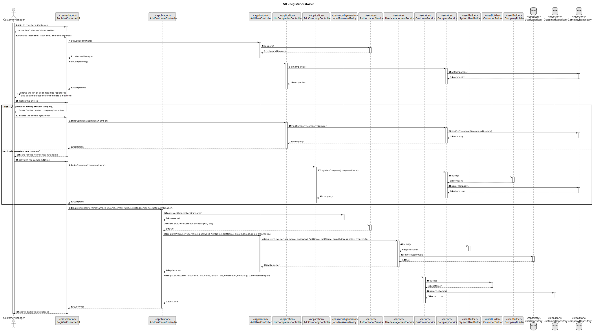
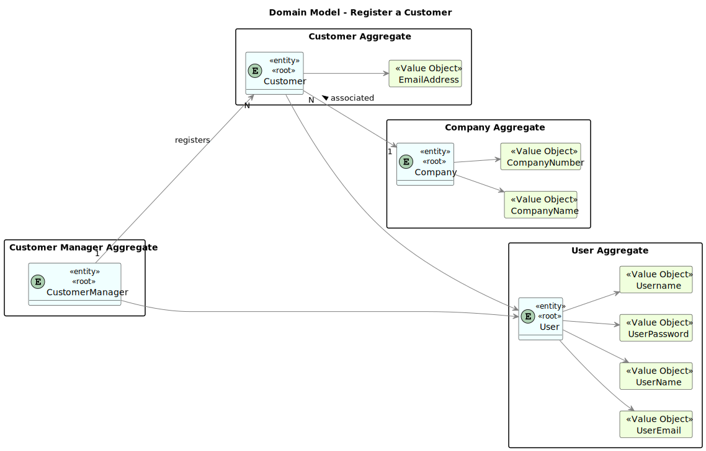
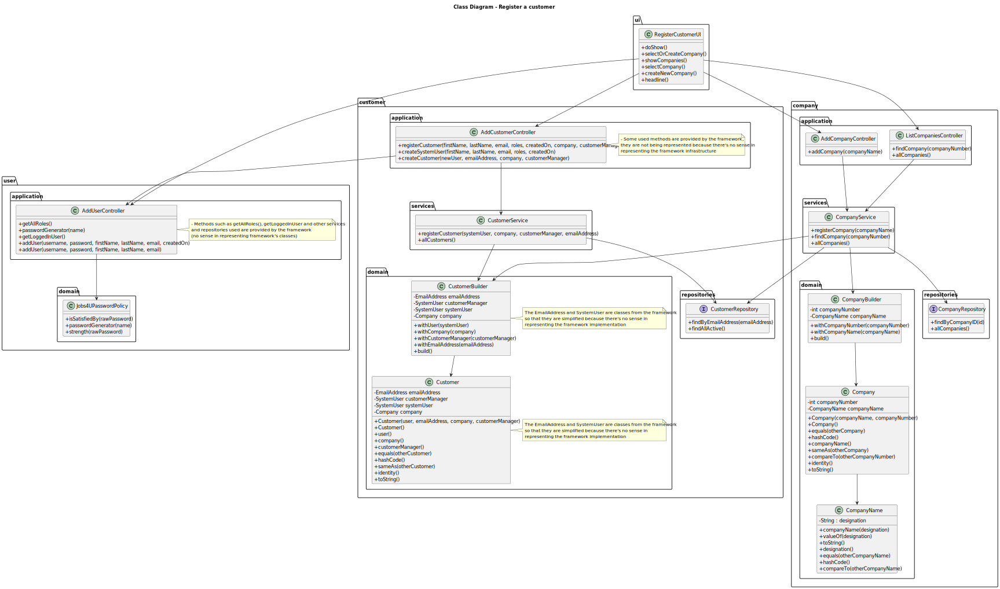
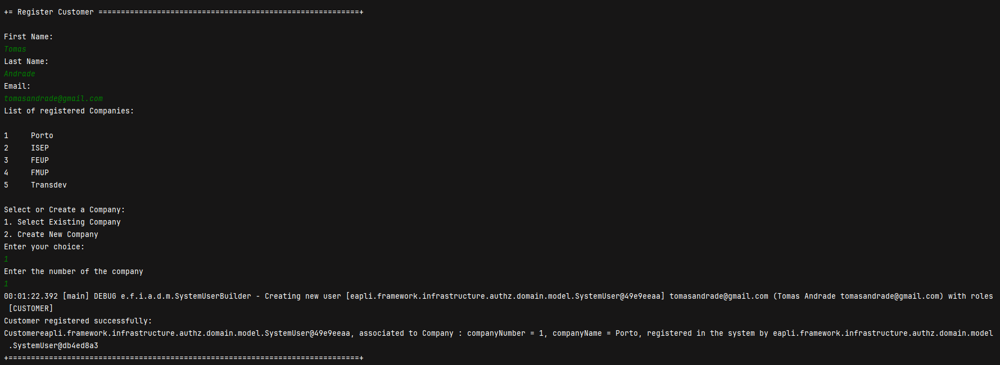

# Register a customer and that the system automatically creates a user for that customer

--------

## 1. Requirements

"As Customer Manager I want to register a customer and that the system automatically creates a user for that customer"

### 1.1. Customer Specifications and Clarifications

#### From the specifications document:

    As Customer Manager I want to register a customer and that the system automatically creates a user for that customer.
    Alternatively this can be achieved by a bootstrap process.

#### From the client clarifications:

* Question:

      19. Na criação de um utilizador no sistema o nome é definido pelo utilizador ou é o nome da pessoa (primeiro e último) e se a password é definida pelo utilizador ou gerada pelo sistema?

* Answer:

      19. No âmbito da US 2000a o Operator cria utilizadores do sistema para candidatos que ainda não estejam no sistema. Tem de fazer isso com base nos dados recebidos na candidatura (que incluem email e nome). O email servirá para identificar a pessoa. Neste contexto é necessário ter uma password para esse novo utilizador. Uma vez que essa informação não é transmitida pelo candidato, suponho que a solução mais “aconselhada” será o sistema gerar uma password para esse utilizador. Como o utilizador/candidato irá receber essa informação (a forma de autenticação na app) está out of scope, no sentido em que não existe nenhuma US que remete para isso. As US 1000 e 1001 também remetem para criação de utilizadores. Aqui, eventualmente poderia-se pensar em introduzir manualmente as passwords, mas pode ser pelo mesmo mecanismo de definição automática de password, descrito anteriormente.
  
* Question:

      81. When we register a customer... are we registering the data of the customer without the data of the user of the company who manage the app or both at the same time? Should we consider the posibility that the Customer User who manage the app changes and we should save the data of the old user too?
    
* Answer:

      81. For registering a customer see US1001.

* Question:

      104. A criação de uma conta para o customer é feita ao inserir manualmente o email e nome do customer ou é expectavel ter uma lista de customers não registados no sistema para usar?

* Answer:

      104. Não percebi bem o conceito de customers não registados. Penso que esse conceito não existe. A US 1001 indica que se pretende registar um customer. Ao registar-se o customer deve-se também criar um utilizador para que o customer possa aceder à App de customers.

* Question:

      111. Regras de negócio para endereço do customer- Quais são as regras de negócio do endereço do customer?

* Answer:

      111. Se me perguntar se é suficiente, nesta fase, que o sistema aceite apenas endereços nacionais, a minha resposta é afirmativa. Se a pergunta era outra, por favor coloque de novo, desta vez como se estivesse a falar com alguém que não sabe o que são regras de negócio, mas é especialista no negócio.

* Question:

      112. É correto assumir que o customer fica automaticamente atribuido ao customer manager que o registou ?

* Answer:

      112. Sim. No âmbito deste projeto vamos assumir que isso deve acontecer.

* Question:

      122. E-mail atribuído ao Customer- Na US 1001 é pedido que a criação de um User através da CustomerEntity criada seja automática. Contudo, para a criação de um User é necessário um e-mail. Permite que seja pedido um e-mail ao Manager, para ficar associado á entidade? A password já será gerada automaticamente, por isso seria também possível a geração automática de um e-mail.

* Answer:

      122. Para essa US faze sentido assumir que o Customer Manager conhece o email a ser suado para esse Customer e pode introduzi-lo. Tal como para outras situações similares podem assumir que a password é gerada pelo sistema e que existe uam forma do utilizador conhecer essa password, mas que está forá do âmbito actual do sistema. Não percebi à referência a CustomerEntity. O que é?

* Question:

      135. Customer Code - Relativamente ao formato do customer code, em todos os exemplos fornecidos, este é uma sigla/acrónimo com letras maiúsculas (ex: "ISEP", "IBM"). Só pode ter este formato ou pode conter números e letras minúsculas?

* Answer:

      135. Ver Q22. Em Q22 sugere-se 10 caracteres no máximo. Penso que seria de manter apenas letras maiúsculas podendo ainda ter dígitos (0-9), mas começando sempre por letra.

### 1.3. Acceptance Criteria

* AC1: Customer Registration:

      The system should allow the Customer Manager to initiate the registration process for a new customer.
      
      Upon registration, the system should prompt the Customer Manager to provide necessary information such as the company name.
  
* AC2: User Creation:
  
      Upon successful registration of a customer, the system should automatically create a corresponding user account.
  
      The user account should include essential details such as email, username, password, and telephone number.
  
      The system should generate a unique username and password for the user account.

* AC3: Data Integrity:
  
      The system should ensure that the user account is linked accurately to the registered customer.

      Data consistency checks should be performed to verify the correctness of the user information entered during registration.
  
* AC4: Notification:

      After the user account is created successfully, the system should notify the Customer Manager of the successful registration and user creation.
  
* AC5: Error Handling:

      If any errors occur during the registration or user creation process, the system should provide informative error messages to the Customer Manager.
  
      Error messages should include guidance on resolving the issue and retrying the operation if necessary.
  
* AC6: User Access:

       The newly created user account should be accessible for authentication and use in the system.

       The Customer Manager should be able to view and manage the created user accounts within the system's user management interface.
  
* AC7: Logging:

      The system should log all registration and user creation activities, including timestamps and the identities of the Customer Managers involved.
  
* AC8: Security:

      User passwords should be securely stored using encryption techniques to protect sensitive information.

      Access controls should be enforced to ensure that only authorized personnel, such as Customer Managers, can perform customer registrations and user creations.

### 1.4. Functional Requirements

      NFR08 - Authentication and Authorization The system must support and apply authentication and authorization for all its users and functionalities

## 2. Analysis

------------------------------------------

The .md file is followed by a Class Diagram and a Sequence Diagram, with the purpose of illustrating the design decisions.

Serving as an overview, here will be presented some of the main concerns:

  - Which classes must be accessed in order to implement this functionality?
 
  - Which classes must be created in order to implement this functionality? 
 
  - Who has the responsibility of creating the Customer?

  - Are there any required validations?

  - Who has the responsibility of saving the Customer?

### 2.1. Main success scenario

    The customer is registered in the system.

### 2.2. System Sequence Diagram (SSD)

### 2.3. System Diagram (SD)

### 2.4. Partial Domain Model

## 3.0. Design

----------------

### 3.1. Partial Class Diagram

### 3.2. Applied Patterns

 - Single Responsibility Principle + High Cohesion: Every class has only one responsibility, which leads to higher cohesion.

 - Open/Closed Principle: By using interfaces, we are allowing classes to extend the behavior, but never modify the previous implementation.

 - Information Expert: A clear example would be the AddCustomerController, that by following the referred pattern, as well as the creator pattern, is responsible for creating the customer.

 - Low Coupling: All the classes are loosely coupled, not depending on concrete classes, rather depending on interfaces.

 - Controller: The controller serves as a bridge between the user interface and the domain.

## 4.0. Integration and Demonstration

------------------

