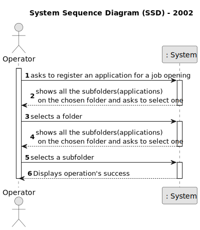
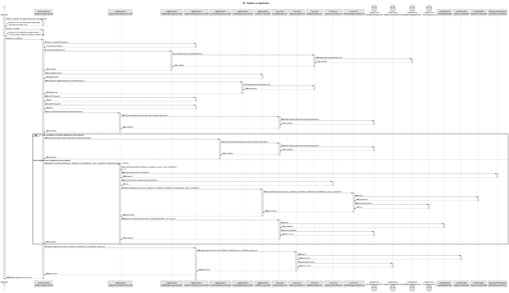
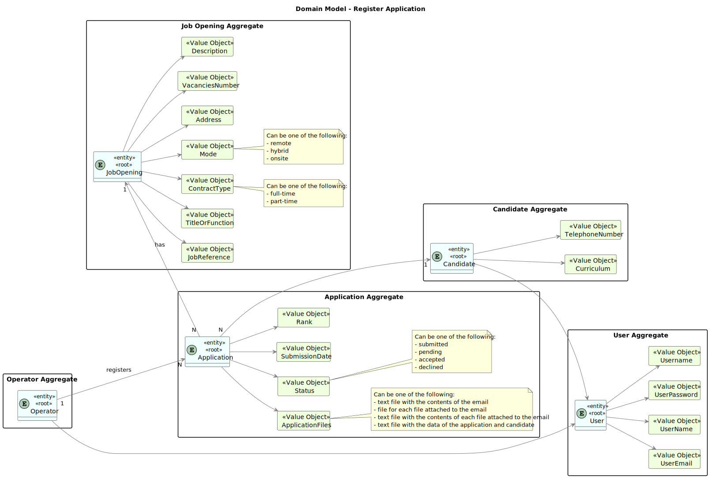
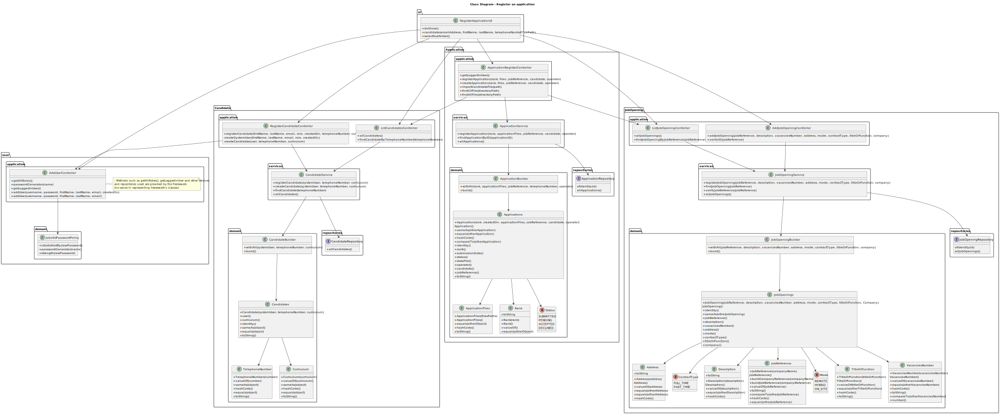
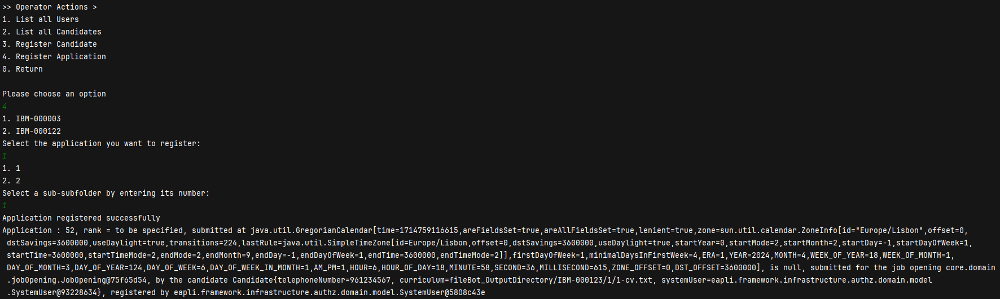

# register an application of a candidate for a job opening and import all files received.

--------

## 1.1. User Story Description

As Operator, I want to register an application of a candidate for a job opening and  import all files received.

## 1.2. Customer Specifications and Clarifications

### From the specifications document:

    Import the data from the file that was processed by the Application File Bot in Req 2001. The Files should be kept in the shared folder, but the Backoffice application needs to know the references to the file locations.

### From the client clarifications:

* Question:

      15. É o Operador que regista uma candidatura ou é o sistema que o faz automaticamente? E como integra o “plugin” de verificação da candidatura neste processo?

* Answer:

      15. Na US 2002 o Operator regista a candidatura. Para isso, é o Operator que inicia o processo mas o sistema deve importar os dados resultantes do Application File Bot de forma “automática” (Ver References da US 2002). O plugin referido entra neste processo através da US 2003, em que o Operador gera um ficheiro template com os dados a introduzir para validar uma candidatura. Na US 2004, o Operador, após preencher os dados específicos da candidatura (com base no ficheiro template anterior) submete no sistema esse ficheiro que vai ser usado para o sistema avaliar/verificar a candidatura. Se os critérios não forem atingidos a candidatura é recusada.
  
* Question:

      65. Micael – US2002 - UI and UX. I'd like to know what is the expected flow of executing US2002 (application registration and files import, by the operator). Can you reproduce step by step which actions should the operator execute? Example: 1. The system asks the operator for the candidate's email. 2. The operator enters the candidate's email. 3. The system asks for the job reference. 4. The operator enters the job reference. 5. The system creates the job application, if there is data for it in the shared folder.
    
* Answer:

      65. There are no specific requirements for the UI/UX but I think it will be more user friendly if the Operator could start the process by selecting the shared folder for the application to be imported.

* Question:

      83. Na descrição da US o PO refere uma importação de ficheiros e depois na referência à mesma a importação dos dados do ficheiro. Poderia esclarecer a que se refere a importação? São importações distintas? Têm destinos diferentes?

* Answer:

      83. Nessa US refiro-me à importação dos ficheiros gerados pelo Application File Bot. Quando me refiro aos dados, serão os dados do ficheiro de texto “A text file with the data of the application and candidate”, secção 2.2.3, um dos ficheiros gerados.

* Question:

      84. Após a informação dos ficheiros que estiverem na shared folder forem utilizados pelo Operator para registar uma candidatura, devem estes permanecer na pasta ou serem eliminados? Caso não sejam apagados como determinamos quais é que ainda não foram "utilizados"?

* Answer:

      84. Admitindo que já foram importados para o sistema, não tenho requisitos adicionais quanto aos ficheiros. A segunda pergunta é um problema que deve ser resolvido pela solução proposta. Eu não tenho nada a dizer sobre esse aspeto.

* Question:

      100. O que é que tem de ser registado no sistema?

* Answer:

      100. Tem de haver um registo que indique que o candidato em questão fez a candidatura e têm de ser registados/importados para o sistema todos os ficheiros submetidos.

* Question:

      133. Número da candidatura- na Q24 é referido um número que identifica uma candidatura a uma job reference. Esse número é diferente em todas as candidaturas, independentemente da job reference? Poderá servir como id da candidatura?

* Answer:

      133. Para além da Q24 veja por favor os exemplos de ficheiros disponibilizados pelo applications email bot. Sim, podemos considerar que esse número é único, nunca se repetindo.

## 1.3. Acceptance Criteria

* AC1: Import all files received:

      The system should provide functionality to import all files received along with the application.
  
* AC2: Ensure data integrity:
  
      The system should ensure the integrity of imported data and file references.

* AC3: Notify Operator of successful import:

      Upon successful import, the system should notify the Operator that the files have been successfully imported.

* AC4: Notification:

      After the user account is created successfully, the system should notify the Customer Manager of the successful registration and user creation.
  
* AC5: Error Handling:

      If any errors occur during the registration or user creation process, the system should provide informative error messages to the Customer Manager.
  
      Error messages should include guidance on resolving the issue and retrying the operation if necessary.

* AC6: Register new candidates in the system

## 2. Analysis

The .md file is followed by a Class Diagram and a Sequence Diagram, with the purpose of illustrating the design decisions.

Serving as an overview, here will be presented some of the main concerns:

- Which classes must be accessed in order to implement this functionality?

- Which classes must be created in order to implement this functionality?

- Who has the responsibility of registering the application?

- Are there any required validations?

- Who has the responsibility of saving the application?

### 2.1. Main success scenario

    The application is registered in the system.

## 2.2. System Sequence Diagram (SSD)

## 2.3. System Diagram (SD)

## 2.4. Partial Domain Model

None to specify

## 3.0. Design

### 3.1. Partial Class Diagram

### 3.2. Applied Patterns

- Single Responsibility Principle + High Cohesion: Every class has only one responsibility, which leads to higher cohesion.

- Open/Closed Principle: By using interfaces, we are allowing classes to extend the behavior, but never modify the previous implementation.

- Information Expert: A clear example would be the AddCustomerController, that by following the referred pattern, as well as the creator pattern, is responsible for creating the customer.

- Low Coupling: All the classes are loosely coupled, not depending on concrete classes, rather depending on interfaces.

- Controller: The controller serves as a bridge between the user interface and the domain.

## 4.0. Integration and Demonstration

------------------

