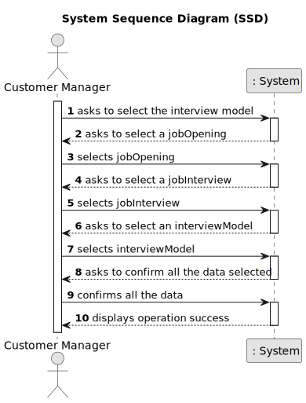
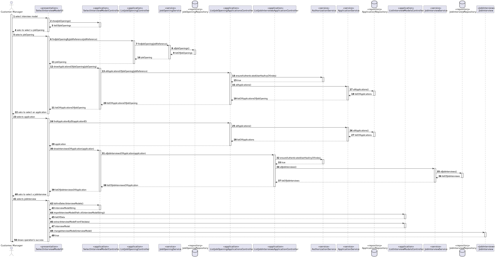
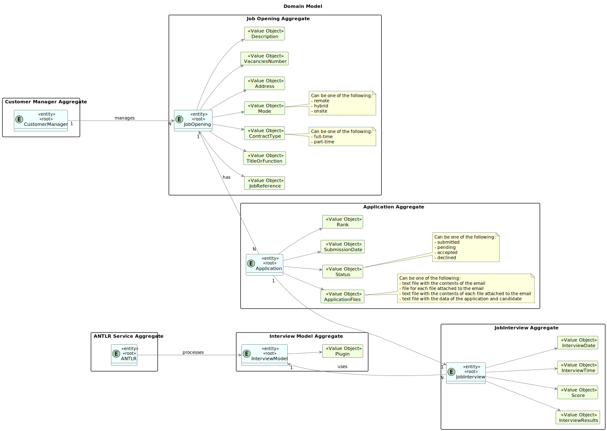
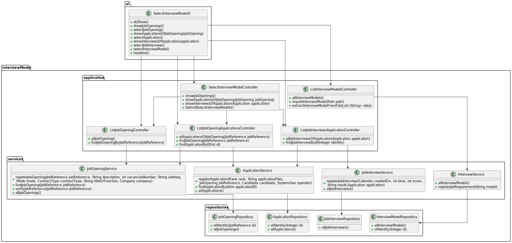

# 1011 - to select the interview model to use for the interviews of a job opening

--------

## 1.1. User Story Description

As Customer Manager, I want to select the interview model to use for the interviews of a job opening (for their
evaluation/grading).

## 1.2. Customer Specifications and Clarifications

### From the client clarifications:

## 1.3. Acceptance Criteria

* The system must be able to:

    * display the list of jobOpenings
    * display the list of applications
    * display the list of job interviews

## 1.4. Found out Dependencies

None

## 1.5 Input and Output Data

* Input Data:

      - Selection of Job Opening.
      - Selection of Application.
      - Selection of Job Interview.
      - Selection of Interview Model.
      - Data Confirmation.

    * Output Data:

          - List of all job openings registered in the system
          - List of all applications registered in the system
          - List of all job interviews registered in the system
          - List of all interview models registered in the system
          - Chosen details
          - (In)Success of the operation

## 1.6. System Sequence Diagram (SSD)

## 1.7. System Diagram (SD)

## 1.8 Other Relevant Remarks

None to specify

## 2.0. Domain Model

----------------

### 2.1. Relevant Domain Model Excerpt

## 3.0. Class Diagram

------------------

### 3.1. Relevant Class Diagram Excerpt

