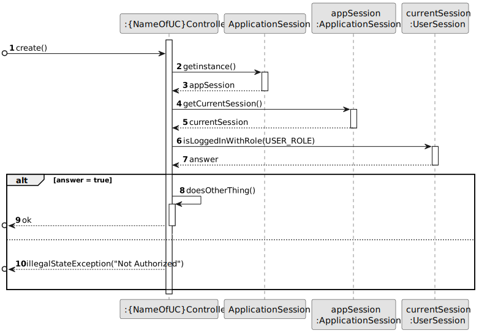
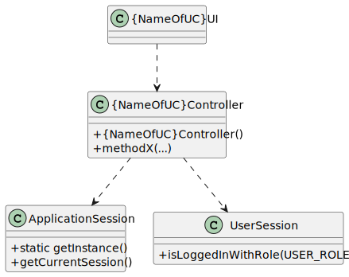

# 1009 - select the requirements specification to be used for a job opening.

--------

## 1.1. User Story Description
   
As Customer Manager, I want to select the requirements specification to be used for a job opening.

## 1.2. Customer Specifications and Clarifications

### From the specifications document:

      Job vacancies (job openings) must include a Job Requirement Specification. This represents a set of application requirements that the applicants must achieve. For instance, we could define a job requirement specification named "front end junior programmer", were candidates must have at least 2 years of experience, a degree in computer science or similar program, and knowledge in, at least, one of the following programming languages: java, javascript, typescript. Usually this information can be collected from the curriculum vitae of the candidate.

### From the client clarifications:

* Question:

      41. Como é que o Language Engineer faz o interview model e os job requirements? É texto? Ou ele seleciona perguntas para a interview e requirements para a job opening? E isso é quando se está a criar uma entrevista ou uma job opening ou para-se a meio para fazer isso e depois continua se?

* Answer:

      41. O language enginner com informação passada pelo customer manager (que obteve do customer) vai desenvolver em java um jar correspondente ao modulo/plugin. Para esse desenvolvimento terá de utilizar técnicas de desenvolvimento de gramáticas/linguagens como o antlr. Esse código ficará num jar que depois o language engineer “instala/regista” na aplicação (US1008, por exemplo, associando um nome ao jar num ficheiro de configuração – “5 anos experiencia java”, “req-model-5-years-java.jar”). A aplicação com essa informação carrega dinamicamente esse jar. Na gramátca usada no jar é que vão estar espelhadas a estrutura das perguntas a usar nesse modelo e sua avaliação. Estas atividades têm de ser feitas antes de se poder fazer a US1008. Esse trabalho é feito “fora” dos sistema, apenas se registando o modelo (quando está pronto) na US1008. A US 1009 e US1011 permitem selecionar modelos a usar (dos que foram devidamente registados no sistema).
  
* Question:

      70. Acerca da User Story da seleção do Job Requirement Specification para o Job Opening, será que o Customer Manager poderá escolher um Job Opening que já tenha um Job Requirement Specification?
    
* Answer:

      70. Admito que essa situação seja possível para qualquer user story similar. Ou seja, a situação que descreve é equivalente a qualquer situação em que seja necessário fazer uma seleção mas que o utilizador se tenha enganado e deseje optar por outra opção. Deve-se, no entanto, garantir que o sistema se mantenha num estado consistente.

* Question:

      85. Depois de definir os estados de recrutamento para uma JobOpening, o Customer Manager poderá selecionar o Job Requirement Specification para esse mesmo Job Opening? Se sim, até que fase de recrutamento poderá executar a ação?

* Answer:

      85. O Customer Manager define as fases do processo de recrutamento, não define os estados. A avaliação de requisitos é feita na fase de Screening. Assim, não percebo bem a questão colocada.
  
* Question:

      88. Quando o Customer Manager regista uma job offer, é ele que cria as requirement specifications e as interview models ou é-lhe dada uma lista destes para ele selecionar?

* Answer:

      88. Existe a US1002 e as US1009 e US1011. Penso que está claro qual a responsabilidade de cada uma. A criação dos modelos das entrevistas e dos requisitos é um caso de uso especifico e com um US especifica para registar no sistema os respectivos plugins (US1008).

## 1.3. Acceptance Criteria
* AC1: Display all registered job openings: The system should be able to show all registered job openings so that the Customer Manager can select one.

* AC2: Allow selection of a job opening: The system should allow the Customer Manager to select a job opening from the displayed list.

* AC3: Display all registered requirement specifications: The system should be able to show all registered requirement specifications so that the Customer Manager can select one or choose to proceed with an existing one.

* AC4: Allow selection of a requirement specification: The system should allow the Customer Manager to select a requirement specification from the displayed list or choose to proceed with an existing one if it's already defined.

* AC5: Confirm selected data: The system should display all chosen details to the Customer Manager and request confirmation before proceeding.

* AC6: Display successful operation message: After the Customer Manager confirms the selected data, the system should display a message indicating that the operation was successful.
  
## 1.4. Found out Dependencies

* 1002 - As Customer Manager, I want to register a job opening.

* 1003 - As Customer Manager, I want to list job openings

* 1008 - As Language Engineer, I want to deploy and configure a plugin (i.e., Job Requirement Specification or Interview Model) to be used by the system.

* 2002 - As Operator, I want to register an application of a candidate for a job opening and import all files received.

## 1.5 Input and Output Data

* Input Data:

      - Selection of Job Opening.
      - Selection of Requirement Specification.
      - Data Confirmation.

  * Output Data:

        - List of all job openings registered in the system
        - List of all requirement specification registered in the system
        - Chosen details
        - (In)Success of the operation

## 1.6. System Sequence Diagram (SSD)

## 1.7. System Diagram (SD)

## 1.8 Other Relevant Remarks

None to specify

## 2.0. Domain Model

----------------

### 2.1. Relevant Domain Model Excerpt

### 2.2. Entities and Aggregates

Entities represent distinct objects with unique identities and lifecycles within the domain. Aggregates are clusters of associated entities and value objects that are treated as a unit for data changes.

* Job Opening

      Represents job openings created by customers.

* JobRequirementsSpecification

      Represents a set of application requirements that candidates must meet for a specific job opening. These specifications are designed and implemented by Language Engineers and used in the candidate screening process.

* CustomerManager:

      Represents employees of the Jobs4U company who manage relationships with customer entities. Customer Managers are responsible for registering job openings, setting up recruitment processes, and overseeing the selection of candidates for their assigned customers.
* User

        Represents all the users that are registered in the system.

* Process

        Represents the different stages in which a job offer can be found.

### Associations

JobOpening "N" --> "1" JobRequirementsSpecification

CustomerManager "1" --> "N" JobOpening : manages

CustomerManager ---> User

JobOpening --> Process

## 3.0. Class Diagram

------------------

### 3.1. Relevant Class Diagram Excerpt

