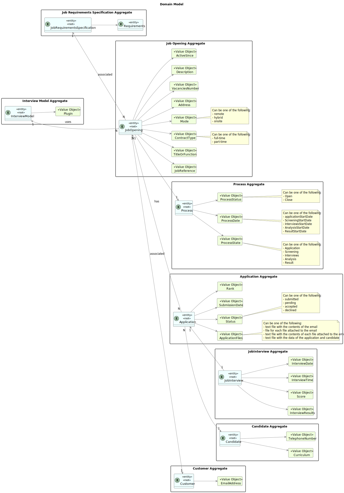

# Evaluation process of interviews for a job opening.

--------------------------------------------------------

## 1. Requirements Engineering

As Customer Manager, I want to execute the process that evaluates (grades) the interviews for a job opening.

### 1.2. Customer Specifications and Clarifications

### From the specifications document:

Requirement Specifications and Interview Models The support
for this functionality must follow specific technical requirements, specified in LPROG.

The ANTLR tool should be used (https://www.antlr.org/).

### From the client clarifications:

> **Question 199:** 
>
> Relativamente à US1018, após a execução do processo de avalição de todas as entrevistas da job opening, a fase em que esta se encontra deve ser automaticamente mudado para "Result" ou deve ser mantida em "Analysis" e apenas pode ser mudada pela execução da US1010?  
>
> **Answer:**
>        
> A US1018 não deve alterar a fase actual. A US1010 permite fazer a mudança de fases do processo de recrutamento.

> **Question 214:**
>
> O nosso grupo tem uma dúvida em relação ao processamento dos ficheiros de respostas dos candidatos para a entrevista. No caso de upload de um ficheiro, se a pergunta que requer um número como resposta for preenchida com um formato inválido, por exemplo, uma letra, devemos considerar isso como um formato inválido na US 1017 (e pedir para o user voltar a dar upload a um ficheiro válido) ou devemos, na US1018, considerar que está incorreta e atribuir 0 pontos automaticamente para essa resposta inválida? Isto é, na US 1017, devemos apenas verificar o formato do ficheiro ou devemos verificar também se as respostas são preenchidas com o tipo de dados correto?
>
> **Answer:**
>
> O caso mencionado deve ser considerado um erro de validação do ficheiro (ou seja, o ficheiro submetido não corresponde à gramática definida).

### 1.3.  Acceptance Criteria

* AC1: The Customer Manager must be able to initiate and execute the interview evaluation process for a specific job opening.

* AC2: The system should allow the Customer Manager to select a job opening from the list of the ones in the "Analysis" phase.

* AC3: The evaluation process should include grading criteria defined for the job opening.

* AC4: The score off all the interviews should be calculated and stored in the system automatically.

### 1.4. Found Out Dependencies

[Candidate's interview responses](..%2Fupload-text-file-with-responses)

[Text file to collect the candidate's interview answers](..%2F..%2FSprintB%2Fgenerate-job-requirements-text-file)

[Select interview model](..%2F..%2FSprintB%2Fselect-interview-model)

[Deploy and configure plugin](..%2F..%2FSprintB%2Fdeploy-and-configure-plugin)

[Register an application](..%2F..%2FSprintB%2Fregister-an-application)

[Register a candidate](..%2F..%2FSprintB%2Fregister-a-candidate)

[Register a job opening](..%2F..%2FSprintB%2Fadd-jobOpening)

[Change Job Opening phase](..%2F7-change-status-process)

### 1.5. Input and Output Data

**Selected Data:**

    * Job Opening

**Input Data:**

    * None

**Output Data:**

    * The score and the information on the interviews evaluated.

### 1.6. System Sequence Diagram (SSD)


### 1.7. System Diagram (SD)


### 1.8. Other relevant remarks

* None to specify.

## 2.0. Analysis and Design#

### 2.1. Partial Domain Model



### 2.2. Class Diagram


## 3. Implementation 

Most of the implementation is done in the UI layer, in the `EvaluateInterviewsUI` class. The `doShow` method is responsible for evaluating the interviews for a job opening.

```java
@Override
    protected boolean doShow() {
        JobOpening jobOpening = selectJobOpeningController.selectJobOpeningAnalysis();

        List<JobInterview> interviews = listJobOpeningInterviewsController.allInterviewOfJobOpening(jobOpening);

        InterviewModel interviewModel = jobOpening.myInterviewModel();

        evaluationProcessController.evaluationProcessExecution(interviews, interviewModel);

        return false;
    }
```

## 4. Testing

The testing of this functionality is done in the `JobInterview` class.

```java
@Test
    void testCreatedOn() {
        assertEquals(createdOn, jobInterview.createdOn());
    }

    @Test
    void testTime() {
        assertEquals(time, jobInterview.time());
    }

    @Test
    void testScore() {
        assertEquals(score, jobInterview.score());
    }

    @Test
    void testResult() {
        assertEquals(result, jobInterview.result());
    }

    @Test
    void testApplication() {
        assertEquals(application, jobInterview.application());
    }

    @Test
    void testInterviewAnswers() {
        assertEquals(interviewAnswers, jobInterview.interviewAnswers());
    }

    @Test
    void testUploadInterviewAnswers() {
        InterviewAnswers newInterviewAnswers = new InterviewAnswers(Arrays.asList("New Answer 1", "New Answer 2", "New Answer 3"));
        jobInterview.uploadInterviewAnswers(newInterviewAnswers);

        assertEquals(newInterviewAnswers, jobInterview.interviewAnswers());
    }

    @Test
    void testEquals() {
        JobInterview sameJobInterview = new JobInterview(createdOn, time, score, result, application, interviewAnswers);
        assertTrue(jobInterview.equals(sameJobInterview));
    }

    @Test
    void testHashCode() {
        JobInterview sameJobInterview = new JobInterview(createdOn, time, score, result, application, interviewAnswers);
        assertEquals(jobInterview.hashCode(), sameJobInterview.hashCode());
    }

    @Test
    void testSameAs() {
        JobInterview sameJobInterview = new JobInterview(createdOn, time, score, result, application, interviewAnswers);
        assertTrue(jobInterview.sameAs(sameJobInterview));
    }

    @Test
    void testToString() {
        String expectedString = "JobInterview{" +
                "id=" + jobInterview.identity() +
                ", createdOn=" + createdOn +
                ", time=" + time +
                ", score=" + score +
                ", result=" + result +
                ", application=" + application +
                ", interviewAnswers=" + interviewAnswers +
                '}';
        assertEquals(expectedString, jobInterview.toString());
    }

    @Test
    void testUpdateScore() {
        Score newScore = new Score(10); // replace with actual Score object
        jobInterview.updateScore(newScore);

        assertEquals(newScore, jobInterview.score());
    }
```

## 5. Demonstration


