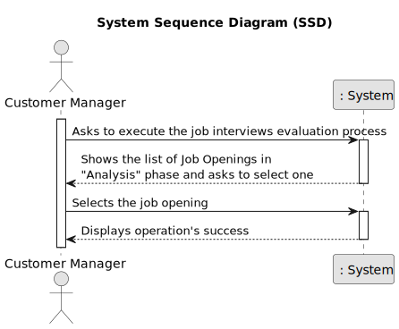

# Evaluation process of interviews for a job opening.

--------------------------------------------------------

## 1.1. Usecase Description

As Customer Manager, I want to execute the process that evaluates (grades) the interviews for a job opening.

## 1.2. Customer Specifications and Clarifications

### From the specifications document:

Requirement Specifications and Interview Models The support
for this functionality must follow specific technical requirements, specified in LPROG.

The ANTLR tool should be used (https://www.antlr.org/).

### From the client clarifications:

* Question 199 : 

        Relativamente à US1018, após a execução do processo de avalição de todas as entrevistas da job opening, a fase em que esta se encontra deve ser automaticamente mudado para "Result" ou deve ser mantida em "Analysis" e apenas pode ser mudada pela execução da US1010?  

* Answer:
        
        A US1018 não deve alterar a fase actual. A US1010 permite fazer a mudança de fases do processo de recrutamento.

* Question 214 :

        O nosso grupo tem uma dúvida em relação ao processamento dos ficheiros de respostas dos candidatos para a entrevista. No caso de upload de um ficheiro, se a pergunta que requer um número como resposta for preenchida com um formato inválido, por exemplo, uma letra, devemos considerar isso como um formato inválido na US 1017 (e pedir para o user voltar a dar upload a um ficheiro válido) ou devemos, na US1018, considerar que está incorreta e atribuir 0 pontos automaticamente para essa resposta inválida? Isto é, na US 1017, devemos apenas verificar o formato do ficheiro ou devemos verificar também se as respostas são preenchidas com o tipo de dados correto?

* Answer:
        
        O caso mencionado deve ser considerado um erro de validação do ficheiro (ou seja, o ficheiro submetido não corresponde à gramática definida).

## 1.3.  Acceptance Criteria

* AC1: The Customer Manager must be able to initiate and execute the interview evaluation process for a specific job opening.

* AC2: The system should allow the Customer Manager to select a job opening from the list of the ones in the "Analysis" phase.

* AC3: The evaluation process should include grading criteria defined for the job opening.

* AC4: The score off all the interviews should be calculated and stored in the system automatically.

## 1.4. Found Out Dependencies

[Candidate's interview responses](..%2Fupload-text-file-with-responses)

[Text file to collect the candidate's interview answers](..%2F..%2FSprintB%2Fgenerate-job-requirements-text-file)

[Select interview model](..%2F..%2FSprintB%2Fselect-interview-model)

[Deploy and configure plugin](..%2F..%2FSprintB%2Fdeploy-and-configure-plugin)

[Register an application](..%2F..%2FSprintB%2Fregister-an-application)

[Register a candidate](..%2F..%2FSprintB%2Fregister-a-candidate)

[Register a job opening](..%2F..%2FSprintB%2Fadd-jobOpening)

[Change Job Opening phase](..%2F7-change-status-process)

## 2.0. Analysis

The .md file is followed by a Class Diagram and a Sequence Diagram, with the purpose of illustrating the design decisions.

Serving as an overview, here will be presented some of the main concerns:

- Which classes must be accessed in order to implement this functionality?

- Which classes must be created in order to implement this functionality?

- Who has the responsibility of evaluating the interviews?

- Are there any required validations?

### 2.1. Main success scenario

        The interview is successfully evaluated.

### 2.2. System Sequence Diagram (SSD)

### 2.3. System Diagram (SD)

### 2.4. Partial Domain Model

## 3.0. Design 

### 3.1. Partial Class Diagram

### 3.2. Applied Patterns

- **Single Responsibility Principle + High Cohesion**: Every class has only one responsibility, which leads to higher cohesion.

- **Open/Closed Principle**: By using interfaces, we are allowing classes to extend the behavior, but never modify the previous implementation.

- **Information Expert**: A clear example would be the ProcessEvaluationController, that by following the referred pattern, as well as the creator pattern, is responsible for creating the customer.

- **Low Coupling**: All the classes are loosely coupled, not depending on concrete classes, rather depending on interfaces.

- **Controller**: The controller serves as a bridge between the user interface and the domain.