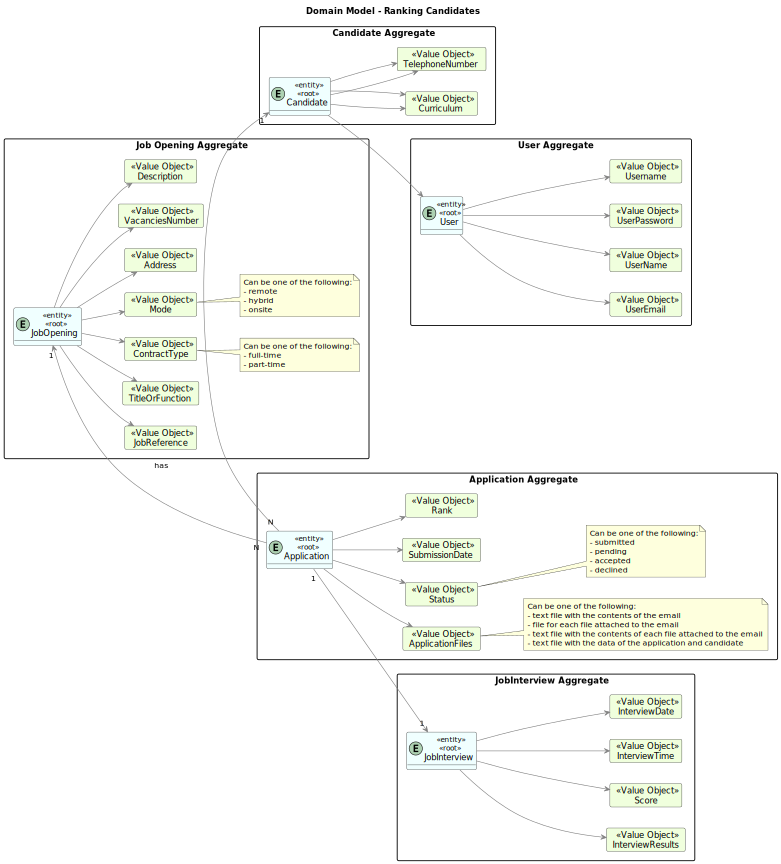

# Get an ordered list of candidates, using the job interview points

--------

## 1. Requirements Engineering

### 1.1. User Story Description

As Customer Manager, I want to get an ordered list of candidates, using the job interview points (grades), to help me analyze the candidates.

### 1.2. Customer Specifications and Clarifications

**From the client clarifications:**

> **Question 169** 
> 
> Relativamente a esta user story, "US 1019 - As Customer Manager, I want to get an ordered list of 
> candidates, using the job interview points (grades), to help me analyze the candidates.", a lista que pretende é 
> relacionada a uma job opening correto? A maneira de ordenação é ascendente ou quer uma opção que inclua ascendente e descendente?
>
> **Answer**
> 
> Sim, a ordenação é relativa a candidaturas para um job opening. A ordenação deve ser descendente, do que tem maior pontuação 
> para o que tem menor pontuação.


> **Question 197**
> 
> Na questao Q169 é mencionado para a listagem ser ordenada descendentemente da nota da entrevista (como mencionado tambem na própria US)
> , no entanto, a questão é, como idealiza a ordenação caso a job opening não possua entrevista?
> 
> **Answer 197**
> 
> Esta US não faz sentido para processos que não tenham entrevista.

> **Question 204**
>
>Paula – US 1019– segundo a resposta A197, devemos então apenas permitir a listagem de job openings que tenham entrevista?
>
> **Answer**
> 
> Penso que não percebi bem a referência à listagem de job openings. Esta US não faz sentido para job openings que não tenham entrevista, uma vez que assenta na listagem dos candidatos e dos seus pontos nas entrevista.

> **Question 226**
> 
>Bernardo Barbosa – US 1019 - Na descrição da user story : " As Customer Manager, I want to get an ordered list of candidates, using the job interview points (grades), to help me analyze the candidates". A intenção "analyze the candidates" impõe alguma mudança/remoção de candidatos no sistema?
>
> **Answer**
>
> A referência a “analize the candidates” é apenas para passar a ideia que se pretende nesta US que o sistema disponibilize uma forma do Customer Manager conseguir consultar o resultado das entrevistas de forma a ajudar a decidir o ranking dos candidatos. Nada mais. O ranking doa candidatos é registado no sistema através da US 1013


### 1.3. Acceptance Criteria

> **AC1:**
> The costumer manager should select the job opening for which he wants the list of candidates.

> **AC2:**
> The ordering must be descending, from the one with the highest score for the one with the lowest score.


### 1.4. Found out Dependencies

[Register a candidate](..%2F..%2FSprintB%2Fregister-a-candidate)

[Register a job opening](..%2F..%2FSprintB%2Fadd-jobOpening)

[Display candidate's data](..%2F..%2FSprintB%2Fdisplay-candidate's-data)

[List job openings' application](..%2F..%2FSprintB%2Flist-job-openings'-application)

[Job interviews evaluation](..%2F..%2FSprintB%2Fjob-interviews-evaluation)


### 1.5. Input and Output Data

**Selected Data:**

    * Job Opening

**Output Data:**

    * List of candidates ordered by score

### 1.6. System Sequence Diagram (SSD)


### 1.7. Sequence Diagram (SD)


## 2. Analysis and Design

### Analysis

### 2.1. Domain Model


### Design

### 2.2. Class Diagram


## 3. Implementation

The implementation of this user story was done in the UI layer, using some methods in  controllers, in the `OrderedListOfCandidatesUI` class. 
The `doShow` method was implemented to allow the customer manager to select a job opening and call all controllers used.
The `displayList` method was implemented to print the list that is the final result after 3 controllers used.
The `OrderedListOfCandidatesController` class is mainly used to order by grade all candidates that have an application for the selected job opening.

```java
 public boolean doShow() {

    JobOpening jobOpening = orderedListOfCandidatesController.selectJobOpening();

    Iterable<Application> applicationList = orderedListOfCandidatesController.allApplicationsOfJobOpening(jobOpening.jobReference());

    List<JobInterview> orderedList = orderedListOfCandidatesController.orderedList(applicationList);

    List<Application> finalList = orderedListOfCandidatesController.applicationList(orderedList);

    displayList(finalList, orderedList);


    return true;
}
```
```java
public void  displayList(List<Application> finalList, List<JobInterview> orderedList) {

    int count= 0;

    if(orderedList != null && finalList!= null)  {
        for (JobInterview jobInterview : orderedList) {
            if (finalList.contains(jobInterview.application())) {
                count++;
                if(count == 1) {
                    System.out.printf("%-50s | %-50s | %-30s | \n", "Telephone Number", "Curriculum", "Grade");
                }
                Candidate candidate = jobInterview.application().candidate();
                System.out.printf("%-50s | %-50s | %-30s | \n", candidate.identity(), candidate.curriculum(), jobInterview.score());
            }
        }
    }
    if(count == 0 ){
        System.out.println("There are no candidates with grade for this job opening.");
    }
}
```
```java
public List<JobInterview> orderedList(Iterable<Application> applicationList){
    List<JobInterview> orderedList = new ArrayList<>();

    for(Application application : applicationList){
        Iterable<JobInterview> list = listJobInterviewsApplicationController.allJobInterviewsOfApplication(application);
        for(JobInterview jobInterview : list){
            orderedList.add(jobInterview);
        }
    }

    orderedList.sort(Comparator.comparing(JobInterview::returnScore).reversed());

    return orderedList;
}
```


## 4. Testing

Classes `Application` ,`JobInterview` and the `Candidate` are fully tested to ensure the score and all other attributes are correctly updated and retrieved:

```java
    @Test
    void testJobReference() {
    assertEquals(jobReference, application.jobReference());
    }

    @Test
    void testReturnScore() {
        assertEquals(score.getScore(), jobInterview.returnScore());
    }

    @Test
    void testScore() {
        assertEquals(score, jobInterview.score());
    }
    
    @Test
    void testUser() {
        assertEquals(candidateUser, candidate.user());
    }

    @Test
    void testCurriculum() {
        assertEquals(curriculum, candidate.curriculum());
    }

    @Test
    void testIdentity() {
        assertEquals(telephoneNumber, candidate.identity());
    }
    

```

## 5. Demonstration

### job pening with interviews


### job opening without interviews


