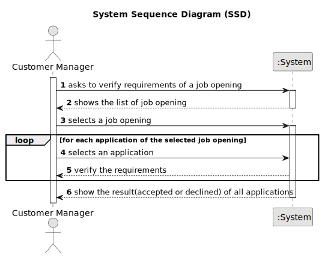
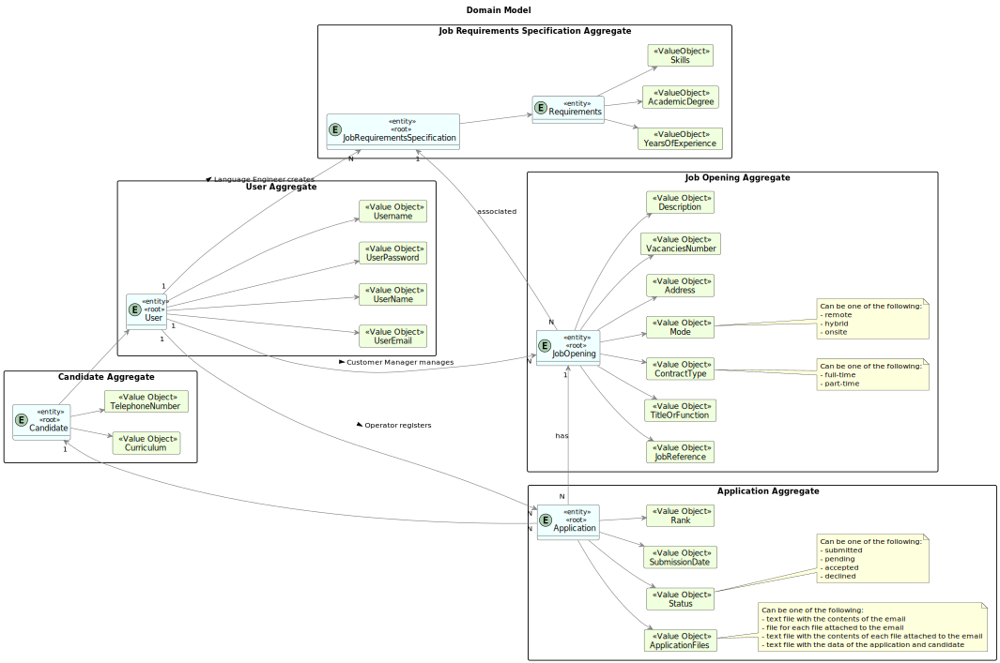
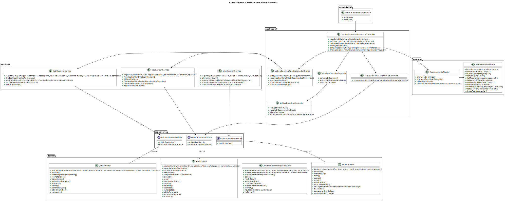
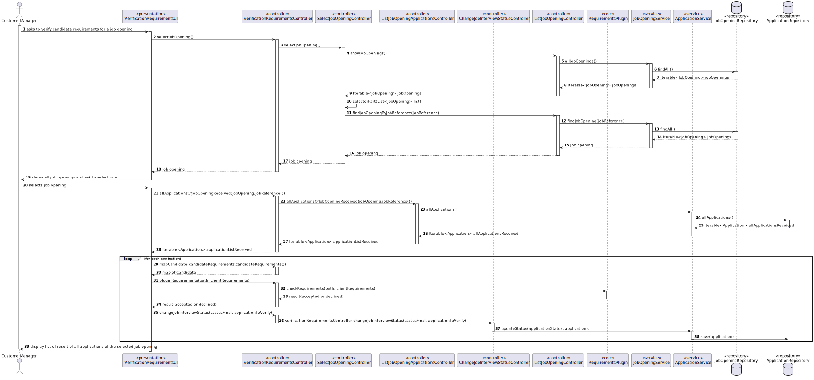
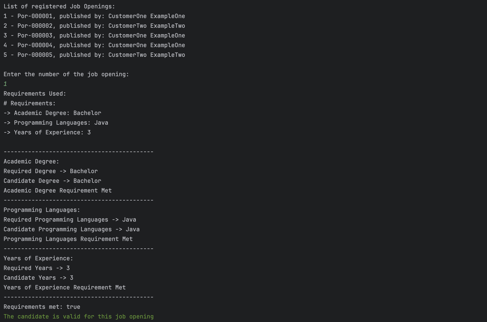
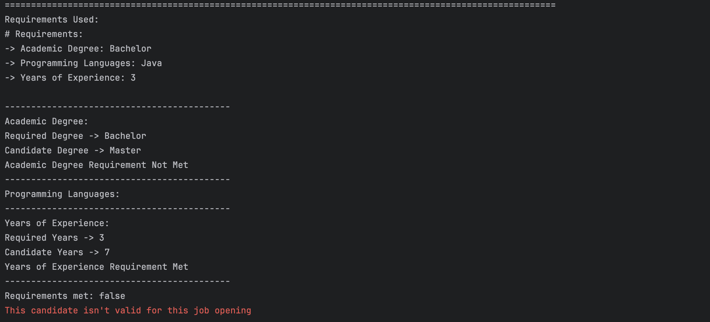
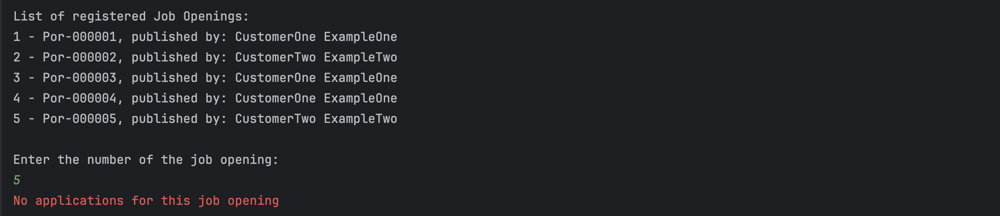

# Process of verication of requirements

--------

## 1. Requirements Engineering

### 1.1. User Story Description

As Customer Manager, I want to execute the process of verication of requirements of applications for a job opening.

### 1.2. Customer Specifications and Clarifications

**From the client clarifications:**


> **Question 167** 
> 
> Gustavo – US1015 
> Deve ser executado o processo para todos os candidatos ou apenas para alguns (segundo algum critério)?
>
> **Answer**
> 
> Os ficheiros com as respostas aos requisitos vão entrando no sistema gradualmente. Talvez seja mais “simples” 
que o processo execute (ou seja, faça a verificação dos requisitos) para os candidatos para os quais já foi submetido o ficheiro de
requisitos. Nalgum momento o processo irá executar com todos os candidatos já com os ficheiros de requisitos submetidos.


> **Question 180**
> 
>Varela – US2004 -Candidate Answers 
> Does US2004 only deals with the upload of the file to the system or also the registration of the candidate's answer by the Operator?
> I've seen many mentions about the file's answers but I want to understand if that aspect is also part of US2004.
>
> **Answer**
> 
> In US2003 the Operator downloads a template file that he/she uses to register the candidate requirements. In US 2004, the Operator uploads a file with the requirements and the system should validate the file (verify of the syntax is correct). US 1015 is the one that executes the 
verification of requirements for the candidates (based on the previously uploaded files).


> **Question 223**
> 
>Araújo – US 2004 
> About the Us2004, in A180 you previously stated that "the Operator uploads a file with the requirements and 
the system should validate the file (verify of the syntax is correct). US 1015 is the one that executes the verification...". What should happen 
if the file failes this verification? Is the application instantly refused or do you have something else in mind?
>
> **Answer**
> 
> A file that fails the verification means that that file has an error (syntactic error) it does not mean that the application does not meet 
the requirements. The user should fix the error and submit again. Only US 1015 results in approving or rejecting an application.


### 1.3. Acceptance Criteria

> **AC1:**
> The costumer manager should select the job opening for which he wants to verify the requirements of its applications.

> **AC2:**
> The verification is only executed if the candidate has already the candidate requirement file submitted.


### 1.4. Found out Dependencies


[Register a job opening](..%2F..%2FSprintB%2Fadd-jobOpening)

[Register an application](..%2F..%2FSprintB%2Fregister-an-application)

[Select the requirement specification](..%2F..%2FSprintB%2Fselect-the-requirements-specification)

[List all applications of a job opening](..%2F..%2FSprintB%2Flist-job-openings'-application)

[Upload requirements](..%2F..%2FSprintB%2FUpload-requirements)


### 1.5. Input and Output Data

**Selected Data:**

    * Job Opening

**Output Data:**

    * List of results for  each candidate's application of the selected job opening.


### 1.6. System Sequence Diagram (SSD)


## 2. Analysis and Design

### Analysis

### 2.1. Domain Model


### Design

### 2.2. Class Diagram


### 2.3. Sequence Diagram (SD)



## 3. Implementation

The implementation of this user story was done in the UI layer, using some methods in  controllers, in the `VerificationRequirementsUI` class. 
The `doShow` method was implemented to allow the customer manager to select a job opening and call all controllers used.
The `VerificationRequirementsController` class is mainly used to get all requirements for candidates who have an application for the selected job opening and to verify their requirements comparing to the selected job opening's requirements.

```java
protected boolean doShow() {
    JobOpening jobOpening = verificationRequirementsController.selectJobOpening();
    JobReference jobReference = jobOpening.jobReference();

    Iterable<Application> jobOpeningApplications = verificationRequirementsController.allApplicationsOfJobOpeningReceived(jobReference);

    if (jobOpeningApplications == null) {
        System.out.println(RED + "No applications for this job opening" + RESET);
    } else {
        for (Application applicationToVerify : jobOpeningApplications) {
            if (applicationToVerify != null) {

                CandidateRequirements candidateRequirements = applicationToVerify.candidateRequirements();
                String path = jobOpening.jobRequirementsSpecification().jobRequirementsPath();


                Map<String, String> clientRequirements = verificationRequirementsController.mapCandidate(candidateRequirements.candidateRequirements());

                boolean result = verificationRequirementsController.pluginRequirements(path, clientRequirements);

                Status statusFinal;

                if (result) {
                    statusFinal = Status.ACCEPTED;
                    verificationRequirementsController.changeJobInterviewStatus(statusFinal, applicationToVerify);
                    System.out.println(GREEN + "The candidate is valid for this job opening" + RESET);
                } else {
                    statusFinal = Status.DECLINED;
                    verificationRequirementsController.changeJobInterviewStatus(statusFinal, applicationToVerify);
                    System.out.println(RED + "This candidate isn't valid for this job opening" + RESET);
                }
                System.out.println("=========================================================================================================");
            }
        }
    }
    return true;
}

```

## 4. Testing

The classes `Application`, `JobOpening` and `Candidate`  are fully tested to ensure the status, rank and all other attributes are correctly updated and retrieved:

```java
@Test
    void testIdentity() {
        assertEquals(jobReference, jobOpening.identity());
    }

    @Test
    void testJobReference() {
        assertEquals(jobReference, jobOpening.jobReference());
    }

    @Test
    void testRank() {
        assertEquals(rank, application.rank());
    }

    @Test
    void testCandidateRequirements() {
        assertEquals(candidateRequirements, application.candidateRequirements());
    }

    @Test
    void testIdentity() {
        assertNotNull(application.identity());
    }

    @Test
    void testStatus() {
        application.changeStatus(Status.CHOSEN);
        assertEquals(Status.CHOSEN, application.status()); // assuming the initial status is PENDING
    }

    @Test
    void testChangeStatus() {
        Status newStatus = Status.ACCEPTED; // replace with actual Status
        application.changeStatus(newStatus);
        assertEquals(newStatus, application.status());
    }

    @Test
    void testIdentity() {
        assertEquals(telephoneNumber, candidate.identity());
    }

```


## 5. Demonstration

    *Requirements Accepted**


    *Requirements Declined**


    *No applications**



