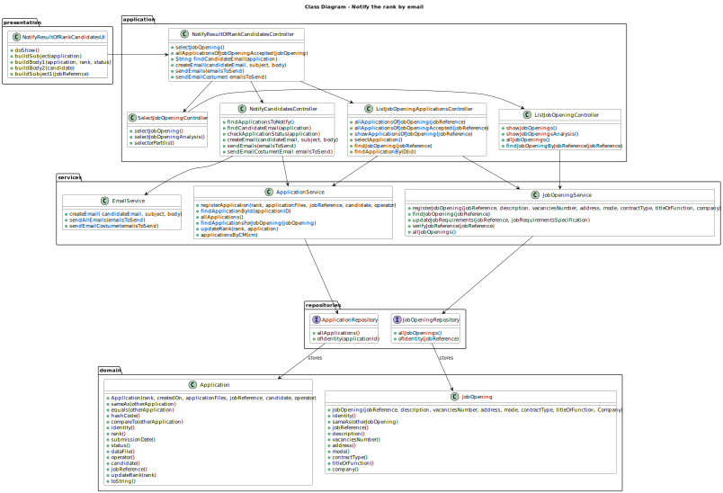
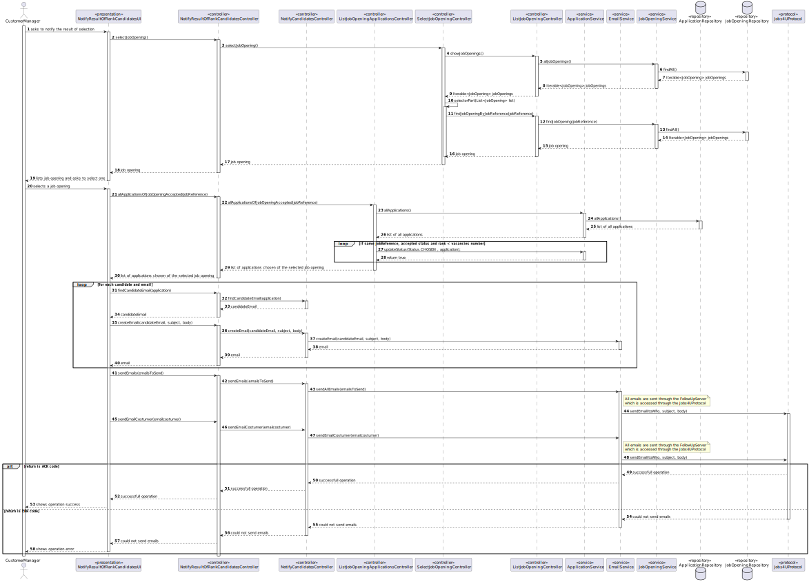

# Notify by email of the results of the selection of candidates for a job opening

--------

## 1. Requirements Engineering

### 1.1. User Story Description

As Customer Manager, I want to publish the results of the selection of candidates for a job opening, so that candidates and customer are notified by email of the result.

### 1.2. Customer Specifications and Clarifications

**From the client clarifications:**


> **Question 51** 
> 
> US 1020, qual é o formato para essa publicação?
>
> **Answer**
> 
> A publicação refere-se a informar os candidatos e o cliente, por email. Os candidatos que são selecionados devem receber um email a indicar que para a sua candidatura ao job opening foram selecionados e irão ser contactados pela empresa. No que se refere à empresa, esta deve receber um email com a lista dos
candidatos selecionados que deve incluir o nome e dados de contacto do candidato.

> **Question 190**
>
> Barbosa – US1020 – Regarding the selection of candidates, should we assume that the first N candidates in the ranking (where N is the number of job vacancies) are chosen, or should we allow the customer manager to select the N candidates?
>
> **Answer**
>
> The first option (using the results from US1013).

> **Question 224**
>
>Pedro Guedes – US 1020 - Esta US pede que seja publicado os resultados das candidaturas, a minha pergunta seria se este processo só pode acontecer quando a job opening estiver encerrada ou se executar esta operação terminaria a job opening.
>
> **Answer**
>
>Esta US é relativa à última fase do processo. Se as notificações executarem todas com sucesso em princípio já não existe mais nada a fazer neste processo.

### 1.3. Acceptance Criteria

> **AC1:**
> The costumer manager should select the job opening for which he wants to verify the requirements of its applications.

> **AC2:**
> The verification is only executed if the candidate has already the candidate requirement file submitted.


### 1.4. Found out Dependencies


[Register a job opening](..%2F..%2FSprintB%2Fadd-jobOpening)

[Register an application](..%2F..%2FSprintB%2Fregister-an-application)

[List all applications of a job opening](..%2F..%2FSprintB%2Flist-job-openings'-application)

[Verification of requirements](..%2F..%2FSprintB%2Fverification_of_requirements)

[List candidate applications](..%2F..%2FSprintB%2Flist-candidate-applications)

[Rank candidates for a job opening](..%2F..%2FSprintB%2rank-candidataes-for-job-opening)


### 1.5. Input and Output Data

**Selected Data:**

    * Job Opening

**Output Data:**

    * Notification for each accepted candidate for the selected job opening.
    * Notification for costumer manager of the list of the selected candidates


## 2. Analysis and Design

### 2.1. Domain Model


### 2.2. Class Diagram


### 2.3. System Sequence Diagram (SSD)


### 2.4. Sequence Diagram (SD)



## 3. Implementation

The implementation of this user story was done in the UI layer, using some methods in  controllers, in the `NotifyCandidatesUI` class. 
The `doShow` method was implemented to allow the customer manager to select a job opening and send automatically emails for the accepted candidates and the costumer.
The `NotifyCandidatesController` class is mainly used to get the email of candidates and to send them the email of confirmation and send to the costumer an email with the list of accepted candidates.

```java
protected boolean doShow() {

    List<Email> emailsToSend = new ArrayList<>();

    List<String> emailToCostumer = new ArrayList<>();

    JobOpening jobOpening = notifyResultOfRankCandidatesController.selectJobOpening();

    JobReference jobReference = jobOpening.jobReference();

    Iterable<Application> appToNotify = notifyResultOfRankCandidatesController.allApplicationsOfJobOpeningAccepted(jobOpening);

    if(appToNotify == null ){
        System.out.println(ConsoleColors.RED + "There are no applications accepted for this job opening." + ConsoleColors.RESET);
    }else {
        for (Application application : appToNotify) {

            String candidateEmail = notifyResultOfRankCandidatesController.findCandidateEmail(application);
            String subject = buildSubject(application);
            String body = buildBody1(application, application.rank(), application.status());
            String body2 = buildBody2(application.candidate());
            Email emailObj = notifyResultOfRankCandidatesController.createEmail(candidateEmail, subject, body);
            emailToCostumer.add(body2);
            emailsToSend.add(emailObj);
        }

        String costumerEmail = jobOpening.customer().identity().toString();
        String subject1 = buildSubject1(jobReference);
        String body3 = emailToCostumer.toString();

        Email emailcostumer = notifyResultOfRankCandidatesController.createEmail(costumerEmail, subject1, body3);

        notifyResultOfRankCandidatesController.sendEmails(emailsToSend);

        notifyResultOfRankCandidatesController.sendEmailCostumer(emailcostumer);
    }
    return true;
}
```

## 4. Demonstration


