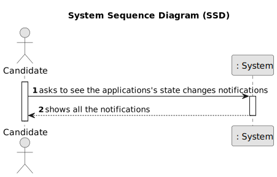
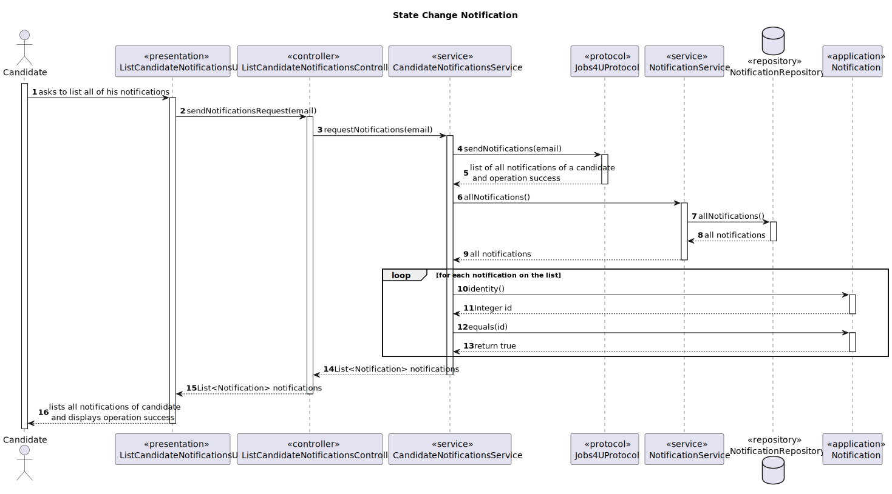
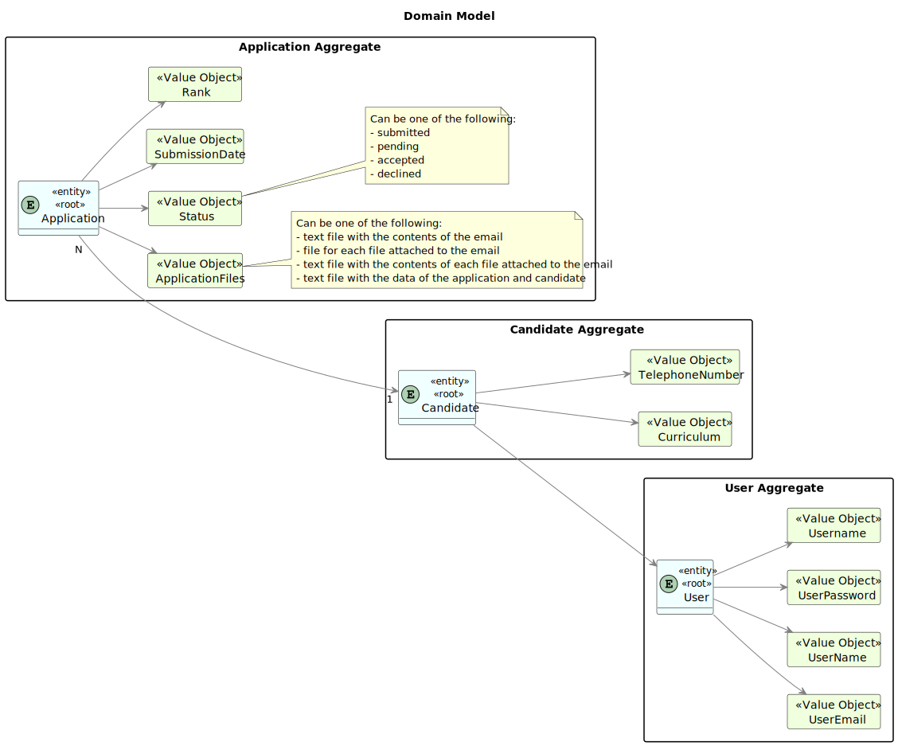
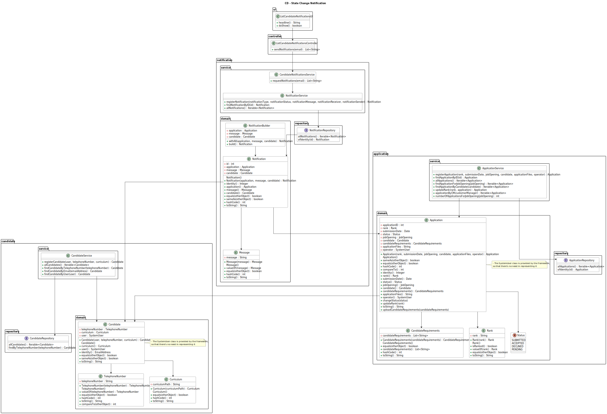

# Application's state change notification

---------------------------

## 1.1. User Story Description

As Candidate, I want to be notified in my application when the state of one of my applications changes.

## 1.2. Customer Specifications and Clarifications

### From the specifications document:

**NFR10(RCOMP)** - Functionalities related to the Candidate and Customer Apps and to
the Follow Up Server part of the system have very specific technical requirements. It
must follow a client-server architecture, where a client application is used to access a
server. Communications between these two components must follow specific protocol
described in a document from RCOMP ("Application Protocol"). Also, the client applications can not access the relational database, they can only access the server application.

**NFR11(RCOMP)** - The solution should be deployed using several network nodes. It is
expected that, at least, the relational database server and the Follow Up Server be deployed in nodes different from localhost, preferably in the cloud. The e-mail notification
tasks must be executed in background by the Follow Up Server.

### From the client clarifications:

* Question:

        Q174 Artur – US3001 - Na US 3001 pretende que o candidato seja notificado na sua aplicação quando o estado de uma aplicação mudar. De que forma pretende que o candidato seja notificado? E caso o candidato não esteja a correr a aplicação, essa notificação é perdida?

* Answer:

        A174 O candidato deve ser notificado quando a sua “app” está em execução. Relativamente a notificações que “acontecem” quando não está a correr a aplicação, seria interessante que as recebesse da próxima vez que executasse a aplicação.

* Question:

        Q175 Isabel – US3001 - Questão âmbito notificações - O candidato será notificado, quando a sua candidatura mudar de estado. O que se entende por notificado, é receber um email, quando entra na aplicação tem uma fila de 'inbox' ? Quando a aplicação está ligada recebo email? É o candidato que faz o pedido(cliente) (Pop) inicia assim a comunicação, e recebe a resposta/notificação (servidor). E como encaixo o cenário de notificação(push)?

* Answer:

        A175 . Neste caso as notificações são na aplicação do candidato, não são por email.

## 1.3. Acceptance Criteria

* AC1 : The candidate must receive a notification in the application whenever the state of one of their job applications changes.

* AC2: Notifications must be easily visible within the application, ensuring that candidates can promptly see any changes.

* AC3: The notification system must be reliable, ensuring that no notifications are missed

## 1.4. Functional Dependencies

[Authentication & authorization](..%2F..%2FSprintB%2Fauthentication-and-authorization)

[Register an application](..%2F..%2FSprintB%2Fregister-an-application)

[Register a candidate](..%2F..%2FSprintB%2Fregister-a-candidate)

## 2. Analysis

### 2.1. Main success scenario

    The candidate is notified by any change on the state of his applications on his app.

## 2.2. System Sequence Diagram (SSD)

## 2.3. System Diagram (SD)

## 2.4. Partial Domain Model

## 3.0. Design

### 3.1. Partial Class Diagram

### 3.2. Applied Patterns

- **Single Responsibility Principle + High Cohesion** : Every class has only one responsibility, which leads to higher cohesion.

- **Open/Closed Principle**: By using interfaces, we are allowing classes to extend the behavior, but never modify the previous implementation.

- **Information Expert**: A clear example would be the AddCustomerController, that by following the referred pattern, as well as the creator pattern, is responsible for creating the customer.

- **Low Coupling**: All the classes are loosely coupled, not depending on concrete classes, rather depending on interfaces.

- **Controller**: The controller serves as a bridge between the user interface and the domain.