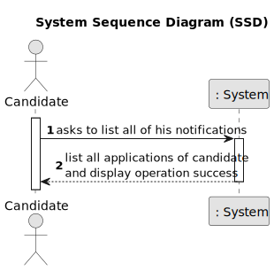

# Application's state change notification

---------------------------

## 1. Requirements Engineering

As Candidate, I want to be notified in my application when the state of one of my applications changes.

### 1.2. Customer Specifications and Clarifications

#### From the specifications document:

**NFR10(RCOMP)** - Functionalities related to the Candidate and Customer Apps and to
the Follow Up Server part of the system have very specific technical requirements. It
must follow a client-server architecture, where a client application is used to access a
server. Communications between these two components must follow specific protocol
described in a document from RCOMP ("Application Protocol"). Also, the client applications can not access the relational database, they can only access the server application.

**NFR11(RCOMP)** - The solution should be deployed using several network nodes. It is
expected that, at least, the relational database server and the Follow Up Server be deployed in nodes different from localhost, preferably in the cloud. The e-mail notification
tasks must be executed in background by the Follow Up Server.

#### From the client clarifications:

> **Question 174:**
>
> Na US 3001 pretende que o candidato seja notificado na sua aplicação quando o estado de uma aplicação mudar. De que forma pretende que o candidato seja notificado? E caso o candidato não esteja a correr a aplicação, essa notificação é perdida?
>
> **Answer:**
>
> O candidato deve ser notificado quando a sua “app” está em execução. Relativamente a notificações que “acontecem” quando não está a correr a aplicação, seria interessante que as recebesse da próxima vez que executasse a aplicação.

> **Question 175:**
>
> O candidato será notificado, quando a sua candidatura mudar de estado. O que se entende por notificado, é receber um email, quando entra na aplicação tem uma fila de 'inbox' ? Quando a aplicação está ligada recebo email? É o candidato que faz o pedido(cliente) (Pop) inicia assim a comunicação, e recebe a resposta/notificação (servidor). E como encaixo o cenário de notificação(push)?
>
> **Answer:**
>
> Neste caso as notificações são na aplicação do candidato, não são por email.

> **Question 189:**
>
> I'd like some clarifications regarding the state that US3001 mentions. Is it the "accepted/not accepted" state, or a state regarding the phases of the recruitment process of which the application is associated to?
>
> **Answer:**
>
> This US is focused on the Candidate perspective. He/she may not be aware of the internal phases of the recruitment process. But he/she is interested in knowing the “external” state of his/her applications. For instance, as a candidate I would like to know if my application was received. Then I would like to know if my application was accepted or not and, finally, if I was selected or not.

> **Question 229:**
>
> Segundo a nossa perspetiva sobre esta funcionalidade, achámos melhor o utilizador ter na sua aplicação uma espécie de inbox de notificações. Quando o utilizador está na funcionalidade das notificações este recebe as notificações que tinha e que não foram enviadas porque não estava na aplicação e depois fica á espera de novas notificações que apareçam entretanto, até o utilizador pedir para sair da funcionalidade. Esta abordagem está alinhada com suas expectativas?

> **Answer:**
>
> Pode ser. Mas não seria possível receber as notificação mesmo não estando nessa “opção de menu”? Sendo uma aplicação “console” limita um pouco a UI, mas não seria possível receber as notificações desde que tenha a aplicação em execução mas só mostrar essas notificações quando o utilizador seleciona a opção? Em termos de UI a diferença é mínima, em termos de implementação pode ser significativa. Talvez esta seja até mais uma questão para RCOMP

> **Question 223:**
>
> Em questões anteriores sobre esta funcionalidade menciona que como candidate gostaria de saber se a sua candidatura foi recebida, aceite e escolhida. Pedimos que descreva a que se refere quando diz que uma candidatura foi aceite, e quando foi escolhida.
>
> **Answer:**
>
> É aceite se passa o processo de verificação de requisitos. É escolhida se após o ranking está dentro dos lugares das vagas para o job opening.

### 1.3. Acceptance Criteria

* AC1 : The candidate must receive a notification in the application whenever the state of one of their job applications changes.

* AC2: Notifications must be easily visible within the application, ensuring that candidates can promptly see any changes.

* AC3: The notification system must be reliable, ensuring that no notifications are missed

### 1.4. Functional Dependencies

[Authentication & authorization](..%2F..%2FSprintB%2Fauthentication-and-authorization)

[Register an application](..%2F..%2FSprintB%2Fregister-an-application)

[Register a candidate](..%2F..%2FSprintB%2Fregister-a-candidate)

[Candidates ranking](..%2F4-rank-candidates-for-job-opening)

[Requirements verification](..%2F11-verification_of_requirements)

### 1.5. Input and Output Data

**Selected Data:**

    * "See Notifications" option
    * "New notification" or "old notifications" options

**Input Data:**

    * None

**Output Data:**

    * Notification message

### 1.6. System Sequence Diagram (SSD)



### 1.7. System Diagram (SD)


### 1.8. Other relevant remarks

* None to specify.

## 2. Analysis and Design

### 2.1. Partial Domain Model


## 2.2. Class Diagram


## 3. Implementation

Most of the implementation is done in the UI layer, in the `ListCandidateNotificationsUI` class. The `doShow` method is responsible for listing the new or the old notifications of the logged in candidate.

```java
@Override
    protected boolean doShow() {

        int selection = showMenuAndGetSelection();
        List<String> notifications;

        switch (selection) {
            case 1:
                System.out.println("Fetching new notifications...");
                notifications = listCandidateNotificationsController.sendNewNotificationsRequest(email);
                if (notifications != null) {
                    for (String notification : notifications) {
                        System.out.println(notification);
                    }
                }
                break;
            case 2:
                System.out.println("Fetching old notifications...");
                notifications = listCandidateNotificationsController.sendOldNotificationsRequest(email);
                if (notifications != null) {
                    for (String notification : notifications) {
                        System.out.println(notification);
                    }
                }
                break;
            default:
                System.out.println("Invalid option.");
                return false;
        }

        return true;

    }
    
    private int showMenuAndGetSelection() {
        System.out.println("Please select an option:");
        System.out.println("1. List new notifications");
        System.out.println("2. List old notifications");
        System.out.print("Your selection: ");

        return Console.readInteger("");
    }

```

## 4. Testing

The testing of this functionality is done in the `Notification` class.

```java
@Test
    void testConstructor() {
        assertEquals(application, notification.application());
        assertEquals(message, notification.message());
        assertEquals(candidate, notification.candidate());
    }

    @Test
    void testHashCode() {
        Notification sameNotification = new Notification(application, message, candidate);
        assertEquals(notification.hashCode(), sameNotification.hashCode());
    }

    @Test
    void testIdentity() {
        assertNotNull(notification.identity()); // ID should be null initially
    }

    @Test
    void testEquals() {
        Notification sameNotification = new Notification(application, message, candidate);
        assertTrue(notification.equals(sameNotification));

        Notification differentNotification = new Notification(application, new Message("Different Message"), candidate);
        assertFalse(notification.equals(differentNotification));
    }

    @Test
    void testApplicationField() {
        assertEquals(application, notification.application());
    }

    @Test
    void testMessageField() {
        assertEquals(message, notification.message());
    }

    @Test
    void testCandidateField() {
        assertEquals(candidate, notification.candidate());
    }

    @Test
    void testEqualsAndHashCode() {
        Notification notification1 = new Notification(application, message, candidate);
        Notification notification2 = new Notification(application, message, candidate);

        assertTrue(notification1.equals(notification2));
        assertEquals(notification1.hashCode(), notification2.hashCode());
    }
```

## 5. Demonstration


