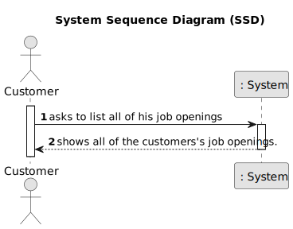
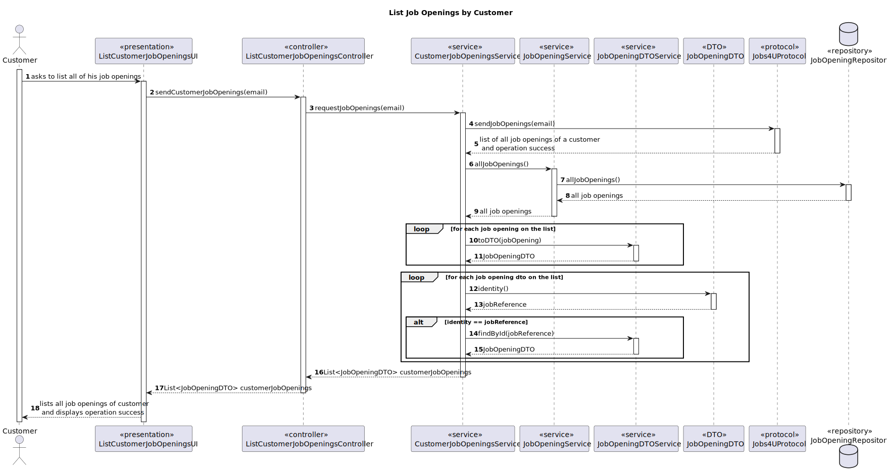
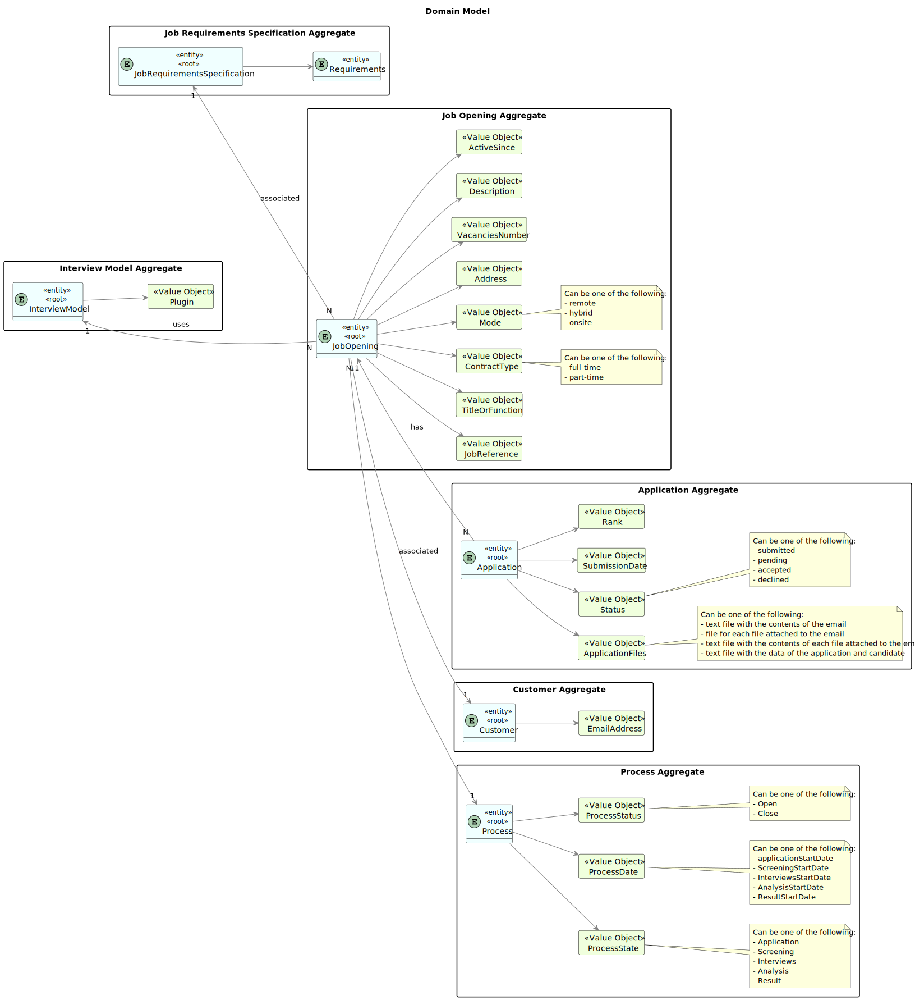
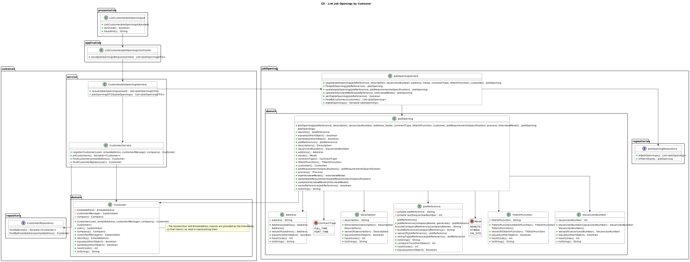

# List all job openings by customer

------------------------------

## 1. Requirements Engineering

### 1.1. User Story Description

As Customer, I want to list all my job openings, including job reference, position, active since, number of applicants.

### 1.2. Customer Specifications and Clarifications

#### From the specifications document:

**NFR10(RCOMP)** - Functionalities related to the Candidate and Customer Apps and to
the Follow Up Server part of the system have very specific technical requirements. It
must follow a client-server architecture, where a client application is used to access a
server. Communications between these two components must follow specific protocol
described in a document from RCOMP ("Application Protocol"). Also, the client applications can not access the relational database, they can only access the server application.

**NFR11(RCOMP)** - The solution should be deployed using several network nodes. It is
expected that, at least, the relational database server and the Follow Up Server be deployed in nodes different from localhost, preferably in the cloud. The e-mail notification
tasks must be executed in background by the Follow Up Server.

#### From the client clarifications:

> **Question 34:**
>
> lista job openings, position o que é?
>
> **Answer:**
> 
>Nessa US quando referimos “position” tem o mesmo significado que “title or function” na secção 2.2.2.

> **Question 172:**
>
> Job Openings Clarifications - You stated that one of the this to show in the listing of job openings is "active since". You've clarified that an active job opening is the one where its recruitment process is on-going. Are the job openings listed in this funcionality only the ones with recruitment process on-going? Or also the ones without recruitment processes, the ones with processes that haven't yet started or have ended?
>
> **Answer:**
>
> In the context of this US, “active since” means the date from the start of the process, the “application” phase (since that date, candidates can apply). This functionality should include all the “active” job openings.

### 1.3. Acceptance Criteria

* AC1 : The customer must be able to view a complete list of all their job openings.

* AC2: Each job opening listed must include the following fields:
      - Job Reference: A unique identifier for the job.
      - Position: The title or role of the job.
      - Active Since: The date the job was posted or activated.
      - Number of Applicants: The total number of applicants who have applied for the job.

* AC3: The system must handle multiple simultaneous requests without performance degradation.

* AC4: The job listing must be accessible at all times, without unexpected interruptions.

### 1.4. Functional Dependencies

[Authentication & authorization](..%2F..%2FSprintB%2Fauthentication-and-authorization)

[Register a Job Opening](..%2F..%2FSprintB%2Fadd-jobOpening)

[Register a Customer](..%2F..%2FSprintB%2Fregister-a-customer)

[Customer Application Login](..%2F12-customer-application-login)

### 1.5. Input and Output Data

**Selected Data:**

    * "Listing Job Openings" option 

**Input Data:**

    * None

**Output Data:**

    * Job Reference
    * Position
    * Active Since
    * Number of Applicants

### 1.6. System Sequence Diagram (SSD)



### 1.7. System Diagram (SD)



### 1.8. Other Relevant Remarks

* None to specify.

## 2. Analysis and Design

### 2.1. Partial Domain Model



### 2.2. Class Diagram



## 3. Implementation

Most of the implementation is done in the UI layer, in the `ListJobOpeningsByCustomerUI` class. The `doShow` method is responsible for listing all job openings by the customer.

```java
@Override
    protected boolean doShow() {
        List<String> jobOpenings = theController.sendCustomerJobOpenings(email);

        if (jobOpenings != null) {
            System.out.printf("%-30s%-30s%-40s%-30s\n", "Job Reference", "Active Since", "Number of Applicants", "Position");
            for (String jobOpening : jobOpenings) {
                System.out.printf("%-140s\n", jobOpening);
            }
        }

        return true;
    }
```

## 4. Testing

The `JobOpening` is fully tested to ensure the correct listing of all job openings by the customer.

```java

@Test
    void testIdentity() {
        assertEquals(jobReference, jobOpening.identity());
    }

    @Test
    void testJobReference() {
        assertEquals(jobReference, jobOpening.jobReference());
    }

    @Test
    void testDescription() {
        assertEquals(description, jobOpening.description());
    }

    @Test
    void testVacanciesNumber() {
        assertEquals(vacanciesNumber, jobOpening.vacanciesNumber());
    }

    @Test
    void testAddress() {
        assertEquals(address, jobOpening.address());
    }

    @Test
    void testMode() {
        assertEquals(mode, jobOpening.mode());
    }

    @Test
    void testContractType() {
        assertEquals(contractType, jobOpening.contractType());
    }

    @Test
    void testTitleOrFunction() {
        assertEquals(titleOrFunction, jobOpening.titleOrFunction());
    }

    @Test
    void testCustomer() {
        assertEquals(customer, jobOpening.customer());
    }

    @Test
    void testJobRequirementsSpecification() {
        assertEquals(jobRequirementsSpecification, jobOpening.jobRequirementsSpecification());
    }

    @Test
    void testProcess() {
        assertEquals(process, jobOpening.process());
    }

    @Test
    void testMyInterviewModel() {
        assertEquals(interviewModel, jobOpening.myInterviewModel());
    }

    @Test
    void testUpdateJobRequirements() {
        JobRequirementsSpecification newJobRequirementsSpecification = new JobRequirementsSpecification(2, "test2.txt");
        jobOpening.updateJobRequirements(newJobRequirementsSpecification);

        assertEquals(newJobRequirementsSpecification, jobOpening.jobRequirementsSpecification());
    }

    @Test
    void testUpdateInterviewModel() {
        InterviewModel newInterviewModel = new InterviewModel("New Model");
        jobOpening.updateInterviewModel(newInterviewModel);

        assertEquals(newInterviewModel, jobOpening.myInterviewModel());
    }
```

## 5. Demonstration

