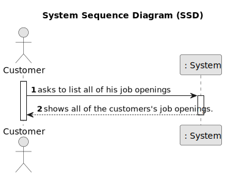

# List all job openings by customer

------------------------------

## 1.1. User Story Description

As Customer, I want to list all my job openings, including job reference, position, active since, number of applicants.

## 1.2. Customer Specifications and Clarifications

### From the specifications document:

**NFR10(RCOMP)** - Functionalities related to the Candidate and Customer Apps and to
the Follow Up Server part of the system have very specific technical requirements. It
must follow a client-server architecture, where a client application is used to access a
server. Communications between these two components must follow specific protocol
described in a document from RCOMP ("Application Protocol"). Also, the client applications can not access the relational database, they can only access the server application.

**NFR11(RCOMP)** - The solution should be deployed using several network nodes. It is
expected that, at least, the relational database server and the Follow Up Server be deployed in nodes different from localhost, preferably in the cloud. The e-mail notification
tasks must be executed in background by the Follow Up Server.

### From the client clarifications:

* Question:

        Q34 Beatriz – US3002, lista job openings, position o que é?

* Answer:

        A34 Nessa US quando referimos “position” tem o mesmo significado que “title or function” na secção 2.2.2.

* Question:

        Q172 Varela – US3002 - Job Openings Clarifications - You stated that one of the this to show in the listing of job openings is "active since". You've clarified that an active job opening is the one where its recruitment process is on-going. Are the job openings listed in this funcionality only the ones with recruitment process on-going? Or also the ones without recruitment processes, the ones with processes that haven't yet started or have ended?

* Answer:

        A172 In the context of this US, “active since” means the date from the start of the process, the “application” phase (since that date, candidates can apply). This functionality should include all the “active” job openings.

## 1.3. Acceptance Criteria

* AC1 : The customer must be able to view a complete list of all their job openings.

* AC2: Each job opening listed must include the following fields:
      - Job Reference: A unique identifier for the job.
      - Position: The title or role of the job.
      - Active Since: The date the job was posted or activated.
      - Number of Applicants: The total number of applicants who have applied for the job.

* AC3: The system must handle multiple simultaneous requests without performance degradation.

* AC4: The job listing must be accessible at all times, without unexpected interruptions.

## 1.4. Functional Dependencies

[Authentication & authorization](..%2F..%2FSprintB%2Fauthentication-and-authorization)

[Register a Job Opening](..%2F..%2FSprintB%2Fadd-jobOpening)

[Register a Customer](..%2F..%2FSprintB%2Fregister-a-customer)

[Customer Application Login](..%2F12-customer-application-login)

## 2. Analysis

### 2.1. Main success scenario

    All the job openings associated to the customer are displayed including job reference, position, active since, number of applicants.

## 2.2. System Sequence Diagram (SSD)

## 2.3. System Diagram (SD)

## 2.4. Partial Domain Model

## 3.0. Design

### 3.1. Partial Class Diagram

### 3.2. Applied Patterns

- **Single Responsibility Principle + High Cohesion** : Every class has only one responsibility, which leads to higher cohesion.

- **Open/Closed Principle**: By using interfaces, we are allowing classes to extend the behavior, but never modify the previous implementation.

- **Information Expert**: A clear example would be the AddCustomerController, that by following the referred pattern, as well as the creator pattern, is responsible for creating the customer.

- **Low Coupling**: All the classes are loosely coupled, not depending on concrete classes, rather depending on interfaces.

- **Controller**: The controller serves as a bridge between the user interface and the domain.