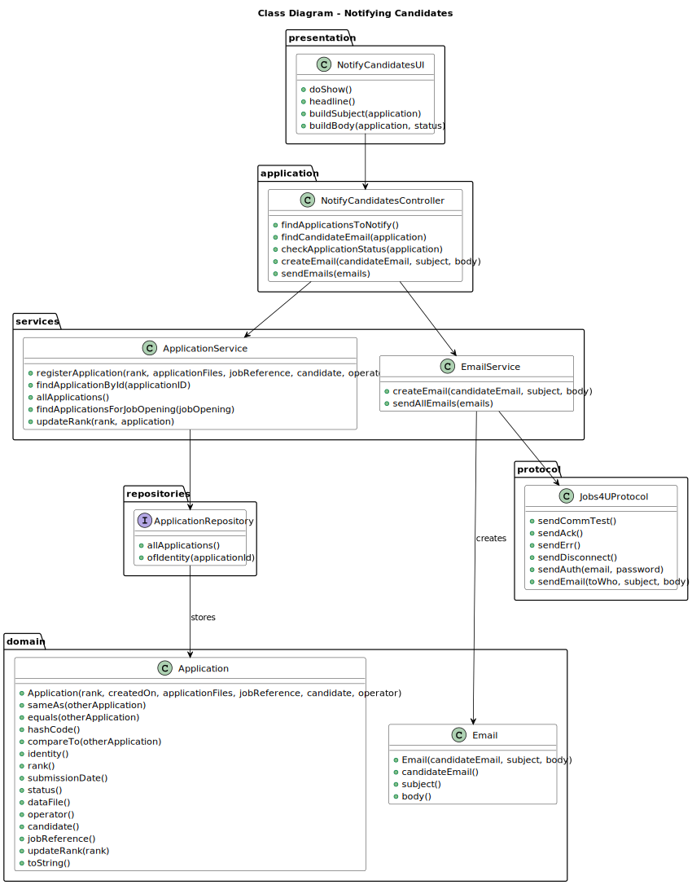

# Notifying candidates about verification status

--------

## 1. Requirements Engineering

### 1.1. User Story Description

As Customer Manager, I want the system to notify candidates, by email, of the result of the verification process.

### 1.2. Customer Specifications and Clarifications

**From the client clarifications:**

> **Question 48:**
>
> US1016 e US1020, relativamente ao envio das notificações por email, 
é necessário guardar que esse envio foi feito?
>
> **Answer:**
> No documento nada de explicito é dito sobre este assunto. No entanto, do ponto de vista de 
gestão do processo da jobs4u parece-me adequado que essa informação fique registada.
 
> **Question 69:**
> 
> Acerca da US 1016 - "As Customer Manager, I want the system to notify candidates, by email, of the result of the 
verification process" qual é o processo através do qual essa notificação é gerada? Após a avaliação do Requirement 
Specification module, este gera um resultado "Aprovado" ou "Rejeitado". Este resultado despoleta automaticamente uma 
notificação para o candidato ou é o Customer Manager que tem a responsabilidade de informar o candidato através do sistema 
do resultado da verificação (ex. depois de um resultado negativo ser gerado, o Customer Manager vai no sistema rejeitar 
o candidato para que seja enviado o email)?
> 
> **Answer:**
> É a segunda opção que apresenta. A US1015 permite que o Customer Manager invoque o processo de verificação de requisitos. 
Depois disso todas as candidaturas devem estar aceites ou recusadas. É então possível ao Customer Manager invocar 
a notificação através da US1016.
 
> **Question 119:**
> 
> Management of screening data - We have a question about the management of the screen phase of the recruitment process. 
Specifically, after the applications are filtered during the screening process, I'm unsure about who manages the results 
and oversees this phase. Could you please clarify if the responsibility for managing the screening results falls under
the customer manager, the operators, or both?
> 
> **Answer:**
> In US2003 and US2004 it is the Operator that “downloads” a template file to register the requirements, registers the 
answers for the requirements in the file, and then uploads the file. It is then the Costumer manager that executes the 
verification process (US1015) and executes the notification of the results (US1016)
 
> **Question 164:**
> 
> US1016 - em relação a US1016 que diz o seguinte: "As Customer Manager, I want the system to notify candidates, by email, 
of the result of the verifcation process". Eu gostaria de saber qual o formato da mensagem a seguir para enviar ao cliente, 
poderia ser algo do genero: "Dear [Candidate's Name], I hope this email finds you well. As the Customer Manager, I wanted 
to inform you about the outcome of the verification process for the position you applied for. After careful consideration 
of your application and qualifications, I'm pleased to inform you that you have successfully passed the verification process. 
Congratulations! Your application has met our initial criteria, and we are impressed with your qualifications and experience. 
We will be proceeding to the next phase of the selection process, which may include interviews or additional assessments. 
We will reach out to you soon with further details regarding the next steps. Thank you for your interest in our company and 
for taking the time to apply for the position. We appreciate your patience throughout the process. If you have any questions 
or need further assistance, please don't hesitate to contact us. Best regards, [Your Name] Customer Manager [Your Company Name]" 
Gostaria de saber as informações mais importantes quando se notificar o candidato, deve aparecer o nome do customer manager, 
a job reference, o nome do candidato. E se o email deve ser em inglês ou português.
> 
> **Answer:**
> Pode ser como apresenta. Pode ser em português ou inglês.

> **Question 209:** 
> 
> About the Us1016 wich states: "As Customer Manager, I want the system to notify candidates, by email, 
of the result of verification process". I want to know when the client says "verification process" 
is the same about the screening phase.
> 
> **Answer:**
> Yes.
 
> **Question 210:**
> 
> Notify candidates - This user story has a functional dependency with 1015. I would like to know if an error occurs, 
do I need to delete what happened in US 1015, as if it were a transaction?
> 
> **Answer:**
> The process of notification (US1016) must be done after the verification (US1015) but an error in the notification 
does not invalidate the “results” of the verification process.

### 1.3. Acceptance Criteria

* AC1: Sending emails:

        The emails should be sent through the follow up server.

* AC2: Relation to US1015:

        The status of the application is defined by US1015.

* AC3: Email content:

        The email content should include the status of their application.

* AC4: Email language:

        The email can be written in Portuguese or English.

* AC5: Emails sent manually:

        The email should be sent manually by the Customer Manager.

### 1.4. Found out Dependencies

* G007 - As a Project Manager, I want the system to support and apply authentication and authorization for all its users and functionalities.
* 1015 - As a Customer Manager, I want to execute the process of verification of requirements for a job opening.

### 1.5. Input and Output Data

**Output Data:**

    * Number of emails sent
    * (In)Success of each operation

### 1.6. System Sequence Diagram (SSD)


### 1.7. Sequence Diagram (SD)


### 1.8 Other Relevant Remarks

*  None to specify 

## 2. Analysis and Design

### 2.1. Domain Model


### 2.2. Class Diagram


## 3. Implementation

In order to send emails to the follow up server, and then online we implemented this method in the `Jobs4UProtocol` class
that follows the rules set by the protocol.

```java
    public void sendEmail(String toWho, String subject, String body) throws IOException {
        List<String> data = new ArrayList<>();
        data.add(toWho);
        data.add(subject);
        data.add(body);

        List<DataChunk> dataChunkList = new ArrayList<>();
        final int MAX_CHUNK_LEN = 255 + 256 * 255;

        for (String s : data) {
            byte[] rawData = s.getBytes();
            int index = 0;

            int chunkSize = Math.min(MAX_CHUNK_LEN, rawData.length - index);
            byte[] arr = new byte[chunkSize];

            for (int j = 0; j < chunkSize; j++) {
                arr[j] = rawData[index];
                index++;
            }

            byte data1LenL = (byte) (chunkSize % 256);
            byte data1LenM = (byte) (chunkSize / 256);

            dataChunkList.add(new DataChunk(new UnsignedInteger(data1LenL), new UnsignedInteger(data1LenM), arr));
        }

        ByteArrayOutputStream byteArrayOut = new ByteArrayOutputStream();
        byteArrayOut.write(VERSION);
        byteArrayOut.write(ProtocolCodes.EMAIL.code());

        for (DataChunk chunk : dataChunkList) {
            byteArrayOut.write(chunk.dataLenL().rawValue());
            byteArrayOut.write(chunk.dataLenM().rawValue());
            byteArrayOut.write(chunk.data());
        }

        byteArrayOut.write(0);
        byteArrayOut.write(0);

        byte[] requestedData = byteArrayOut.toByteArray();

        outData.write(requestedData);
    }
```

## 4. Testing

## 5. Demonstration

