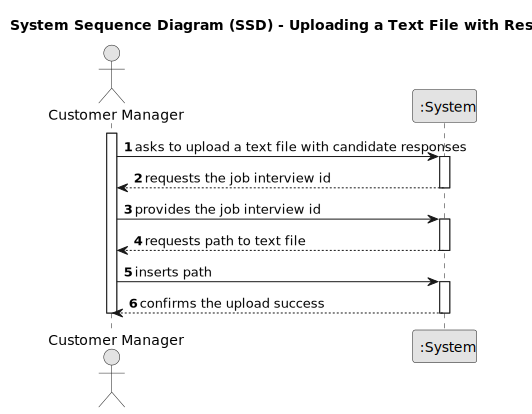
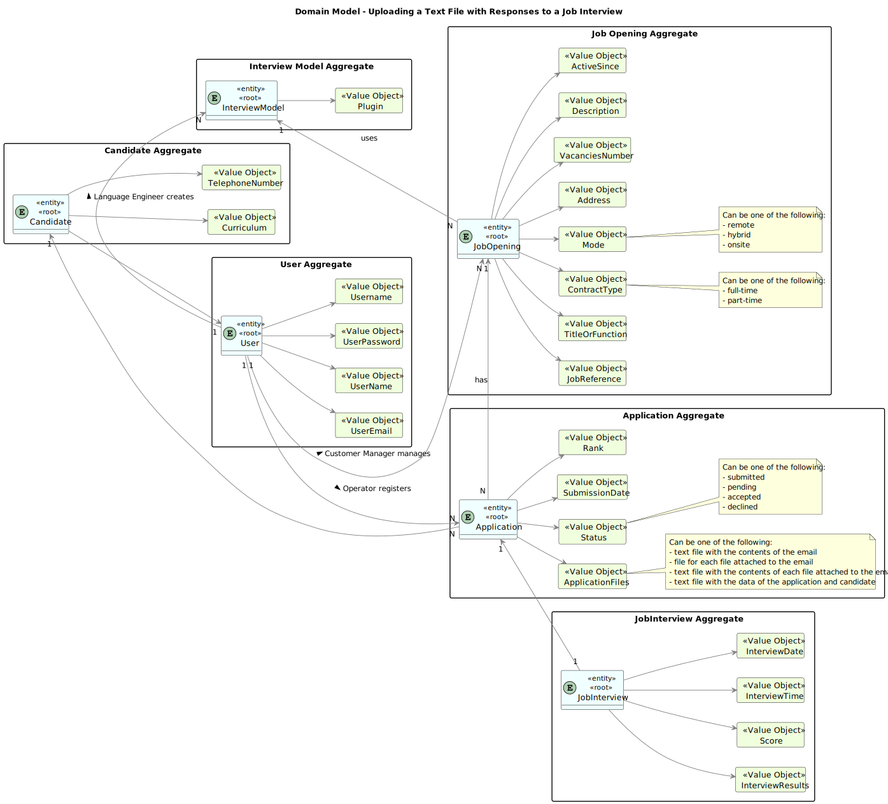
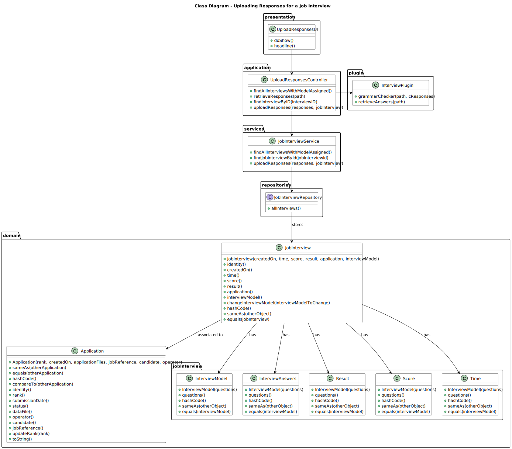
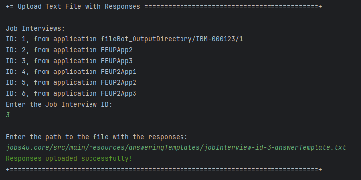

# Uploading a Text File with the Candidate Responses

--------

## 1. Requirements Engineering

### 1.1. User Story Description

As Customer Manager, I want to upload a text file with the candidate responses for an interview.

### 1.2. Customer Specifications and Clarifications

**From the specifications document:**

> **NFR09(LPROG) - Requirement Specifications and Interview Models:**
> 
> The support for this functionality must follow specific technical requirements, 
specified in LPROG. The ANTLR tool should be used (https://www.antlr.org/).

**From the client clarifications:**

> **Question 214:**
>
> O nosso grupo tem uma dúvida em relação ao processamento dos ficheiros de respostas dos candidatos para a entrevista. 
No caso de upload de um ficheiro, se a pergunta que requer um número como resposta for preenchida com um formato inválido, 
por exemplo, uma letra, devemos considerar isso como um formato inválido na US 1017 (e pedir para o user voltar a dar 
upload a um ficheiro válido) ou devemos, na US1018, considerar que está incorreta e atribuir 0 pontos automaticamente para 
essa resposta inválida? Isto é, na US 1017, devemos apenas verificar o formato do ficheiro ou devemos verificar também se 
as respostas são preenchidas com o tipo de dados correto?
>
> **Answer:**
> O caso mencionado deve ser considerado um erro de validação do ficheiro (ou seja, o ficheiro submetido não corresponde à gramática definida).

> **Question 227:**
> 
> Em termos "upload" certamente passa pela verificação com a gramática e após sucesso colocar o ficheiro das respostas da 
entrevista junto da pasta com os ficheiros da "Application" certo?
> 
> Sim, a sintaxe deve ser verificada e, se tudo estiver correto, o ficheiro deve ser “importado” para o sistema de forma a 
que possa ser usado posteriormente, por exemplo, no âmbito da US 1018. Qual a solução para o “importar” faz parte da vossa solução. 
Idealmente julgo que faria sentido que ficasse integrado na base de dados. Não sendo possível, penso que é aceitável que fique numa 
pasta/diretório de um servidor.

### 1.3. Acceptance Criteria

* AC1: Uploading the responses:

        The system must allow the Customer Manager to upload a text file with the candidate responses for an interview.

* AC2: File format validation:

        The system must validate the file format according to the grammar defined. 
        If the file format is invalid, the system must display an error message.

* AC3: File storage:

        The responses should be stored somewhere in the system, so they can be used later.
        Storing in the database is the ideal solution.

### 1.4. Found out Dependencies

* G007 - As a Project Manager, I want the system to support and apply authentication and authorization for all its users and functionalities.
* 1008 - As Language Engineer, I want to deploy and configure a plugin (i.e., Job Requirement Specification or Interview Model) to be used by the system.
* 1012 - As Customer Manager, I want to generate and export a template text file to help collect the candidate answers during the interviews.

### 1.5. Input and Output Data

**Input Data:**

    * Job Interview ID
    * Path to the text file

**Output Data:**

    * (In)Success of the operation

### 1.6. System Sequence Diagram (SSD)


### 1.7. Sequence Diagram (SD)


### 1.8 Other Relevant Remarks

*  None to specify 

## 2. Analysis and Design
The desing of this use case is based on the following domain model and class diagram:

### 2.1. Domain Model


### 2.2. Class Diagram


## 3. Implementation

These are the methods coded into `UploadResponsesController` that are used by the UI for this use case.

```java
    public JobInterview findInterviewByID(int jobInterviewID) {
        return jobInterviewService.findById(jobInterviewID);
    }
    
    public void uploadResponses(List<String> responses, JobInterview jobInterview) {
        InterviewAnswers interviewAnswers = new InterviewAnswers(responses);
        jobInterviewService.uploadResponses(interviewAnswers, jobInterview);
    }
    
    public List<String> retrieveResponses(String path) {
        InterviewPlugin plugin = new InterviewPlugin();
        return plugin.retrieveAnswers(path);
    }
    
    public List<JobInterview> findAllInterviewsWithModelAssigned() {
        List<JobInterview> jobInterviews = (List<JobInterview>) jobInterviewService.allJobInterviews();
        List<JobInterview> availableInterviews = new ArrayList<>();
      
        for (JobInterview jobInterview : jobInterviews) {
            if (jobInterview.application().jobReference().myInterviewModel() != null) {
                availableInterviews.add(jobInterview);
            }
        }
      
        return availableInterviews;
    }
```

## 4. Testing

JUnit tests were implemented for the `InterviewAnswers` class to ensure that the class behaves as expected.

```java
    @BeforeEach
    void setUp() {
        answers = Arrays.asList("Answer 1", "Answer 2", "Answer 3");
        interviewAnswers = new InterviewAnswers(answers);
    }
    
    @Test
    void testEquals() {
        InterviewAnswers sameInterviewAnswers = new InterviewAnswers(answers);
        assertEquals(interviewAnswers, sameInterviewAnswers);
    }

    @Test
    void testHashCode() {
        InterviewAnswers sameInterviewAnswers = new InterviewAnswers(answers);
        assertEquals(interviewAnswers.hashCode(), sameInterviewAnswers.hashCode());
    }

    @Test
    void testToString() {
        String expectedString = answers.toString();
        assertEquals(expectedString, interviewAnswers.toString());
    }

    @Test
    void testAnswersList() {
        assertEquals(answers, interviewAnswers.answersList());
    }
```

## 5. Demonstration
