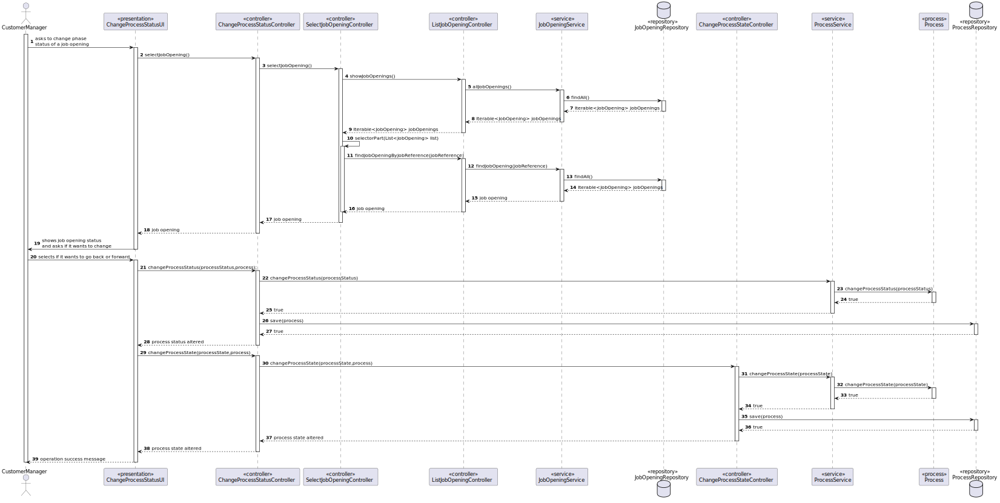
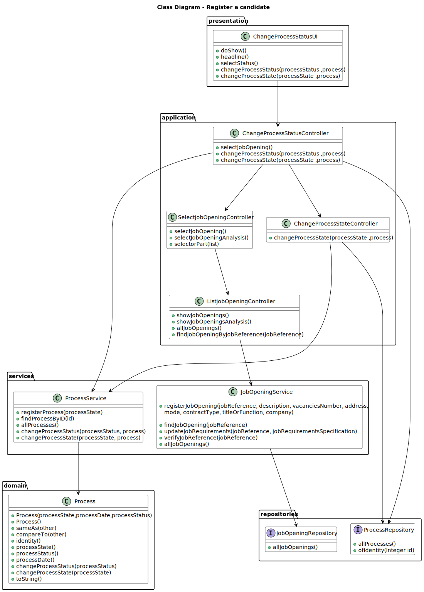

# Change Status of Process of Job Opening

--------

## 1. Requirements Engineering

### 1.1. User Story Description

As Customer Manager, I want to open or close phases of the process for a job opening

### 1.2. Customer Specifications and Clarifications

**From the client clarifications:**

> **Question 16**
>
> Relativamente à secção 2.2.1 e às fases do processo de
recrutamento, para passarmos para a fase seguinte a anterior tem de fechar
ou podemos avançar sem ter a anterior fechada?
>
> **Answer**
>
> A resposta curta é que as fases devem ser sequenciais e não sobrepostas. Quando
fecha uma fase abre a próxima. A US 1007 prevê a definição das fases. A US 1010 prevê a
abertura e fecho de fases do processo. A decisão do Customer Manager de fechar uma
fase deve assumir que o processo avança para a próxima fase automaticamente
(independentemente das datas definidas para as fases).


> **Question 143**
> 
> Open or close phases of the process for a job
opening. – Quando o Customer Manager deseja abrir ou fechar uma fase de
recrutamento, este deve ter a oportunidade de escolher qual fase deseja
abrir ou fechar, ou automaticamente ele avança para a próxima fase, isto é
fecha a fase atual e abre a seguinte.
>
> **Answer**
> 
> Já respondida em Q16. Mas, resumindo, a ideia desta US é permitir avançar nas
fases de um job opening. As fases devem ser sempre sequenciais. Podemos considerar
que o fecho de uma fase resulta na abertura da fase seguinte (e o avançar para a fase
seguinte, significa fechar a anterior). Não deve ser possível “saltar” fases, a não ser fases
que não façam parte do processo (por exemplo, se não tiver entrevistas).

> **Question 168**
> 
> O utilizador deve escolher a fase que quer abrir
ou fechar?
>
> **Answer**
> 
> Sem querer condicionar a UI/UX, penso que uma possibilidade seria o sistema
apresentar a fase atual do processo e indicar o que é possível fazer. Se for possível
avançar ou recuar, deve indicar que é possível e qual a fase resultante. Se não (ainda)
possível avançar/recuar deve indicar a justificação desse facto.

> **Question 212**
> 
> Quando se pode recuar de fase?
>
> **Answer**
> 
> O princípio geral é, se não estiver a fazer nada específico da fase atual pode-se
recuar. Por exemplo, se estiver na fase das entrevistas e ainda não comecei a avaliar
nenhuma entrevista, então pode-se recuar para a fase de screening. Embora não faça
sentido voltar a avaliar os requisitos dos candidatos se eles já foram avisados do
resultado. Numa situação real, em que aconteça um erro que invalide um resultado que já
foi notificado a terceiros (candidatos ou empresas) podemos assumir que isso será
resolvido no âmbito de um processo excecional que está fora do âmbito do nosso sistema
atual (o sistema não tem atualmente de suportar esses casos).


> **Question 232**
> 
> Recuar da primeira fase - No caso da atual fase ser a
"Application phase" (fase inicial do processso de recrutamento) é possível
também recuar?
>
> **Answer**
> 
> Esse assunto já foi amplamente discutido em questões anteriores. A resposta à
questão depende do desenho da vossa solução. A “Application” é a primeira fase na vossa
solução ou existe outra? Se é a primeira fase então não se pode recuar. Quando muito
pode-se “fechar” essa fase inicial (ou seja, considerar como ainda não aberta/iniciada).
Mas talvez não faça sentido fazer isso se já estamos a receber candidaturas.


### 1.3. Acceptance Criteria

> **AC1:**
> The costumer manager should select the job opening for which he wants to update process status

> **AC2:**
> The costumer manager should select the status he intends for the job opening selected

### 1.4. Input and Output Data

**Selected Data:**

    * job opening
    * status of job opening

**Output Data:**

    * status updated of job opening
    * (In)Success of the operation

### 1.5. System Sequence Diagram (SSD)


## 2. Analysis and Design

### Analysis

### 2.1. Domain Model


### Design

### 2.2. Sequence Diagram (SD)


### 2.3. Class Diagram


## 3. Implementation

Most of the implementation of this user story was done in the UI layer, in the `ChangeProcessStatusUI` class.
The `doShow` method was implemented to allow the customer manager to change the process status of a job opening
The `ChangeProcessStatusController` class is mainly used to access the repositories and other controllers to retrieve and update data.

```java
@Override
    protected boolean doShow() {

        System.out.println("\nAvailable Job Openings: ");
        JobOpening jobOpening = changeProcessStatusController.selectJobOpening();
        selectStatus(jobOpening);

        return false;
    }
```

```java
private void selectStatus(JobOpening jobOpening) {

        Process process = jobOpening.process();
        ProcessState state = process.processState();
        ProcessStatus status = process.processStatus();
        String nameState = state.name();
        String nameStatus = status.name();
        System.out.printf("%-30s%-30s%-30S%n", "Job Opening", "State", "Status");
        System.out.printf("%-30s%-30s%-30S%n", jobOpening.identity(), nameState, nameStatus);
        final int optionMove = Console.readInteger("\nDo you want to move: \n 1 - Back \n 2 - Forward \n" + "Choose an option: ");

        if (optionMove == 1) {
            switch (nameState) {
                case "APPLICATION":
                    System.out.println("You cannot move backwards because this is the first state of the process");
                    System.out.println("Status of the process: " + process.processStatus().toString());
                    break;
                case "SCREENING":
                    changeProcessStatus(ProcessStatus.CLOSE, process);
                    changeProcessState(ProcessState.APPLICATION, process);
                    changeProcessStatus(ProcessStatus.OPEN, process);

                    break;
                case "INTERVIEWS":
                    changeProcessStatus(ProcessStatus.CLOSE, process);
                    changeProcessState(ProcessState.SCREENING, process);
                    changeProcessStatus(ProcessStatus.OPEN, process);

                    break;
                case "ANALYSIS":
                    changeProcessStatus(ProcessStatus.CLOSE, process);
                    changeProcessState(ProcessState.INTERVIEWS, process);
                    changeProcessStatus(ProcessStatus.OPEN, process);

                    break;
                case "RESULT":
                    changeProcessStatus(ProcessStatus.CLOSE, process);
                    changeProcessState(ProcessState.ANALYSIS, process);
                    changeProcessStatus(ProcessStatus.OPEN, process);

                    break;
                default:
                    System.out.println("State not valid! \n");
                    break;
            }

        } else if (optionMove == 2) {
            switch (nameState) {
                case "APPLICATION":
                    changeProcessStatus(ProcessStatus.CLOSE, process);
                    changeProcessState(ProcessState.SCREENING, process);
                    changeProcessStatus(ProcessStatus.OPEN, process);

                    break;
                case "SCREENING":
                    changeProcessStatus(ProcessStatus.CLOSE, process);
                    changeProcessState(ProcessState.INTERVIEWS, process);
                    changeProcessStatus(ProcessStatus.OPEN, process);

                    break;
                case "INTERVIEWS":
                    changeProcessStatus(ProcessStatus.CLOSE, process);
                    changeProcessState(ProcessState.ANALYSIS, process);
                    changeProcessStatus(ProcessStatus.OPEN, process);

                    break;
                case "ANALYSIS":
                    changeProcessStatus(ProcessStatus.CLOSE, process);
                    changeProcessState(ProcessState.RESULT, process);
                    changeProcessStatus(ProcessStatus.OPEN, process);

                    break;
                case "RESULT":
                    System.out.println("You cannot move forward because this is the last state of the process");
                    System.out.println("Status of the process: " + process.processStatus().toString());

                    break;
                default:
                    System.out.println("State not valid! \n");
                    break;
            }
        } else {
            System.out.println("Option not valid! \n Please try again. \n\n ");
            selectStatus(jobOpening);
        }
    }
```

```java
public void changeProcessStatus(ProcessStatus processStatus, Process process) {
        Process newProcess = changeProcessStatusController.changeProcessStatus(processStatus, process);
        System.out.println("Success: Status was updated to " + newProcess.processStatus() + " for the process " + newProcess.identity());
    }

```

```java
public void changeProcessState(ProcessState processState, Process process) {
        Process newProcess = changeProcessStatusController.changeProcessState(processState, process);
        System.out.println("Success: State was updated to " + newProcess.processState() + " for the process " + newProcess.identity());
    }
```

## 4. Testing
```java
class ProcessStatusTest {

    @Test
    void testEnumValues() {
        // Test that all enum values are defined correctly
        assertEquals(ProcessStatus.OPEN, ProcessStatus.valueOf("OPEN"));
        assertEquals(ProcessStatus.CLOSE, ProcessStatus.valueOf("CLOSE"));

    }

    @Test
    void testDistinctValues() {
        // Test that enum values are distinct
        assertNotEquals(ProcessStatus.OPEN, ProcessStatus.CLOSE);
        assertNotEquals(ProcessStatus.CLOSE, ProcessStatus.OPEN);

    }

}
```


## 5. Demonstration

### Cannot move backwards


### Can move backwards


### Cannot move forward


### Can move forward


