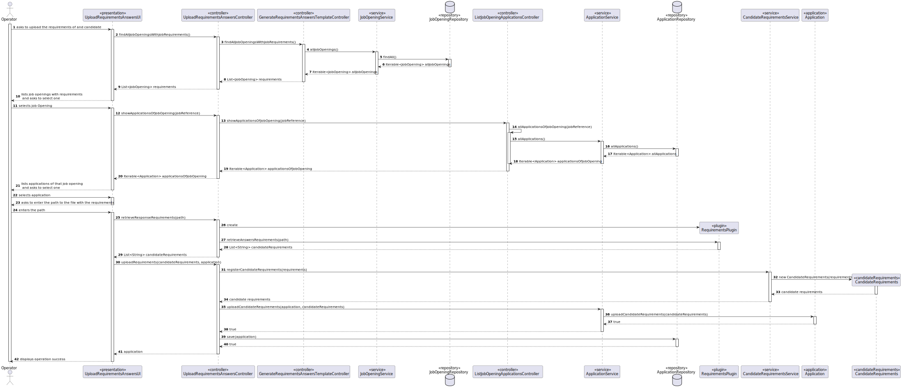
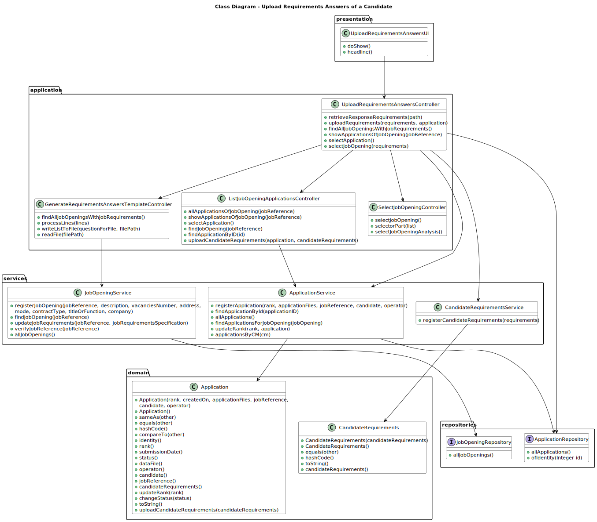

# Upload Requirements Answers of a Candidate

--------

## 1. Requirements Engineering

### 1.1. User Story Description

As an Operator, I want to upload a text file with the data fields (requirements) of a candidate for its verification.

### 1.2. Customer Specifications and Clarifications

**From the client clarifications:**

> **Question 15**
>
> É o Operador que regista uma candidatura ou é o sistema que
o faz automaticamente? E como integra o “plugin” de verificação da
candidatura neste processo?
>
> **Answer**
>
> Na US 2002 o Operator regista a candidatura. Para isso, é o Operator que inicia o
processo mas o sistema deve importar os dados resultantes do Application File Bot de
forma “automática” (Ver References da US 2002). O plugin referido entra neste processo
através da US 2003, em que o Operador gera um ficheiro template com os dados a
introduzir para validar uma candidatura. Na US 2004, o Operador, após preencher os
dados específicos da candidatura (com base no ficheiro template anterior) submete no
sistema esse ficheiro que vai ser usado para o sistema avaliar/verificar a candidatura. Se
os critérios não forem atingidos a candidatura é recusada.

> **Question 102**
> 
> Quem vai preencher as respostas no ficheiro template?
> 
> **Answer**
> 
> Será o Operador e, no âmbito da US2004, este submete o ficheiro já preenchido no
sistema.


> **Question 132**
> 
> Usage of ANTLR- Is it possible to clarify the
usage of ANTRL within user story 2003? You've stated in Q15, Q102 and Q119,
that US2003 simply generates the file, while in US2004 the Operator defines
the answers and uploads the file. Where is this file uploaded to? Given this,
where is the usage of ANTRL in US2003 directed to?
> 
> **Answer**
> 
> Regarding the first question, although difficult it is possible to generate the template
text file using ANTLR. If so, there we have the usage o ANTLR. Although, unless there is
some specific evaluation requirement from LPROG, it is acceptable that the template file
is hardcoded in the plugin (no need for any “complex” generation process/function).
Regarding the second question, the file is uploaded to the system. The last question was
answered first.

> **Question 218**
> 
> Submissão de um ficheiro para verificação – O
meu grupo tem uma dúvida em relação à US2004, nomeadamente sobre o
processo de submissão do ficheiro. Gostaríamos de saber se "submeter o
ficheiro para verificação" na US 2004 implica apenas guardar o caminho do
ficheiro no sistema e fazer a sua análise sintática (como referiu na Q180) ou
se envolve também a extração e armazenamento da informação contida no
ficheiro em estruturas específicas para posterior verificação. Temos esta
dúvida porque há User Stories em que está explícito que é suposto importar
as informações dos ficheiros, como por exemplo na US2002: "As Operator, I
want to register an application of a candidate for a job opening and import all
files received". No entanto, na US2004 não está explícito o que significa
"submeter o ficheiro".
>
> **Answer**
> 
> Submeter o ficheiro significa “importar” o ficheiro para o sistema, verificando se
está sintaticamente correto. O ficheiro passa a fazer parte do sistema, sendo possível
operações posteriores sobre esse ficheiro/dados, como a US1015. Não quero/devo
condicionar como é que isso é feito em termos de solução.


### 1.3. Acceptance Criteria

> **AC1:**
> The operator should be able to select the job opening for which he wants to upload candidate requirements

> **AC2:**
> The operator should be able to select the application he intends to upload candidate requirements

> **AC3:**
> The operator should be able to enter the path to the file he wants to upload


### 1.4. Found out Dependencies

    * 1005 — List Applications Of A Job Opening

### 1.5. Input and Output Data

**Selected Data:**

    * Job Opening
    * Application

**Input Data:**

    * Path to file

**Output Data:**

    * (In)Success of the operation

### 1.6. System Sequence Diagram (SSD)


## 2. Analysis and Design
To find out more details about the analysis and design of Application or Job Opening, please refer to the following documents:

[Register an Application](..%2F..%2FSprintB%2Fregister-an-application%2FReadme.md)

[Add a Job Opening](..%2F..%2FSprintB%2Fadd-jobOpening%2FReadme.md)

[List all Applications of a Job Opening](..%2F..%2FSprintB%2Flist-job-openings'-application%2FReadme.md)

### Analysis

### 2.1. Domain Model


### Design

### 2.2. Sequence Diagram (SD)


### 2.3. Class Diagram


## 3. Implementation

Most of the implementation of this user story was done in the UI layer, in the `UploadRequirementsAnswersUI` class. The `doShow` method was implemented to allow the operator to upload the candidate's requirements
The `UploadRequirementsAnswersController` class is mainly used to access the repositories and other controllers to retrieve and update data.

```java
@Override
    protected boolean doShow() {
        List<JobOpening> requirements = uploadRequirementsAnswersController.findAllJobOpeningsWithJobRequirements();

        int cont = 1;
        if (requirements.isEmpty()) {
            System.out.println(ConsoleColors.RED + "There are no job openings with requirements" + ConsoleColors.RESET);
            return false;
        } else {
            System.out.printf("%-30s%-30s%-30s%-30s%n", "Job Opening Number:", "Job Reference:", "Title or Function:", "Job Opening Customer:");

            for (JobOpening jobOpening : requirements) {
                System.out.printf("%-30s%-30s%-30s%-30s%n", cont, jobOpening.jobReference(), jobOpening.titleOrFunction(), jobOpening.customer());
                cont++;
            }

            JobOpening jobOpening = uploadRequirementsAnswersController.selectJobOpening(requirements);
            uploadRequirementsAnswersController.showApplicationsOfJobOpening(jobOpening.jobReference());
            Application application = uploadRequirementsAnswersController.selectApplication();

            String path = Console.readLine("\nEnter the path to the file with the requirements: ");
            List<String> candidateRequirements = uploadRequirementsAnswersController.retrieveResponseRequirements(path);

            uploadRequirementsAnswersController.uploadRequirements(candidateRequirements, application);
            System.out.println(ConsoleColors.GREEN + " Candidate Requirements uploaded successfully!" + ConsoleColors.RESET);

            return true;
        }
    }
```

## 4. Testing

```java
class CandidateRequirementsTest {

    private CandidateRequirements candidateRequirements1;
    private CandidateRequirements candidateRequirements2;
    private CandidateRequirements candidateRequirements3;

    @BeforeEach
    void setUp() {
        List<String> requirements1 = Arrays.asList("Requirement1", "Requirement2");
        List<String> requirements2 = Arrays.asList("Requirement1", "Requirement2");
        List<String> requirements3 = Arrays.asList("Requirement3", "Requirement4");

        candidateRequirements1 = new CandidateRequirements(requirements1);
        candidateRequirements2 = new CandidateRequirements(requirements2);
        candidateRequirements3 = new CandidateRequirements(requirements3);
    }

    @Test
    void testEquals() {
        assertEquals(candidateRequirements1, candidateRequirements2);
        assertNotEquals(candidateRequirements1, candidateRequirements3);
    }

    @Test
    void testHashCode() {
        assertEquals(candidateRequirements1.hashCode(), candidateRequirements2.hashCode());
        assertNotEquals(candidateRequirements1.hashCode(), candidateRequirements3.hashCode());
    }

    @Test
    void testToString() {
        assertEquals(candidateRequirements1.toString(), candidateRequirements2.toString());
        assertNotEquals(candidateRequirements1.toString(), candidateRequirements3.toString());
    }
}
```

## 5. Demonstration

### Cannot Upload Successfully


### Can Upload Successfully


