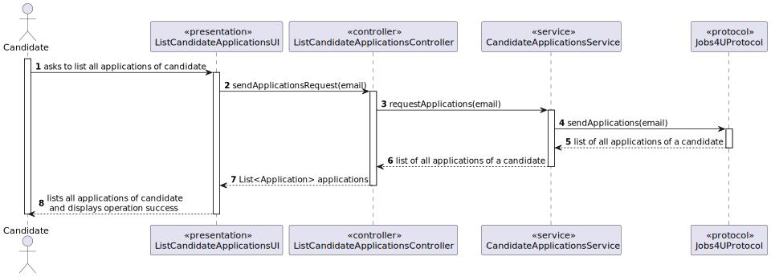

# List Candidate Applications

--------

## 1. Requirements Engineering

### 1.1. User Story Description

As a Candidate, I want to list all my applications and their state (including the number of applicants).

### 1.2. Customer Specifications and Clarifications

**From the client clarifications:**


> **Question 176**
>
> Na US3000 pede que, para alem de listar as aplicações
e o estado das mesmas de um candidato, que liste o numero de candidatos.
Este numero de candidatos é um somatório da quantidade de candidatos que
fizeram uma aplicação para as mesmas Job Openings deste primeiro
candidato (que esta a executar o caso de uso)?
>
> **Answer**
>
> Devem ser listadas todas as “applications” (candidaturas) do candidato, o estado
delas, assim como o número de candidaturas que cada job opening teve (assim o
candidato tem uma noção da “concorrência” que teve para cada uma das suas
candidaturas).


### 1.3. Acceptance Criteria

> **AC1:**
> The candidate should be able to see all his applications, their status and the corresponding job opening

> **AC2:**
> The candidate should be able to see as well the number of applicants for the same job opening for each application

### 1.4. Found out Dependencies

    * 1005 — List Applications Of A Job Opening

### 1.5. Input and Output Data

**Output Data:**

    * List of applications of a candidate
    * Number of apllicants of a job opening
    * (In)Success of the operation

### 1.6. System Sequence Diagram (SSD)


## 2. Analysis and Design

### Analysis

### 2.1. Domain Model


### Design

### 2.2. Sequence Diagram (SD)


### 2.3. Class Diagram


## 3. Implementation

Part of the implementation of this user story was done in the UI layer, in the `ListCandidateApplicationsUI` class. The `doShow` method was implemented to allow the customer manager to rank the candidates for a job opening.
The `ListCandidateApplicationsController` class is mainly used to access the repositories and other controllers to retrieve and update data.
The `CandidateApplicationsService` class is responsible for the first step of asking the server to send the list of applications and receiving the answers from the server

`ListCandidateApplicationsUI`
```java
@Override
    protected boolean doShow() {
        List<String> applications = listCandidateApplicationsController.sendApplicationsRequest(email);

        if (applications != null) {
            for (String applicationCandidate : applications) {
                System.out.printf("%-140s \n", applicationCandidate);
            }
        }

        return true;
    }
```

`ListCandidateApplicationsController`
```java
public List<String> sendApplicationsRequest(String email) {
        return candidateApplicationsService.requestApplications(email);
    }
```

`CandidateApplicationsService`
```java
public List<String> requestApplications(String email) {
        try {
            Socket socket = new Socket("127.0.0.1", 2005);
            DataInputStream inData = new DataInputStream(socket.getInputStream());

            Jobs4UProtocol protocol = new Jobs4UProtocol(socket);
            protocol.sendApplications(email);

            inData.readByte();
            byte code = inData.readByte();

            if (code == ProtocolCodes.APPLICATIONS.code()) {
                int dataLenL = new UnsignedInteger(inData.readByte()).positiveValue();
                int dataLenM = new UnsignedInteger(inData.readByte()).positiveValue();

                int lenghtData = (256 * dataLenM + dataLenL);

                byte[] listApp = inData.readNBytes(lenghtData);

                String application = new String(listApp, StandardCharsets.UTF_8);

                String applicationsArray = application.replaceAll("[\\[\\]\"]", "").trim();

                String[] appEntries = applicationsArray.split(",");

                socket.close();

                return new ArrayList<>(Arrays.asList(appEntries));
            } else {
                System.out.println("You do not have any applications! ");
                return null;
            }
        } catch (
                IOException e) {
            throw new RuntimeException(e);
        }
    }
```

## 4. Demonstration

### Cannot List Applications


### Can List Applications

