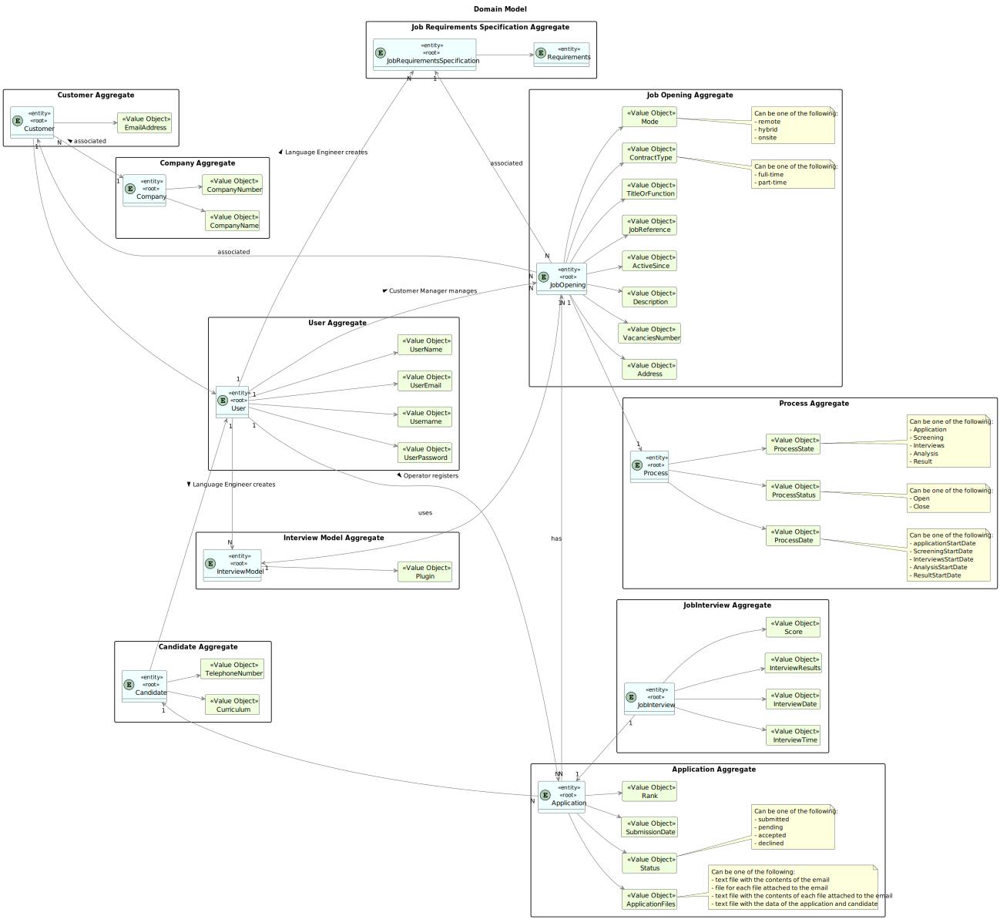

# Sprint C

--------------------------------------------------------------------------

## 1. Use Cases

---------------------------------------------------------------------------

### 1.1. Use Case Diagram

### 1.2. Use Cases

|               **UC/US**                | **Description**                                                                                                                                                   |
|:--------------------------------------:|:------------------------------------------------------------------------------------------------------------------------------------------------------------------|
|            activate a user             | [activate-a-user](..%2Factivate-a-user)                                                                                                                           |
|             add jobOpening             | [add-jobOpening](..%2Fadd-jobOpening)                                                                                                                             |
|                add user                | [add-user](..%2Fadd-user)                                                                                                                                         |
|    authentication and authorization    | [authentication-and-authorization](..%2Fauthentication-and-authorization)                                                                                         |
|           deactivate a user            | [deactivate-a-user](..%2Fdeactivate-a-user)                                                                                                                       |
|      deploy and configure plugin       | [deploy-and-configure-plugin](..%2Fdeploy-and-configure-plugin)                                                                                                   |
|        display candidate´s data        | [display-candidate's-data](..%2Fdisplay-candidate%27s-data)                                                                                                       |
|        generate interview model        | [generate-interview-model](..%2Fgenerate-interview-model)                                                                                                         |
|    generate job interview text file    | [generate-job-requirements-text-file](..%2Fgenerate-job-requirements-text-file)                                                                                   |
|         list backoffice users          | [list-backoffice-users](..%2Flist-backoffice-users)                                                                                                               |
|    list job openings´s application     | [list-job-openings'-application](..%2Flist-job-openings%27-application)                                                                                           |
|           register candidate           | [register-a-candidate](..%2Fregister-a-candidate)                                                                                                                 |
|           register customer            | [register-a-customer](..%2Fregister-a-customer)                                                                                                                   |  
|          register application          | [register-an-application](..%2Fregister-an-application)                                                                                                           |
|         select interview model         | [select-interview-model](..%2Fselect-interview-model)                                                                                                             |
| select the requirements specification  | [select-the-requirements-specification](..%2Fselect-the-requirements-specification)                                                                               |

## 2. Domain Model

-----------------------------------------------------------------------

The Domain Model represents the essential concepts, entities, aggregates, and their relationships within the project's domain.

### 2.1. Introduction

The domain model serves as a conceptual blueprint of the project's domain. It helps to understand the key entities, their attributes, and relationships, facilitating effective communication and development.

### 2.2. Project Structure

The domain model is structured using UML notation. It consists of entities, aggregates, value objects, and associations between them.

### 2.3. Entities and Aggregates

#### Entities
- Customer

        Represents companies or entities that need to recruit human resources.
        Attributes:
          - CustomerId
          - CompanyName
          - CompanyNumber

- Candidate

      Represents individuals applying for job openings.
      Attributes:
        - CandidateId
        - Curriculum
        - TelephoneNumber

- Job Opening

      Represents job openings created by customers.
      Attributes:
        - JobOpeningId
        - JobReference
        - TitleOrFunction
        - ContractType
        - Mode
        - Address
        - VacanciesNumber
        - Description

- Job Requirements Specification
  
      Represents a set of application requirements that candidates must meet for a specific job opening.
      Attributes:
        - SpecificationId
        - Requirements

- Application

      Represents job applications submitted by candidates.
      Attributes:
        - ApplicationId
        - CandidateId
        - JobOpeningId
        - ApplicationFiles
        - Status
        - SubmissionDate
        - Rank

- Job Interview

      Represents interviews conducted for job candidates.
      Attributes:
        - InterviewId
        - JobOpeningId
        - CandidateId
        - InterviewResults
        - Score
        - InterviewTime
        - InterviewDate

- Process

      Represents the different stages in which a job offer can be found.
      Attributes:
        - ProcessId
        - JobOpeningId
        - ProcessState
        - ProcessDate

- Interview Model

      Represents a predefined sequence of questions used for conducting job interviews.
      Attributes:
        - ModelId
        - Plugin

- Language Engineer

      Represents a software engineer specializing in language processing, responsible for designing and implementing modules for processing job requirements specifications and interview models.
      

- Admin 

      Represents system administrators responsible for managing customer entities and system users.

- Customer Manager

       Represents employees of the Jobs4U company who manage relationships with customer entities.
       Attributes:
         - associatedCustomerManager

- Operator

       Represents employees responsible for monitoring and managing the automated processes within the talent acquisition system.

- ANTLR Service

      Represents a service or tool used for processing and parsing job requirements specifications and interview models.

- User

      Represents all the users that are registered in the system.
      Attributes:
        - Username
        - UserEmail
        - UserPassword
        - UserRole
        - UserName

- Company
  
       Represents additional information about a company associated with a customer.
       Attributes:
         - CompanyName
         - CompanyNumber

#### Associations

    Customer - JobOpening: One-to-Many association. A customer can have multiple job openings.

    Customer - Admin: One-to-Many association. An admin manages multiple customers.

    CustomerManager - JobOpening: One-to-Many association. A customer manager manages multiple job openings.

    CustomerManager - Customer: One-to-Many association. A customer manager manages multiple customers.

    Operator - Application: One-to-Many association. An operator registers multiple applications.

    LanguageEngineer - JobRequirementsSpecification: One-to-Many association. A language engineer creates multiple job requirements specifications.

    LanguageEngineer - InterviewModel: One-to-Many association. A language engineer creates multiple interview models.

    Admin - User: One-to-Many association. An admin manages multiple users.

    CustomerManager - User: One-to-Many association. A customer manager manages multiple users.

    Operator - User: One-to-Many association. An operator manages multiple users.

    LanguageEngineer - User: One-to-Many association. A language engineer manages multiple users.

    Customer - User: One-to-Many association. A customer manages multiple users.

    JobOpening - Application: One-to-Many association. A job opening can have multiple applications.

    JobOpening - JobRequirementsSpecification: One-to-One association. A job opening is associated with one job requirements specification.

    JobInterview - JobOpening: Many-to-One association. Multiple job interviews can be conducted for one job opening.

### 2.5. Domain Model

## 4. Glossary

----------------------------------------------------------------------

[glossary.md](glossary.md)

## 5. Supplementary Specification

-----------------------------------------------------------------------

[supplementary-specification.md](supplementary-specification.md)