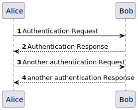

# Evaluation process of interviews for a job opening.

--------------------------------------------------------

## 1.1. Usecase Description

As Customer Manager, I want to execute the process that evaluates (grades) the interviews for a job opening.

## 1.2. Customer Specifications and Clarifications

### From the specifications document:

Requirement Specifications and Interview Models The support
for this functionality must follow specific technical requirements, specified in LPROG.

The ANTLR tool should be used (https://www.antlr.org/).

### From the client clarifications:

* Question:

* Answer:

## 1.3.  Acceptance Criteria

## 2.0. Analysis

The .md file is followed by a Class Diagram and a Sequence Diagram, with the purpose of illustrating the design decisions.

Serving as an overview, here will be presented some of the main concerns:

- Which classes must be accessed in order to implement this functionality?

- Which classes must be created in order to implement this functionality?

- Who has the responsibility of evaluating the interviews?

- Are there any required validations?

### 2.1. Main success scenario

        The interview is successfully evaluated

### 2.2. System Sequence Diagram (SSD)

### 2.3. System Diagram (SD)

### 2.4. Partial Domain Model

## 3.0. Design 

### 3.1. Partial Class Diagram

### 3.2. Applied Patterns

- Single Responsibility Principle + High Cohesion: Every class has only one responsibility, which leads to higher cohesion.

- Open/Closed Principle: By using interfaces, we are allowing classes to extend the behavior, but never modify the previous implementation.

- Information Expert: A clear example would be the ProcessEvaluationController, that by following the referred pattern, as well as the creator pattern, is responsible for creating the customer.

- Low Coupling: All the classes are loosely coupled, not depending on concrete classes, rather depending on interfaces.

- Controller: The controller serves as a bridge between the user interface and the domain.