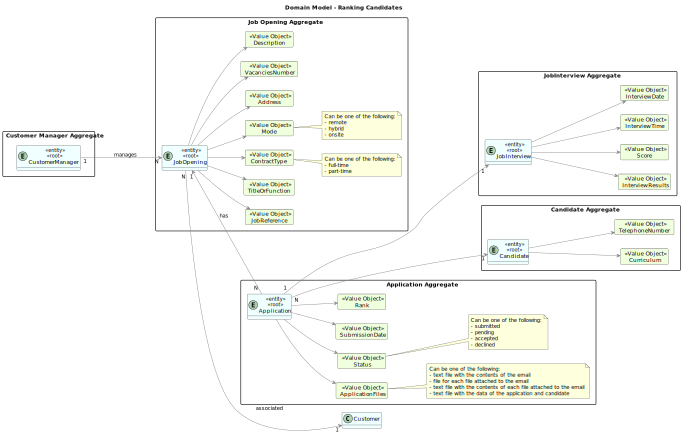
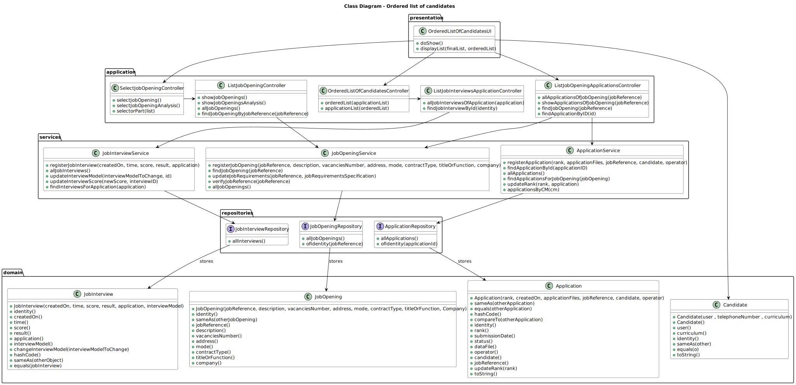
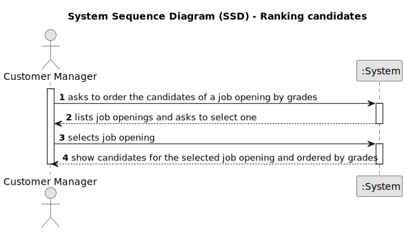
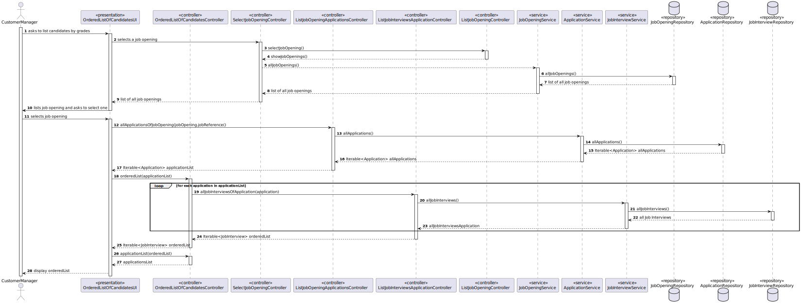
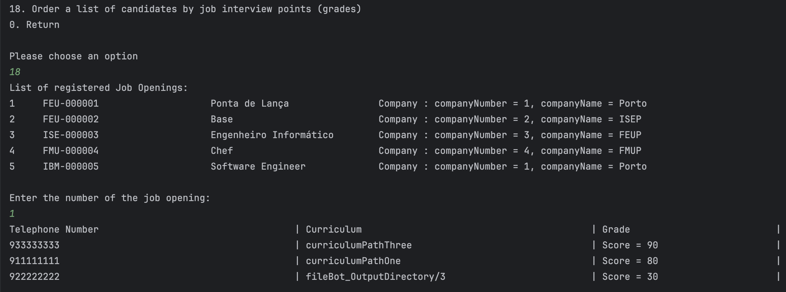
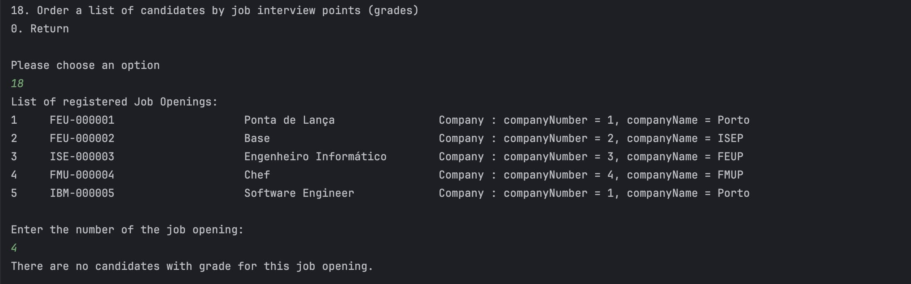

# Get an ordered list of candidates, using the job interview points

--------

## 1. Requirements Engineering

### 1.1. User Story Description

As Customer Manager, I want to get an ordered list of candidates, using the job interview points (grades), to help me analyze the candidates.

### 1.2. Customer Specifications and Clarifications

**From the client clarifications:**

> **Question 169** 
> 
> Relativamente a esta user story, "US 1019 - As Customer Manager, I want to get an ordered list of 
> candidates, using the job interview points (grades), to help me analyze the candidates.", a lista que pretende é 
> relacionada a uma job opening correto? A maneira de ordenação é ascendente ou quer uma opção que inclua ascendente e descendente?
>
> **Answer**
> 
> Sim, a ordenação é relativa a candidaturas para um job opening. A ordenação deve ser descendente, do que tem maior pontuação 
> para o que tem menor pontuação.


> **Question 197**
> 
> Na questao Q169 é mencionado para a listagem ser ordenada descendentemente da nota da entrevista (como mencionado tambem na própria US)
> , no entanto, a questão é, como idealiza a ordenação caso a job opening não possua entrevista?
> 
> **Answer 197**
> 
> Esta US não faz sentido para processos que não tenham entrevista.

### 1.3. Acceptance Criteria


### 1.4. Found out Dependencies

* As a Project Manager, I want the system to support and apply authentication and authorization for all its users and functionalities.
*  As Customer Manager, I want to register a job opening.
* As Operator, I want to register an application of a candidate for a job opening and import all files received.

### 1.5. Input and Output Data

**Selected Data:**

    * Job Opening

**Input Data:**

    * None
**Output Data:**

    * List of candidates


### 1.8 Other Relevant Remarks

*  None to specify 

## 2. Analysis and Design

### 2.1. Domain Model


### 2.2. Class Diagram


### 2.3. System Sequence Diagram (SSD)


### 2.4. Sequence Diagram (SD)



## 3. Implementation

The implementation of this user story was done in the UI layer, using some methods in  controllers, in the `OrderedListOfCandidatesUI` class. 
The `doShow` method was implemented to allow the customer manager to select a job opening and call all controllers used.
The `displayList` method was implemented to print the list that is the final result after 3 controllers used.
The `OrderedListOfCandidatesController` class is mainly used to order by grade all candidates that have an application for the selected job opening.

```java
    public boolean doShow() {

  JobOpening jobOpening = selectJobOpeningController.selectJobOpening();
  JobReference jobReference = jobOpening.jobReference();

  Iterable<Application> applicationList = listJobOpeningApplicationsController.allApplicationsOfJobOpening(jobReference);

  List<JobInterview> orderedList = orderedListOfCandidatesController.orderedList(applicationList);

  List<Application> finalList = orderedListOfCandidatesController.applicationList(orderedList);

  displayList(finalList, orderedList);


  return true;
}
```


## 5. Demonstration

    * Demonstration with interviews


    * Demonstration with no interviews
  


