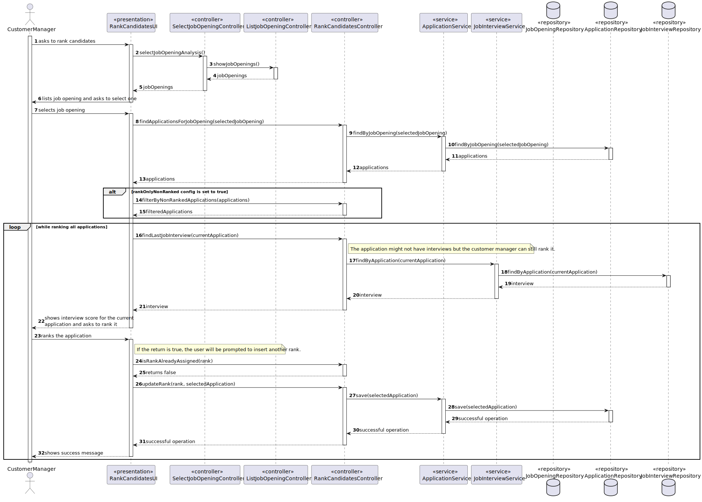
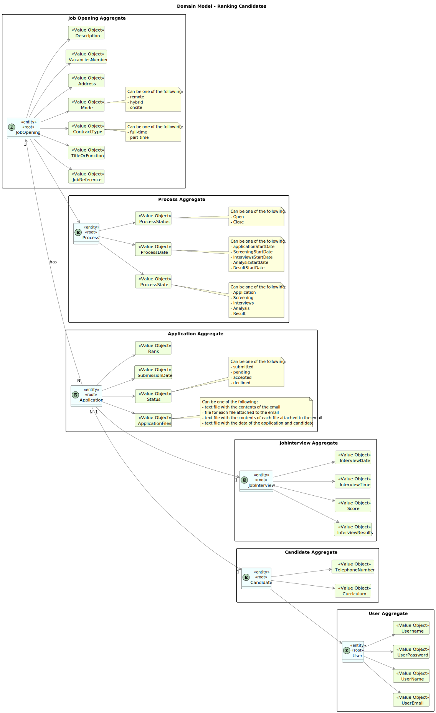
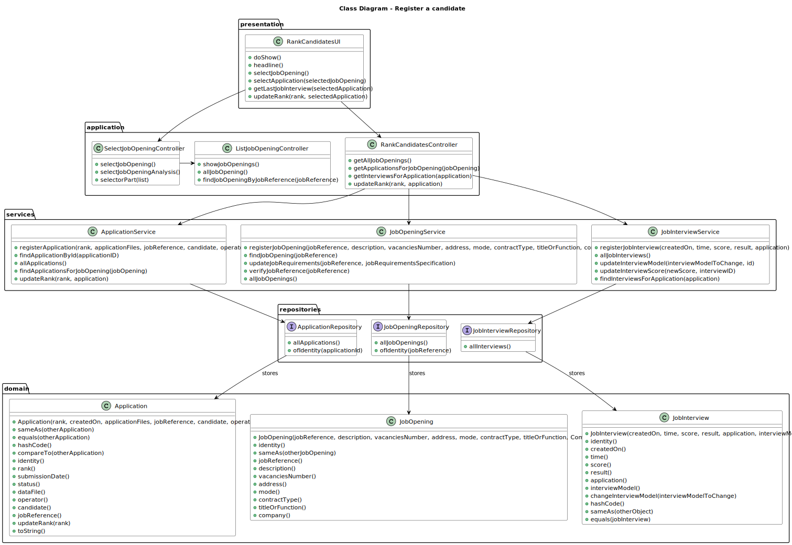

# Ranking the candidates for a job opening

--------

## 1. Requirements Engineering

### 1.1. User Story Description

As Customer Manager, I want to rank the candidates for a job opening. 

### 1.2. Customer Specifications and Clarifications

**From the client clarifications:**

> **Question 17:**
> 
> Relativamente à secção 2.2.1, é na fase de Analysis que as entrevistas são avaliadas e é esse 
resultado que define o ranking dos candidatos? Além disso, para que serve o CV nesta fase? Visto 
que as entrevistas não são obrigatórias, o que acontece quando estas não se realizam?
> 
> **Answer:**
> A pontuação das entrevistas é efetuada/calculada na fase das entrevistas. O CV e outros dados 
(como o resultado das entrevistas) é usado pelo Customer manager na fase de analise para ordenar 
os candidatos. Mas a ordenação é da responsabilidade do Customer Manager (por exemplo, não tem de 
seguir a ordem da pontuação nas entrevistas). A US 1013 corresponde à ordenação manual dos candidatos 
feita pelo Customer Manager. O facto de não haver entrevistas não tem implicações na ordenação dos 
candidatos pois esta não depende explicitamente das entrevistas.
 
> **Question 142:**
>
> Candidate Ranking – Mr Client mention a manual ranking (Q17). If the pontuation of an interview 
is not essential for the candidate's rank, what criteria is to be used when ranking?
> 
> **Answer:**
> Please view again Q17. The ranking is a decision of the Customer Manager based on all the data that 
he/she may have during the process (including CV and other attached documents and the interviews as well 
as other data/information that may not be part of the system).

> **Question 148:**
> 
> A minha questão é relativa a como o ranking é feito. O customer manager dá uma nota a cada candidatura e o sistema 
ordena por ordem crescente sendo assim atribuído o ranking de cada candidatura? Se for assim, a nota terá que escala? 
Caso ainda seja assim ele só pode atribuir uma nota quando tiver conhecimento de todas? Ou pode ir colocando e o ranking 
só é atribuído quando todas as candidaturas já estiverem avaliadas?
> 
> **Answer:**
> Ver Q17. A ordenação dos candidatos (ranking) é da responsabilidade do customer manager. Ele pode basear-se no resultado 
das entrevistas e de outra informação, mas o ranking não é automático. Não há nota nem escala a usar. As candidaturas são 
ordenadas.

> **Question 152:**
> 
> In US 1013, as mentioned before, the customer manager will decide the rank of each candidate's application for a job opening. 
As such, our team would like to know what is the scale of this rank and a bit of information about how it works. First of all, 
is the ranking a point system, in which the customer manager will award points to each application, making it so the the ranking 
is ordered by how many points each application has, or will the customer manager simply assign a place in the rank? For the 
second option, what I am picturing is the program asking the customer manager what position to place each candidate in, one by 
one, and the customer manager awarding, 1st, 2nd place and etc.. Second of all, if it is indeed a point system, is there a 
universal scale it should follow?
> 
> **Answer:**
> See Q148.
 
> **Question 155:**
> 
> Is there a limit on rank entries? Let's say that 100 candidates apply for a job opening. Does the Customer Manager have to sort all 100 candidates?
> 
> **Answer:**
> The order of candidates should include at least all the first candidates within the vacancy number and some following candidates. 
At the moment, I do not know exactly the number of the following candidates to be ordered. Therefore, I would like for it to 
be a global configuration property in the system. It could be a number representing a magnitude from the vacancy number. For 
instance, 1 could mean exactly the same number of vacancies, 2 the double, 0,5 half the number of vacancies. The remainder of 
the candidates could be just tagged as not ranked.
 
> **Question 157:**
> 
> Rank the candidates for a job Opening is the same as rank the job Applications for a Job Opening, knowing that I can only know 
the candidates throw the job application?
> 
> **Answer:**
> In the context of a job opening, a candidate is someone that made an application to that job opening. But the same person can be a candidate to other job openings.
 
> **Question 158:**
> 
> How is the ranking done? The customer manager selects a job opening and is shown the different candidates, and they assign a rank to each one. 
And the ranking process end when he assigns a rank to all candidates?
> 
> **Answer:**
> Once again, I do not have specific requirements for UI/UX. But I can provide some ideas. Being a console application limits the UI/UX. However, 
I see this functionality similar to the way people enter recipients for an email, for instance. In the case of the recipients of an email 
I simply write their emails separated by a comma. Could it be similar in this case?
 
> **Question 159:**
> 
> When a customer manager starts the ranking process, he can stop and continue later? Or the ranking process must be done in one go?
> 
> **Answer:**
> See Q158. I guess it may depend on how you implement the solution. But, in the case it may work as a “long operation” be aware of when and how to conclude the “operation”
 
> **Question 160:**
> 
> The customer manager can change the rank of a candidate after assigning it?
> 
> **Answer:**
> See Q159. That should be possible if none of the interested parties were yet notified of the results.
 
> **Question 162:**
> 
> When the analysis phase ends, the ranking need to have all the candidates? or can the customer manager rank only 
some of the candidates?
> 
> **Answer:**
> See Q149. All the candidates should be ranked before moving to the result phase.

> **Question 163:**
> 
> When the customer manager is ranking the candidates, in terms of UI, should we display information 
from the application such as interview score, etc... or just the candidate's name and email?
> 
> **Answer:**
> As stated before, I do not have specific requirements for the UI/UX. Use best practices. However, I would like it to be possible for the 
Customer Manager to have 2 or more instances of the application running, so that he/she could, for instance, see the interviews grades and, 
at the same time, register the order/ranking of the candidates.
 
> **Question 165:**
> 
> Mr. Client mentioned in Q155 that the system should have ranking configurations so that the Customer Manager 
doesn't have to rank all the candidates for a job opening, and that the ones that haven't been manually ranked are to be tagged 
with "not ranked". However, in Q162, you've said that all the candidates must be ranked before the result phase starts. 
Can you clarify this situation?
> 
> **Answer:**
> The customer manager must evaluate all the candidates. It is the only way he/she can produce a ranking/order for the candidates 
and select the “best” candidates to be included in the vacancies for the job opening. In Q155 I was only proposing a way to avoid recording 
in the system a lot of details that will not have any impact on the next activities. The term “not ranked” maybe is not the best. 
Maybe “rank not recorded” or something similar could be more appropriated.

> **Question 183:**
> 
> When ranking the candidates, the customer manager makes decisions based on their CV and other relevant documents. My question is: 
should there be an option for the customer manager to view the relevant documents before ranking a candidate? Or has the
customer manager already made the decision before ranking the candidates and purely uses this functionality to assign the 
previously planned ranking?
> 
> **Answer:**
> Once again this could be only a UX/UI issue. Please refer to Q17, Q163 and Q140. Also note that there is US1021 for listing application data.
 
> **Question 192:**
> 
> I'm struggling to understang the global configurations defined for US1013. All candidates must be ranked, so that all of 
them can be notified. Are the global configurations only for persistence purposes? Example: all candidates are ranked and 
notified, so if 0.5 is in the global definition, then only half of the number of vancancies must be persisted in the system. 
Is this the scenario that Mr. Client has in mind?
> 
> **Answer:**
> I am assuming you refer to Q155. Suppose you have 2 vacancies. You have 80 candidates. If you configure the property as 
1 you need to rank (record in the system) the 2 first candidates plus 2 other candidates. If the property is 0,5 you should 
rank the 2 first candidates plus 1 third candidate. If the property is 2, you should rank the 2 first candidates plus 4 extra 
candidates. This is a way to assure that you do not have to record in the system the rank of all the possible candidates, but 
only a number that includes the ones required to fulfill the vacancies plus some extra (according to the property) for possible 
exceptions (such as someone leaving the application). But my suggestion was only to help in the UI/UX. You may use any other option.
 
> **Question 198:**
> 
> The ranking of candidates should be save in an array to be able to do easier the result phase?
> 
> **Answer:**
> This question is about the design/implementation of the solution. I have no specific opinion regarding this specific question.

### 1.3. Acceptance Criteria

* AC1: Manually ranking candidates:

        The customer manager should manually rank the candidates.

* AC2: Current proccess state:

        The job opening should be in the "Analysis" state.

* AC3: Ranking without interviews:

        The fact that no interviews are available should not block the customer manager from ranking that application.

* AC4: Moving to the result phase:

        All candidates should be ranked before moving to the result phase.

* AC5: Ranking configurations:

        The system should have ranking configurations so that the Customer Manager doesn't have to rank all the candidates for a job opening, 
        and that the ones that haven't been manually ranked are to be tagged with "not ranked".

### 1.4. Found out Dependencies

* G007 - As a Project Manager, I want the system to support and apply authentication and authorization for all its users and functionalities.
* 1002 - As Customer Manager, I want to register a job opening.
* 2002 - As Operator, I want to register an application of a candidate for a job opening and import all files received.

### 1.5. Input and Output Data

**Selected Data:**

    * Job Opening
    * Application

**Input Data:**

    * Rank

**Output Data:**

    * Interview Score, if available
    * (In)Success of the operation

### 1.6. System Sequence Diagram (SSD)


### 1.7. Sequence Diagram (SD)


### 1.8 Other Relevant Remarks

*  None to specify 

## 2. Analysis and Design
To find out more details about the analysis and design of Application, Job Opening or Job Interview, please refer to the following documents:

[Register an Application](..%2F..%2FSprintB%2Fregister-an-application%2FReadme.md)

[Add a Job Opening](..%2F..%2FSprintB%2Fadd-jobOpening%2FReadme.md)

[Select Interview Model for Job Interview](..%2F..%2FSprintB%2Fselect-interview-model%2FReadme.md)

### 2.1. Domain Model


### 2.2. Class Diagram


## 3. Implementation

Most of the implementation of this user story was done in the UI layer, in the `RankCandidatesForJobOpeningUI` class. The `doShow` method was implemented to allow the customer manager to rank the candidates for a job opening.
The `RankCandidatesController` class is mainly used to access the repositories to retrieve and update data.

```java
    @Override
    protected boolean doShow() {
        JobOpening selectedJob = selectJobOpening();
        Application selectedApplication = selectApplication(selectedJob);
        Score selectedInterview = getLastJobInterview(selectedApplication);

        System.out.println(The score of the last interview for the selected application is " + selectedInterview);

        if (selectedInterview == null) {
            String response = Console.readLine("Do you still want to rank the application? (Yes/No): ");
            if (!response.equalsIgnoreCase("yes")) {
                return false;
            }
        }

        int rank = Console.readInteger("Insert the new rank for this candidate: ");

        updateRank(rank, selectedApplication);

        return true;
    }
```

## 4. Testing

## 5. Demonstration
