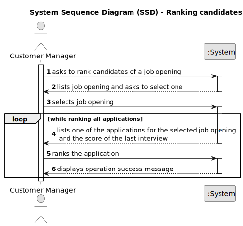

# Ranking the candidates for a job opening

--------

## 1. Requirements Engineering

### 1.1. User Story Description

As Customer Manager, I want to rank the candidates for a job opening. 

### 1.2. Customer Specifications and Clarifications

> **Question 17:**
> 
> Relativamente à secção 2.2.1, é na fase de Analysis que as entrevistas são avaliadas e é esse 
resultado que define o ranking dos candidatos? Além disso, para que serve o CV nesta fase? Visto 
que as entrevistas não são obrigatórias, o que acontece quando estas não se realizam?
> 
> **Answer:**
> A pontuação das entrevistas é efetuada/calculada na fase das entrevistas. O CV e outros dados 
(como o resultado das entrevistas) é usado pelo Customer manager na fase de analise para ordenar 
os candidatos. Mas a ordenação é da responsabilidade do Customer Manager (por exemplo, não tem de 
seguir a ordem da pontuação nas entrevistas). A US 1013 corresponde à ordenação manual dos candidatos 
feita pelo Customer Manager. O facto de não haver entrevistas não tem implicações na ordenação dos 
candidatos pois esta não depende explicitamente das entrevistas.
 
> **Question 142:**
>
> Candidate Ranking – Mr Client mention a manual ranking (Q17). If the pontuation of an interview 
is not essential for the candidate's rank, what criteria is to be used when ranking?
> 
> **Answer:**
> Please view again Q17. The ranking is a decision of the Customer Manager based on all the data that 
he/she may have during the process (including CV and other attached documents and the interviews as well 
as other data/information that may not be part of the system).

### 1.3. Acceptance Criteria

* AC1: Manually ranking candidates:

        The customer manager should manually rank the candidates.

* AC2: Ranking without interviews:

        The fact that no interviews are available should not block the customer manager from ranking that application.

### 1.4. Found out Dependencies

* G007 - As a Project Manager, I want the system to support and apply authentication and authorization for all its users and functionalities.
* 1002 - As Customer Manager, I want to register a job opening.
* 2002 As Operator, I want to register an application of a candidate for a job opening and import all files received.

### 1.5. Input and Output Data

**Selected Data:**

    * Job Opening
    * Application

**Input Data:**

    * Rank

**Output Data:**

    * (In)Success of the operation

### 1.6. System Sequence Diagram (SSD)

### 1.7. Sequence Diagram (SD)

### 1.8 Other Relevant Remarks

*  None to specify 

## 2. Analysis and Design

### 2.1. Domain Model

### 2.2. Class Diagram

## 3. Implementation
