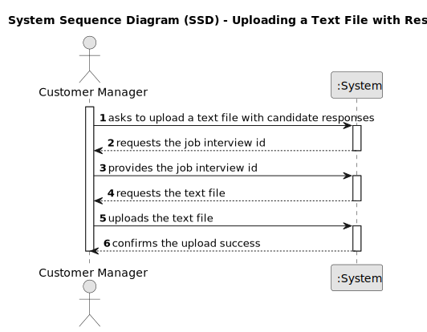
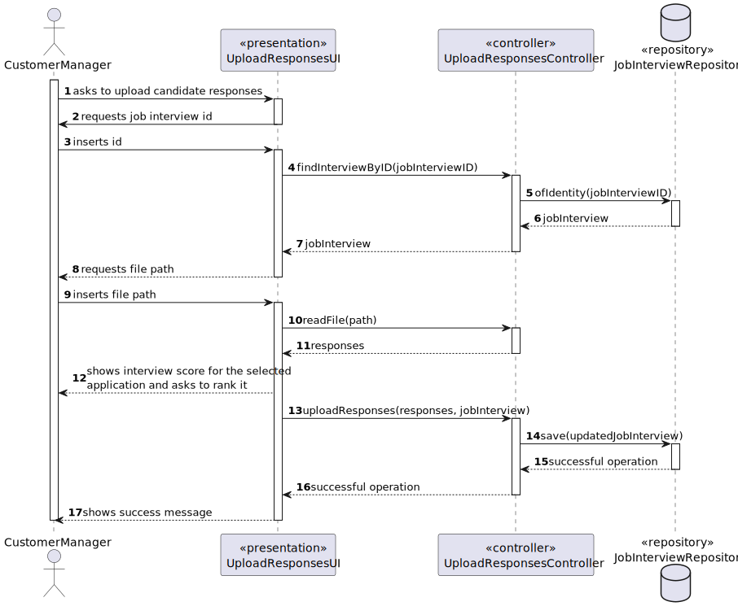
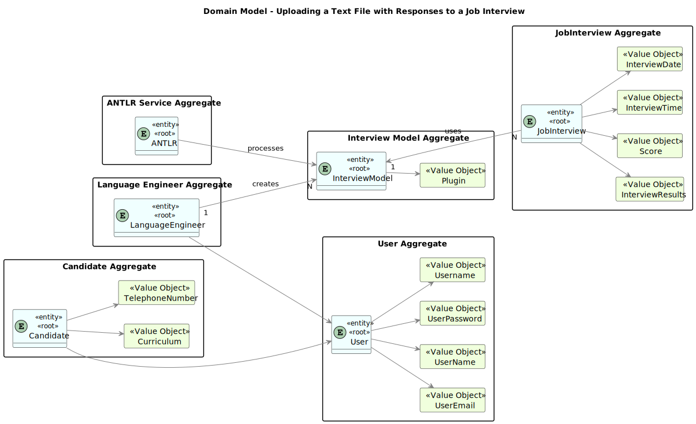
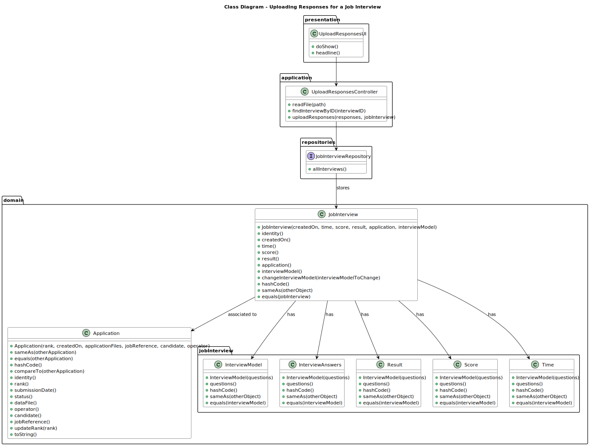

# Uploading a Text File with the Candidate Responses

--------

## 1. Requirements Engineering

### 1.1. User Story Description

As Customer Manager, I want to upload a text file with the candidate responses for an interview.

### 1.2. Customer Specifications and Clarifications

**From the specifications document:**

> **NFR09(LPROG) - Requirement Specifications and Interview Models:**
> 
> The support for this functionality must follow specific technical requirements, 
specified in LPROG. The ANTLR tool should be used (https://www.antlr.org/).

**From the client clarifications:**

### 1.3. Acceptance Criteria

### 1.4. Found out Dependencies

* G007 - As a Project Manager, I want the system to support and apply authentication and authorization for all its users and functionalities.
* 1012 - As Customer Manager, I want to generate and export a template text file to help collect the candidate answers during the interviews.

### 1.5. Input and Output Data

**Input Data:**

    * Job Interview ID
    * Path to the text file

**Output Data:**

    * (In)Success of the operation

### 1.6. System Sequence Diagram (SSD)


### 1.7. Sequence Diagram (SD)


### 1.8 Other Relevant Remarks

*  None to specify 

## 2. Analysis and Design

### 2.1. Domain Model


### 2.2. Class Diagram


## 3. Implementation

These are the three methods code in the `UploadResponsesController` that are used by the UI for this use case.

```java
    public List<String> readFile(String filePath) {
        try {
            return Files.readAllLines(Paths.get(filePath));
        } catch (IOException e) {
            System.out.println("Error reading file: " + e.getMessage());
            return null;
        }
    }

    public JobInterview findInterviewByID(int jobInterviewID) {
        return jobInterviewRepository.ofIdentity(jobInterviewID).orElse(null);
    }

    public JobInterview uploadResponses(List<String> responses, JobInterview jobInterview) {
        InterviewAnswers interviewAnswers = new InterviewAnswers(responses);

        jobInterview.uploadInterviewAnswers(interviewAnswers);
        return jobInterviewRepository.save(jobInterview);
    }
```

## 4. Testing

## 5. Demonstration